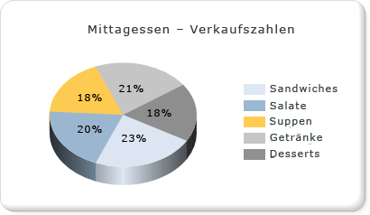

# Kreisdiagramme (Berichts-Generator und SSRS)
  Kreis- und Ringdiagramme zeigen Daten als Teile des Ganzen an. Kreisdiagramme werden häufig verwendet, um Vergleiche zwischen Gruppen zu erstellen. Kreis- und Ringdiagramme bilden zusammen mit Pyramiden- und Trichterdiagrammen die Gruppe der Formdiagramme. Formdiagramme haben keine Achsen. Wenn ein numerisches Feld auf einem Formdiagramm abgelegt wird, berechnet das Diagramm den prozentualen Anteil jedes einzelnen Werts der Gesamtsumme. Weitere Informationen zu Formdiagrammen finden Sie unter [Formdiagramme &#40;Berichts-Generator und SSRS&#41;](../../reporting-services/report-design/shape-charts-report-builder-and-ssrs.md).  
  
 Die folgende Abbildung zeigt ein 3D-Kreisdiagramm mit als Prozentsätze formatierten Datenbezeichnungen an.  Die Legende wird in der Mitte rechts positioniert.  
  
   
  
> [!NOTE]  
>  [!INCLUDE[ssRBRDDup](../../includes/ssrbrddup-md.md)]  
  
## Variationen  
  
-   **Explodierter Kreis**. Ein Kreisdiagramm, in dem die Segmente vom Kreismittelpunkt ausgerückt werden. Neben dem explodierten Kreisdiagramm, in dem alle Segmente getrennt sind, können Sie ein explodiertes Segmentdiagramm erstellen, in dem nur ein Segment ausgerückt ist.  
  
-   **Ring**. Ein Kreisdiagramm mit einer offenen Fläche in der Mitte.  
  
-   **Explodierter Ring**. Ein Ringdiagramm, in dem die Segmente vom Ringmittelpunkt ausgerückt werden.  
  
-   **3D-Kreis**. Ein Kreisdiagramm im 3D-Format.  
  
-   **Explodierter 3D-Kreis**. Ein explodiertes Kreisdiagramm im 3D-Format.  
  
## Überlegungen zu Daten für die Anzeige in einem Kreisdiagramm  
  
-   Kreisdiagramme sind wegen ihrer visuellen Wirkung in Berichten beliebt. Bei Kreisdiagrammen handelt es sich jedoch um einen sehr vereinfachten Diagrammtyp, der Ihre Daten möglicherweise nicht optimal darstellt. Verwenden Sie ein Kreisdiagramm ggf. erst, nachdem die Daten zu sieben Datenpunkten oder weniger aggregiert wurden.  
  
-   Kreisdiagramme zeigen jede Datengruppe als separates Segment im Diagramm an. Sie müssen dem Kreisdiagramm mindestens ein Datenfeld und ein Kategoriefeld hinzufügen. Wenn dem Kreisdiagramm mehr als ein Datenfeld hinzugefügt wird, werden beide Datenfelder im selben Diagramm angezeigt.  
  
-   NULL-, leere und negative Werte haben keine Auswirkungen auf die Berechnung von Verhältnissen. Aus diesem Grund werden diese Werte nicht in einem Kreisdiagramm angezeigt. Wenn Sie diese Werte in Ihrem Diagramm visuell darstellen möchten, ändern Sie den Diagrammtyp.  
  
-   Wenn Sie mithilfe einer benutzerdefinierten Palette eigene Farben in einem Kreisdiagramm definieren, müssen in der Palette genügend Farben vorhanden sein, damit jeder Datenpunkt eine eigene Farbe erhalten kann. Weitere Informationen finden Sie unter [Formatieren von Reihenfarben in einem Diagramm &#40;Berichts-Generator und SSRS&#41;](../../reporting-services/report-design/formatting-series-colors-on-a-chart-report-builder-and-ssrs.md).  
  
-   Im Gegensatz zu den meisten anderen Diagrammtypen zeigt ein Kreisdiagramm einzelne Datenpunkte und keine einzelnen Reihen in der Legende an.  
  
-   Ein Kreisdiagramm erfordert mindestens zwei Werte, um einen gültigen Vergleich zwischen Proportionen zu erstellen. Wenn das Kreisdiagramm nur eine Farbe enthält, überprüfen Sie, ob Sie ein Kategoriefeld für die Gruppierung hinzugefügt haben. Enthält das Kreisdiagramm keine Kategorien, werden die Werte aus dem Datenfeld in einen Wert aggregiert und angezeigt.  
  
-   Wie alle anderen Diagrammtypen generiert das Kreisdiagramm Farben auf Grundlage der in der Standardpalette enthaltenen Farbwerte. Dieser Ansatz kann dazu führen, dass verschiedene Kreisdiagramme Datenpunkte mit unterschiedlichen Farben versehen, wenn Sie mehrere Kreisdiagramme in einem Bericht verwenden. Bei mehreren Kreisdiagrammen in einem Bericht können Sie die Farben für jede Kategoriegruppe manuell festlegen, um die Farbe in verschiedenen Diagrammen beizubehalten. Weitere Informationen zum Definieren von Farben in einem Diagramm finden Sie unter [Formatieren von Reihenfarben in einem Diagramm &#40;Berichts-Generator und SSRS&#41;](../../reporting-services/report-design/formatting-series-colors-on-a-chart-report-builder-and-ssrs.md).  
  
## Übernehmen von Zeichnungsarten für ein Kreisdiagramm  
 Sie können dem Kreisdiagramm besondere Zeichnungsarten hinzufügen, um die visuelle Wirkung zu erhöhen. Zeichnungsarten schließen Abschrägung und konkave Effekte ein. Diese Effekte sind nur in einem 2D-Kreisdiagramm verfügbar. Die folgende Abbildung zeigt ein Beispiel für die Abschrägung und die konkaven Zeichnungsarten in einem Kreisdiagramm.  
  
   
  
 Weitere Informationen finden Sie unter [Hinzufügen einer Abschrägung, Prägung und Struktur zu einem Diagramm &#40;Berichts-Generator und SSRS&#41;](../../reporting-services/report-design/add-bevel-emboss-and-texture-styles-to-a-chart-report-builder-and-ssrs.md).  
  
## Anzeigen von Prozentwerten in einem Kreisdiagramm  
 Wie andere Formdiagramme stellen Kreisdiagramme Anteile des Ganzen dar. Daher werden Kreisdiagrammbezeichnungen üblicherweise als Prozentsätze formatiert. Zur Wahrung der Konsistenz mit anderen Diagrammtypen zeigt das Diagramm Prozentbezeichnungen nicht standardmäßig an. Weitere Informationen zum Anzeigen von Werten als Prozentsätze im Diagramm finden Sie unter [Anzeigen von Prozentwerten in einem Kreisdiagramm &#40;Berichts-Generator und SSRS&#41;](../../reporting-services/report-design/display-percentage-values-on-a-pie-chart-report-builder-and-ssrs.md). Weitere Informationen zum Formatieren von Zahlen als Prozentsätze im Bericht finden Sie unter [Formatieren von Zahlen und Datumsangaben &#40;Berichts-Generator und SSRS&#41;](../../reporting-services/report-design/formatting-numbers-and-dates-report-builder-and-ssrs.md).  
  
   
  
## Verhindern von überlappenden Bezeichnungen in einem Kreisdiagramm  
 Wenn viele Datenpunkte in einem Kreisdiagramm vorhanden sind, überschneiden sich die Datenbezeichnungen. Es gibt mehrere Möglichkeiten, das Überlappen der Bezeichnungen zu verhindern:  
  
-   Verringern Sie den Schriftgrad der Datenpunktbezeichnungen.  
  
-   Erhöhen Sie die Breite und die Höhe des Diagramms, um mehr Platz für die Bezeichnungen zu schaffen.  
  
-   Zeigen Sie Kreisbezeichnungen außerhalb der Diagrammfläche an. Weitere Informationen finden Sie unter [Anzeigen von Datenpunktbezeichnungen außerhalb eines Kreisdiagramms &#40;Berichts-Generator und SSRS&#41;](../../reporting-services/report-design/display-data-point-labels-outside-a-pie-chart-report-builder-and-ssrs.md).  
  
-   Stellen Sie die kleinen Kreissegmente zu einem Segment zusammen.  
  
## Konsolidieren kleiner Segmente in einem Kreisdiagramm  
 Wenn das Kreisdiagramm zu viele Elemente aufweist, werden die Daten verdeckt und sind schwer zu lesen. Wenn die Daten viele kleine Datenelemente aufweisen, gibt es zwei Möglichkeiten, mehrere Kreisslices darzustellen:  
  
-   Zusammenfassen kleinerer Datenslices in einer Kreisslice. Dies ist beispielsweise hilfreich, wenn das Kreisdiagramm die Slice "Sonstige" enthalten soll, in der die übrigen Daten zusammengefasst werden. Weitere Informationen finden Sie unter [Zusammenfassen von kleinen Slices in einem Kreisdiagramm &#40;Berichts-Generator und SSRS&#41;](../../reporting-services/report-design/collect-small-slices-on-a-pie-chart-report-builder-and-ssrs.md).  
  
-   Zusammenfassen kleinerer Slices in einem ergänzenden Kreisdiagramm. Das zweite Kreisdiagramm wird nicht im Designer angezeigt. Stattdessen wird bei der Berichtsverarbeitung anhand der Werte der Datenelemente für das Diagramm ermittelt, ob ein zweites Kreisdiagramm angezeigt werden muss. In diesem Fall werden die Werte einem weiteren Kreisdiagramm hinzugefügt.  
  
## Siehe auch  
 [Anzeigen von Datenpunktbezeichnungen außerhalb eines Kreisdiagramms &#40;Berichts-Generator und SSRS&#41;](../../reporting-services/report-design/display-data-point-labels-outside-a-pie-chart-report-builder-and-ssrs.md)   
 [Zusammenfassen von kleinen Slices in einem Kreisdiagramm &#40;Berichts-Generator und SSRS&#41;](../../reporting-services/report-design/collect-small-slices-on-a-pie-chart-report-builder-and-ssrs.md)   
 [Anzeigen von Prozentwerten in einem Kreisdiagramm &#40;Berichts-Generator und SSRS&#41;](../../reporting-services/report-design/display-percentage-values-on-a-pie-chart-report-builder-and-ssrs.md)   
 [Tutorial: Hinzufügen eines Kreisdiagramms zu einem Bericht &#40;Berichts-Generator&#41;](../../reporting-services/tutorial-add-a-pie-chart-to-your-report-report-builder.md)   
 [Formatieren der Legende in einem Diagramm &#40;Berichts-Generator und SSRS&#41;](../../reporting-services/report-design/formatting-the-legend-on-a-chart-report-builder-and-ssrs.md)   
 [Leere und NULL-Datenpunkte in Diagrammen &#40;Berichts-Generator und SSRS&#41;](../../reporting-services/report-design/empty-and-null-data-points-in-charts-report-builder-and-ssrs.md)   
 [Formatieren von Reihenfarben in einem Diagramm &#40;Berichts-Generator und SSRS&#41;](../../reporting-services/report-design/formatting-series-colors-on-a-chart-report-builder-and-ssrs.md)  
  
  