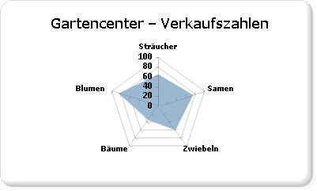

# Polardiagramme (Berichts-Generator und SSRS)
  Ein Polardiagramm zeigt eine Reihe als Satz von Punkten an, die nach der Kategorie in einem 360-Grad-Kreis angeordnet sind. Werte werden durch den Abstand der Punkte von der Mitte des Kreises dargestellt. Je weiter der Punkt von der Mitte entfernt liegt, desto größer ist sein Wert. Kategoriebezeichnungen werden auf dem Umkreis des Diagramms angezeigt. Weitere Informationen zu Hinzufügen von Daten zu einem Polardiagramm finden Sie unter [Diagramme &#40;Berichts-Generator und SSRS&#41;](../../reporting-services/report-design/charts-report-builder-and-ssrs.md).  
  
> [!NOTE]  
>  [!INCLUDE[ssRBRDDup](../../includes/ssrbrddup-md.md)]  
  
## Variationen  
  
-   **Netzdiagramm**. Ein Netzdiagramm zeigt eine Serie als zirkuläre Linie oder Bereich an. Im Gegensatz zum Polardiagramm zeigt das Netzdiagramm die Daten nicht im Hinblick auf polare Koordinaten an.  
  
## Überlegungen zu Daten für ein Polardiagramm  
  
-   Das Netzdiagramm ist für Vergleiche zwischen mehreren Serien von Kategoriedaten nützlich.  
  
-   Polardiagramme werden am häufigsten zur Aufzeichnung von polaren Daten verwendet, bei denen jeder Datenpunkt durch einen Winkel und einen Abstand festgelegt ist.  
  
-   Polardiagramme können nicht mit anderen Diagrammtypen im gleichen Diagrammbereich kombiniert werden.  
  
## Beispiel  
 Im folgenden Beispiel wird gezeigt, wie ein Netzdiagramm verwendet werden kann. In der unten stehenden Tabelle werden Beispieldaten für das Diagramm bereitgestellt.  
  
|Name|Sales|  
|----------|-----------|  
|Sträucher|61|  
|Samen|78|  
|Zwiebeln|60|  
|Bäume|38|  
|Blumen|81|  
  
 In diesem Beispiel wird das Feld Name in den Bereich Kategoriegruppen eingefügt. Das Feld Verkauf wird in den Bereich Werte eingefügt. Das Feld Verkauf wird automatisch für das Diagramm aggregiert, wenn Sie es ablegen. Im Netzdiagramm wird basierend auf der Anzahl der Werte im Feld "Verkauf" berechnet, wo die Bezeichnungen platziert werden. Das Feld enthält fünf Werte, und es werden fünf Bezeichnungen an Punkten mit gleichem Abstand auf einem Kreis platziert. Wenn das Feld "Verkauf" drei Werte enthielte, würden die Bezeichnungen an drei Punkten mit gleichem Abstand auf einem Kreis platziert.  
  
 Die folgende Abbildung zeigt ein Beispiel für ein Netzdiagramm auf Grundlage der dargestellten Daten.  
  
   
  
## Siehe auch  
 [Diagramme &#40; Berichts-Generator und SSRS &#41;](../../reporting-services/report-design/charts-report-builder-and-ssrs.md)   
 [Formatieren eines Diagramms &#40; Berichts-Generator und SSRS &#41;](../../reporting-services/report-design/formatting-a-chart-report-builder-and-ssrs.md)   
 [Diagrammtypen &#40; Berichts-Generator und SSRS &#41;](../../reporting-services/report-design/chart-types-report-builder-and-ssrs.md)   
 [Liniendiagramme &#40; Berichts-Generator und SSRS &#41;](../../reporting-services/report-design/line-charts-report-builder-and-ssrs.md)   
 [Leere und NULL-Datenpunkte in Diagrammen &#40;Berichts-Generator und SSRS&#41;](../../reporting-services/report-design/empty-and-null-data-points-in-charts-report-builder-and-ssrs.md)  
  
  
