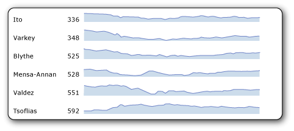
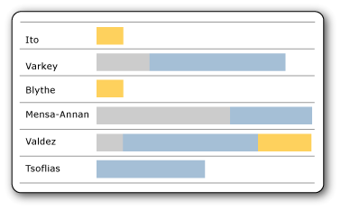
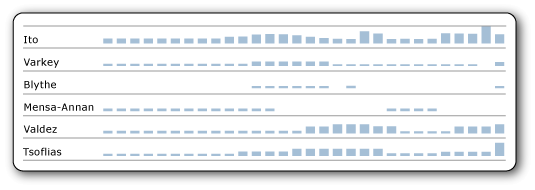

# Sparklines und Datenbalken (Berichts-Generator und SSRS)
  Sparklines und Datenbalken sind einfache, kleine Diagramme, die zahlreiche Informationen auf wenig Raum vermitteln und häufig in den Fließtext eingebunden sind.   
    
  In [!INCLUDE[ssRSnoversion_md](../../includes/ssrsnoversion-md.md)] -Berichten werden Sparklines und Datenbalken oft in Tabellen und Matrizen verwendet. Sparklines bzw. Datenbalken sind am wirkungsvollsten, wenn sie in ihrer Gesamtheit übereinander betrachtet und schnell verglichen werden können, nicht wenn sie einzeln angezeigt werden. Auf diese Weise können schnell Ausreißer, d. h. Zeilen, deren Verhalten von dem der anderen Zeilen abweicht, ermittelt werden. Obwohl sie klein sind, stellt jede Sparkline häufig mehrere Datenpunkte dar, oft in einem Zeitverlauf. Datenbalken können mehrere Datenpunkte darstellen, stehen in der Regel jedoch nur für einen Datenpunkt. Normalerweise stellt jede Sparkline eine einzelne Reihe dar. Einer Detailgruppe in einer Tabelle können keine Sparklines hinzugefügt werden. Da Sparklines aggregierte Daten darstellen, müssen sie in eine Zelle eingefügt werden, die einer Gruppe zugeordnet ist. Sparklines und Datenbalken verfügen über die gleichen grundlegenden Diagrammelemente wie Kategorien, Reihen und Werte, weisen aber keine Legenden, Achsenlinien, Bezeichnungen oder Teilstriche auf.  
  
   
  
 Kurze Anweisungen zu Sparklines finden Sie unter [Tutorial: Hinzufügen einer Sparkline zum Bericht &#40;Berichts-Generator&#41;](../../reporting-services/tutorial-add-a-sparkline-to-your-report-report-builder.md) und in den Videos [How to: Create a Sparkline in a Table](http://go.microsoft.com/fwlink/?LinkId=197092) (Erstellen einer Sparkline in einer Tabelle) und [Sparklines, Bar Charts, and Indicators in Report Builder](http://technet.microsoft.com/bi/video/ff877165) (Sparklines, Balkendiagramme und Indikatoren in Berichts-Generator).  
  
> [!NOTE]  
>  Sparklines und Datenbalken können mit ihrer übergeordneten Tabelle, Matrix oder Liste getrennt von einem Bericht als Berichtsteil veröffentlicht werden. Erfahren Sie mehr über [Berichtsteile](../../reporting-services/report-design/report-parts-report-builder-and-ssrs.md).  
  
##   Typen von Sparklines  
 Sie können fast genauso viele Typen von Sparklines erstellen, wie es reguläre Diagramme gibt. Im Allgemeinen können Sie keine 3D-Sparklines erstellen. Sie können Sparklineversionen der folgenden Volldiagramme erstellen:  
  
-   [Säulendiagramme (Berichts-Generator und SSRS)](../../reporting-services/report-design/column-charts-report-builder-and-ssrs.md): einfache, gestapelte und gestapelte Säulendiagramme (100 %)  
  
-   [Liniendiagramme (Berichts-Generator und SSRS)](../../reporting-services/report-design/line-charts-report-builder-and-ssrs.md): alles außer 3D-Liniendiagrammen  
  
-   [Flächendiagramme (Berichts-Generator und SSRS)](../../reporting-services/report-design/area-charts-report-builder-and-ssrs.md): alles außer 3D-Flächendiagrammen  
  
-   [Kreisdiagramme (Berichts-Generator und SSRS)](../../reporting-services/report-design/pie-charts-report-builder-and-ssrs.md): Ringdiagramme, sowohl flach als auch 3D, jedoch keine anderen Formen wie Trichter- und Pyramidendiagramme  
  
-   [Bereichsdiagramme &#40;Berichts-Generator und SSRS&#41;](../../reporting-services/report-design/range-charts-report-builder-and-ssrs.md): Kurs-, Kerzen-, Abweichungsbalken- und Boxplotdiagramme.  
  
##   Datenbalken  
 Datenbalken stellen in der Regel einen einzelnen Datenpunkt dar, obwohl sie wie normale Balkendiagramme auch mehrere Datenpunkte darstellen können. Sie enthalten häufig mehrere Reihen ohne Kategorie oder verfügen über Reihengruppierungen.  
  
   
  
 In diesem Beispiel mit gestapelten Datenbalken stellt nur ein Datenbalken mehr als einen Datenpunkt dar. Die drei verschiedenen Farben des Balkens könnten z. B. Aufgaben auf drei Prioritätsebenen darstellen, wobei die Länge des Balkens der Gesamtzahl der Aufgaben entsprechen könnte, die jeder Person zugewiesen wurden. Wenn Sie stattdessen gestapelte Datenbalken (100%) verwenden würden, würde jeder Balken die Zelle ausfüllen und die verschiedenen Farben den Prozentsatz des Ganzen für jede Prioritätsstufe darstellen.  
  
 Sie können Datenbalkenversionen der folgenden Volldiagramme erstellen:  
  
-   [Balkendiagramme (Berichts-Generator und SSRS)](../../reporting-services/report-design/bar-charts-report-builder-and-ssrs.md): einfache, gestapelte und gestapelte Balkendiagramme (100 %)  
  
-   [Säulendiagramme (Berichts-Generator und SSRS)](../../reporting-services/report-design/column-charts-report-builder-and-ssrs.md): einfache, gestapelte und gestapelte Säulendiagramme (100 %) Säulendiagramme können entweder Sparklines oder Datenbalken sein.  
  
##   Ausrichten von Sparklinedaten in einer Tabelle oder einer Matrix  
 Wenn Sie eine Sparkline in eine Tabelle oder eine Matrix einfügen, ist es normalerweise wichtig, dass die Datenpunkte in den einzelnen Sparklines mit den Datenpunkten der anderen Sparklines in dieser Spalte übereinstimmen. Andernfalls ist es schwierig, die Daten in den verschiedenen Zeilen zu vergleichen. Wenn Sie z. B. die Umsatzdaten verschiedener Vertriebsmitarbeiter im Unternehmen nach Monat vergleichen, müssen die Monate übereinstimmen. Wenn ein Mitarbeiter im Monat April abwesend war, gib es für diesen Mitarbeiter für diesen Monat keine Daten. Für diesen Monat sollte daher eine Lücke angezeigt werden, und die Daten für die folgenden Monate sollten an den Daten der anderen Mitarbeiter ausgerichtet sein. Sie erreichen dies durch die Ausrichtung der horizontalen Achse. Weitere Informationen finden Sie im Abschnitt über Sparklines unter [Ausdrucksbereich für Gesamtwerte, Aggregate und integrierte Auflistungen (Berichts-Generator und SSRS)](../../reporting-services/report-design/expression-scope-for-totals-aggregates-and-built-in-collections.md) und [Ausrichten von Diagrammdaten in einer Tabelle oder einer Matrix (Berichts-Generator und SSRS)](../../reporting-services/report-design/align-the-data-in-a-chart-in-a-table-or-matrix-report-builder-and-ssrs.md).  
  
 Auf ähnliche Weise müssen die Daten auch vertikal auszurichten sein, um Zeilen vergleichen zu können. Dies bedeutet, dass die Höhe der Balken oder Linien in einer Sparkline oder einem Datenbalken relativ zur Höhe der Balken und Linien aller anderen Sparklines oder Datenbalken sein muss. Andernfalls können Sie die Zeilen nicht miteinander vergleichen.  
  
   
  
 In diesem Bild wird das Säulendiagramm für die täglichen Verkäufe jedes Mitarbeiters dargestellt. Beachten Sie, dass Tage, an denen ein Mitarbeiter keine Verkäufe getätigt hat, leer gelassen werden und die nachfolgenden Tage ausgerichtet werden. Dies ist ein Beispiel für die horizontale Ausrichtung. Beachten Sie außerdem, dass für einige Mitarbeiter jeder Balken kurz ist und kein Balken den oberen Rand der Zelle erreicht. Dies ist ein Beispiel für die vertikale Ausrichtung. Ohne diese Ausrichtung würden sich die kurzen Balken in Zeilen ohne hohe Balken bis an den oberen Rand der Zelle erstrecken.  
  
##   Grundlegendes zu den für eine Sparkline oder einen Datenbalken angegebenen Daten  
 Wenn Sie einer Tabelle oder einer Matrix eine Sparkline oder einen Datenbalken hinzufügen, wird dies als *schachteln* eines Datenbereichs in einem anderen bezeichnet. Schachteln bedeutet, dass die für eine Sparkline oder einen Datenbalken bereitgestellten Daten von dem Dataset gesteuert werden, auf dem die Tabelle oder Matrix basiert, sowie durch die Position in der Tabelle oder Matrix. Weitere Informationen finden Sie unter [Geschachtelte Datenbereiche &#40;Berichts-Generator und SSRS&#41;](../../reporting-services/report-design/nested-data-regions-report-builder-and-ssrs.md).  
  
##   Konvertieren einer Sparkline oder eines Datenbalkens in ein Volldiagramm  
 Da Sparklines und Datenbalken nur eine Art von Diagramm sind, können Sie diese bei Bedarf in ein Volldiagramm mit allen entsprechenden Funktionen konvertieren, indem Sie mit der rechten Maustaste auf das Diagramm klicken und dann **In Volldiagramm konvertieren**auswählen. Wenn Sie dies durchführen, werden die Achsenlinien, Bezeichnungen, Teilstriche und die Legende automatisch hinzugefügt.  
  
> [!NOTE]  
>  Sie können ein Volldiagramm nicht durch einen einfachen Klick in eine Sparkline oder einen Datenbalken konvertieren. Sie können jedoch eine Sparkline oder einen Datenbalken aus einem Volldiagramm erstellen, indem Sie alle Diagrammelemente löschen, die nicht Teil von Sparklines und Datenbalken sind.  
  
##   Themen zur Vorgehensweise  
 [Hinzufügen von Sparklines und Datenbalken &#40;Berichts-Generator und SSRS&#41;](../../reporting-services/report-design/add-sparklines-and-data-bars-report-builder-and-ssrs.md)  
  
 [Ausrichten von Diagrammdaten in einer Tabelle oder einer Matrix &#40;Berichts-Generator und SSRS&#41;](../../reporting-services/report-design/align-the-data-in-a-chart-in-a-table-or-matrix-report-builder-and-ssrs.md)  
  
### Andere Themen zur Vorgehensweise für Diagramme  
 Da Sparklines und Datenbalken ein Diagrammtyp sind, sind möglicherweise auch die folgenden Themen zur Vorgehensweise für Diagramme hilfreich für Sie:  
  
 [Hinzufügen eines Diagramms zu einem Bericht &#40;Berichts-Generator und SSRS&#41;](../../reporting-services/report-design/add-a-chart-to-a-report-report-builder-and-ssrs.md)  
  
 [Hinzufügen von leeren Punkten zum Diagramm &#40;Berichts-Generator und SSRS&#41;](../../reporting-services/report-design/add-empty-points-to-a-chart-report-builder-and-ssrs.md)  
  
 [Hinzufügen oder Entfernen von Rändern aus einem Diagramm &#40;Berichts-Generator und SSRS&#41;](../../reporting-services/report-design/add-or-remove-margins-from-a-chart-report-builder-and-ssrs.md)  
  
 [Ändern eines Diagrammtyps &#40;Berichts-Generator und SSRS&#41;](../../reporting-services/report-design/change-a-chart-type-report-builder-and-ssrs.md)  
  
 [Definieren von Farben in einem Diagramm mit einer Palette &#40;Berichts-Generator und SSRS&#41;](../../reporting-services/report-design/define-colors-on-a-chart-using-a-palette-report-builder-and-ssrs.md)  
  
 [Anzeigen von QuickInfos für eine Reihe &#40;Berichts-Generator und SSRS&#41;](../../reporting-services/report-design/show-tooltips-on-a-series-report-builder-and-ssrs.md)  
  
 [Angeben einer logarithmischen Skalierung &#40;Berichts-Generator und SSRS&#41;](../../reporting-services/report-design/specify-a-logarithmic-scale-report-builder-and-ssrs.md)  
  
 [Angeben eines Achsenintervalls &#40;Berichts-Generator und SSRS&#41;](../../reporting-services/report-design/specify-an-axis-interval-report-builder-and-ssrs.md)  
  
 [Angeben von Farben, die für mehrere Formdiagramme konsistent sind &#40;Berichts-Generator und SSRS&#41;](../../reporting-services/report-design/specify-consistent-colors-across-multiple-shape-charts-report-builder-and-ssrs.md)  
  
## Siehe auch  
 [Diagramme &#40;Berichts-Generator und SSRS&#41;](../../reporting-services/report-design/charts-report-builder-and-ssrs.md)   
 [Tutorial: Hinzufügen einer Sparkline zum Bericht (Berichts-Generator)](../../reporting-services/tutorial-add-a-sparkline-to-your-report-report-builder.md)   
  
  
