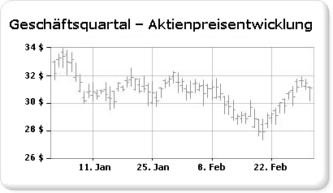

# Kursdiagramme (Berichts-Generator und SSRS)

  Ein Kursdiagramm ist speziell für Finanz- oder wissenschaftliche Daten ausgelegt, bei denen bis zu vier Werte pro Datenpunkt verwendet werden. Diese Werte werden an den Hoch-, Tief-, Anfangs- und Schlusswerten ausgerichtet, die zur Aufzeichnung von Finanzkursdaten verwendet werden. Dieser Diagrammtyp zeigt Anfangs- und Schlusswerte mit Markern, normalerweise Zeilen oder Dreiecke, an. Im folgenden Beispiel werden die Anfangswerte durch Marker auf der linken Seite angezeigt, und die Schlusswerte werden durch Marker auf der rechten Seite dargestellt.  
  
   
  
 Ein Beispiel eines börsendiagramms ist als eine Berichts-Generator-Beispielbericht verfügbar. Weitere Informationen zum Herunterladen dieses Beispielberichts und anderer finden Sie unter [Beispielberichte für Berichts-Generator und Berichts-Designer](http://go.microsoft.com/fwlink/?LinkId=198283).  
  
> [!NOTE]  
>  [!INCLUDE[ssRBRDDup](../../includes/ssrbrddup-md.md)]  
  
## Variationen  
  
-   **Kerze**. Das Kerzendiagramm ist eine spezielle Form des Kursdiagramms, in dem mithilfe von Kästchen der Unterschied zwischen Anfangs- und Schlusswerten angezeigt wird. Wie das Kursdiagramm kann das Kerzendiagramm bis zu vier Werte pro Datenpunkt anzeigen.  
  
## Überlegungen zu Daten für ein Kursdiagramm  
  
-   Bei der Darstellung vieler Kursdatenpunkte, wie bei einem Jahresaktienkurs, ist es schwierig, die einzelnen Anfangs-, Schluss-, Hoch- und Tiefwerte jedes Datenpunkts zu unterscheiden. Erwägen Sie in diesem Fall, ein Liniendiagramm anstelle eines Kursdiagramms zu verwenden.  
  
-   Wenn Achsenbezeichnungen generiert werden, fängt die Kennzeichnung normalerweise auf dem Nullpunkt an.  Im Allgemeinen fluktuieren Aktienkurse nicht so stark wie anderen Datasets. Deshalb ist es eventuell sinnvoll, den Beginn der Achsenbezeichnungen auf dem Nullpunkt zu deaktivieren, um eine bessere Übersicht über Ihre Daten zu erhalten. Legen sie hierzu im Dialogfeld **Achseneigenschaften** oder im Fenster **Eigenschaften** die Option **IncludeZero** auf false fest. Weitere Informationen zum Generieren von Achsenbezeichnungen in einem Diagramm finden Sie unter [Formatieren von Achsenbezeichnungen in einem Diagramm &#40;Berichts-Generator und SSRS&#41;](../../reporting-services/report-design/formatting-axis-labels-on-a-chart-report-builder-and-ssrs.md).  
  
-   [!INCLUDE[ssRSnoversion](../../includes/ssrsnoversion-md.md)] bietet viele berechnete Zellen zur Verwendung mit Kursdiagrammen, wie "Price Indicator", "Relative Strength Index", "MACD" usw.  

## Nächste Schritte

[Bereichsdiagramme](../../reporting-services/report-design/range-charts-report-builder-and-ssrs.md)   
[Diagramme](../../reporting-services/report-design/charts-report-builder-and-ssrs.md)   
[Formatieren eines Diagramms](../../reporting-services/report-design/formatting-a-chart-report-builder-and-ssrs.md)   
[Achse-Eigenschaften (Dialogfeld), Achsenoptionen](http://msdn.microsoft.com/library/b276e210-7a12-48ae-971b-7dabae51df11)  

Weiteren Fragen wenden? [Versuchen Sie das Reporting Services-Forum stellen](http://go.microsoft.com/fwlink/?LinkId=620231)
