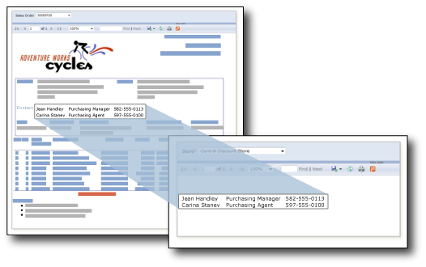

# Unterberichte (Berichts-Generator und SSRS)
  Ein Unterbericht ist ein Berichtselement, das einen anderen Bericht innerhalb des Hauptteils eines Hauptberichts anzeigt. Grundsätzlich ist ein Unterbericht in einem Bericht mit einem Frame in einer Webseite vergleichbar. Er wird dazu verwendet, einen Bericht innerhalb eines Berichts einzubetten. Jeder Bericht kann als Unterbericht verwendet werden. Der als Unterbericht angezeigte Bericht wird auf einem Berichtsserver gespeichert, normalerweise im gleichen Ordner wie der übergeordnete Bericht. Sie können den übergeordneten Bericht zum Übergeben von Parametern an den Unterbericht einrichten. Ein Unterbericht kann innerhalb von Datenbereichen wiederholt werden. Dabei wird ein Parameter zum Filtern von Daten in jeder Instanz des Unterberichts verwendet.  
  
> [!NOTE]  
>  Wenn Sie einen Unterbericht in einem Tablix-Datenbereich verwenden, werden der Unterbericht und seine Parameter für jede Zeile verarbeitet. Wenn viele Zeilen vorhanden sind, sollten Sie sich in einem solchen Fall überlegen, ob ein Drillthroughbericht nicht besser geeignet ist.  
  
   
  
 In dieser Abbildung stammen die im Hauptbericht "Verkaufsauftrag" angezeigten Kontaktinformationen eigentlich aus einem Unterbericht "Kontakte".  
  
> [!NOTE]  
>  [!INCLUDE[ssRBRDDup](../../includes/ssrbrddup-md.md)]  
  
## Vergleich von Unterberichten und geschachtelten Datenbereichen  
 Wenn Sie vorhaben, separate Datengruppen mithilfe von Unterberichten anzuzeigen, können Sie stattdessen ggf. Datenbereiche wie Tabellen, Matrizen und Diagramme verwenden. Berichte, die nur Datenbereiche enthalten, bieten möglicherweise eine bessere Leistung als Berichte mit Unterberichten.  
  
 Verwenden Sie Datenbereiche, um Datengruppen aus derselben Datenquelle innerhalb eines einzelnen Datenbereichs zu schachteln. Verwenden Sie Unterberichte, um Datengruppen aus verschiedenen Datenquellen innerhalb eines einzelnen Datenbereichs zu schachteln, einen Unterbericht in mehreren übergeordneten Berichten wieder zu verwenden oder einen eigenständigen Bericht in einem anderen Bericht anzuzeigen. Sie können z. B. eine Art Lagebesprechungsprotokoll erstellen, indem Sie mehrere Unterberichte innerhalb des Hauptteils eines anderen Berichts einfügen.  
  
 Datenbereiche bieten weitgehend dieselbe Funktionalität und Flexibilität wie Unterberichte, aber mit besserer Leistung. Da auf dem Berichtsserver jede Instanz eines Unterberichts als separater Bericht verarbeitet wird, wirkt sich dies u. U. negativ auf die Leistung aus. Weitere Informationen finden Sie unter [Geschachtelte Datenbereiche &#40;Berichts-Generator und SSRS&#41;](../../reporting-services/report-design/nested-data-regions-report-builder-and-ssrs.md).  
  
## Verwenden von Parametern in Unterberichten  
 Um Parameter vom übergeordneten Bericht an den Unterbericht zu übergeben, definieren Sie in dem Bericht, den Sie als Unterbericht verwenden, einen Berichtsparameter. Wenn Sie den Unterbericht im übergeordneten Bericht platzieren, können Sie den Berichtsparameter und einen Wert auswählen, der vom übergeordneten Bericht an den Berichtsparameter im Unterbericht übergeben wird.  
  
> [!NOTE]  
>  Der aus dem Unterbericht ausgewählte Parameter ist ein Berichtsparameter, kein Abfrageparameter.  
  
 Ein Unterbericht kann im Hauptteil des Berichts oder in einem Datenbereich platziert werden. Wenn ein Unterbericht in einem Datenbereich platziert wird, wird dieser mit jeder Instanz der Gruppe oder Zeile im Datenbereich wiederholt. Um einen Wert von der Gruppe oder Zeile an den Unterbericht zu übergeben, verwenden Sie in der Value-Eigenschaft des Unterberichts für das Feld einen Feldausdruck mit dem Wert, den Sie an den Parameter des Unterberichts übergeben möchten.  
  
 Weitere Informationen zum Arbeiten mit Unterberichten finden Sie unter [Hinzufügen eines Unterberichts und Hinzufügen von Parametern &#40;Berichts-Generator und SSRS&#41;](../../reporting-services/report-design/add-a-subreport-and-parameters-report-builder-and-ssrs.md).  
  
## Angeben von Unterberichtsnamen und Speicherorten  
 Sie können einen Hauptbericht entwerfen, um in einem anderen Ordner auf demselben Berichtsserver einen Unterbericht anzugeben.  
  
 Die zum Angeben des Unterberichts verwendete Syntax hängt davon ab, ob der Berichtsserver im einheitlichen Modus oder im integrierten SharePoint-Modus ausgeführt wird. Weitere Informationen finden Sie unter [Angeben von Pfaden zu externen Elementen &#40;Berichts-Generator und SSRS&#41;](../../reporting-services/report-design/specifying-paths-to-external-items-report-builder-and-ssrs.md).  
  
 Um im Berichts-Generator einen Unterbericht eines Hauptberichts in der Vorschau anzuzeigen, müssen beide Berichte auf demselben Berichtsserver gespeichert sein, oder Sie müssen einen vollständigen Pfad zum Unterbericht angeben.  
  
## Siehe auch  
 [Drillthrough, Drilldown, Unterberichte und geschachtelte Datenbereiche &#40;Berichts-Generator und SSRS&#41;](../../reporting-services/report-design/drillthrough, drilldown, subreports, and nested data regions.md)  
  
  