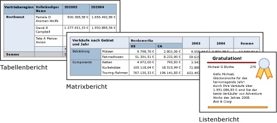

# Tabellen, Matrizen und Listen (Berichts-Generator und SSRS)
 In [!INCLUDE[ssRSnoversion_md](../../includes/ssrsnoversion-md.md)]sind Tabellen, Matrizen und Listen *Datenbereiche* , in denen Daten paginierter Berichte in Zellen angezeigt werden, die in Zeilen und Spalten angeordnet sind. Die Zellen enthalten in der Regel Textdaten wie Text, Datumsangaben und Zahlen, können jedoch auch Messgeräte, Diagramme oder Berichtselemente wie Bilder enthalten. Als Ganzes gesehen werden Tabellen, Matrizen und Listen häufig als *Tablix* -Datenbereiche bezeichnet.  
  
 Die Tabellen-, Matrix- und Listenvorlagen werden auf Grundlage des Tablix-Datenbereichs erstellt, der als flexibles Raster Daten in Zellen anzeigen kann. In den Tabellen- und Matrixvorlagen werden Zellen in Zeilen und Spalten angeordnet. Da Vorlagen Variationen des zugrunde liegenden generischen Tablix-Datenbereichs sind, können Sie Daten in einer Kombination von Vorlagenformaten anzeigen und die Tabelle, Matrix oder Liste so ändern, dass die Funktionen eines anderen Datenbereichs aufgenommen werden, während Sie den Bericht weiterentwickeln. Wenn Sie zum Beispiel eine Tabelle hinzufügen und feststellen, dass sie nicht Ihren Vorstellungen entspricht, können Sie Spaltengruppen hinzufügen und die Tabelle so in eine Matrix umwandeln.  
  
 Die Tabellen- und Matrixdatenbereiche können komplexe Datenbeziehungen anzeigen, indem sie geschachtelte Tabellen, Matrizen, Listen, Diagramme und Messgeräte einschließen. Tabellen und Matrizen haben ein Tabellenlayout. Die Daten stammen aus einem einzelnen Dataset, das auf einer einzelnen Datenquelle beruht. Der Hauptunterschied zwischen Tabellen und Matrizen ist, dass Tabellen nur Zeilengruppen enthalten können, während Matrizen Zeilengruppen und Spaltengruppen enthalten.  
  
 Listen unterscheiden sich leicht davon. Sie unterstützen ein freies Layout und können mehrere Peertabellen oder -matrizen umfassen, von denen jede ein anderes Dataset verwendet. Listen können auch für Formulare verwendet werden, z. B. für Rechnungen.  
  
 In den folgenden Bildern werden einfache Berichte mit einer Tabelle, Matrix oder Liste angezeigt.  
  
   
  
 Die folgenden Tutorials ermöglichen Ihnen einen schnellen Einstieg: [Tutorial: Erstellen eines einfachen Tabellenberichts &#40;Berichts-Generator&#41;](../../reporting-services/tutorial-creating-a-basic-table-report-report-builder.md), [Tutorial: Erstellen eines Matrixberichts &#40;Berichts-Generator&#41;](../../reporting-services/tutorial-creating-a-matrix-report-report-builder.md) und [Tutorial: Erstellen eines Freiformberichts &#40;Berichts-Generator&#41;](../../reporting-services/tutorial-creating-a-free-form-report-report-builder.md).  
  
> [!NOTE]  
>  Sie können Tabellen, Matrizen und Listen getrennt von einem Bericht als Berichtsteile veröffentlichen. Erfahren Sie mehr über [Berichtsteile](../../reporting-services/report-design/report-parts-report-builder-and-ssrs.md).  
  
##   Tabelle  
 Mithilfe einer Tabelle können Sie Detaildaten anzeigen und/oder Daten in Zeilengruppen anordnen. Die Tabellenvorlage enthält drei Spalten mit einer Tabellenkopfzeile und einer Detailzeile für Daten. Die folgende Abbildung zeigt die ursprüngliche Tabellenvorlage für die Auswahl auf der Entwurfsoberfläche:  
  
   
  
 Sie können Daten nach einzelnen Feldern, mehreren Feldern oder unter Verwendung eigener Ausdrücke gruppieren. Sie können geschachtelte Gruppen oder unabhängige, angrenzende Gruppen erstellen und aggregierte Werte für gruppierte Daten anzeigen oder Gruppen Gesamtergebnisse hinzufügen. Wenn die Tabelle beispielsweise eine Zeilengruppe mit dem Namen [Kategorie] enthält, können Sie ein Teilergebnis für jede Gruppe sowie ein Gesamtergebnis für den Bericht hinzufügen. Um die Darstellung der Tabelle zu verbessern und Daten hervorzuheben, die Sie herausstellen möchten, können Sie Zellen miteinander verbinden und Daten und Tabellenüberschriften formatieren.  
  
 Sie können Detaildaten oder gruppierte Daten zunächst ausblenden und Benutzern mithilfe von Drilldownelementen eine interaktive Auswahl der anzuzeigenden Elemente ermöglichen.  
  
 Weitere Informationen finden Sie unter [Tabellen &#40;Berichts-Generator und SSRS&#41;](../../reporting-services/report-design/tables-report-builder-and-ssrs.md).  
  
##   Matrix  
 Mithilfe einer Matrix können Sie analog zu einer PivotTable oder einer Kreuztabelle Zusammenfassungen von aggregierten Daten in Zeilen- und Spaltengruppen anzeigen. Die Anzahl der Zeilen und Spalten für Gruppen wird von der Anzahl der eindeutigen Werte für die einzelnen Zeilen- und Spaltengruppen bestimmt. Die folgende Abbildung zeigt die ursprüngliche Matrixvorlage für die Auswahl auf der Entwurfsoberfläche:  
  
   
  
 Sie können Daten nach mehreren Feldern oder Ausdrücken in Zeilen- und Spaltengruppen gruppieren. Wenn die Berichtsdaten und die Datenbereiche zur Laufzeit kombiniert werden, wächst eine Matrix horizontal und vertikal in dem Maß, in dem auf der Seite Spalten für Spaltengruppen und Zeilen für Zeilengruppen hinzugefügt werden. Die Matrixzellen zeigen aggregierte Werte für die Schnittmenge der Zeilen- und Spaltengruppen, zu denen die Zelle gehört. Wenn die Matrix beispielsweise eine Zeilengruppe (Kategorie) und zwei Spaltengruppen (Gebiet und Jahr) hat, aus denen die Summe der Verkäufe hervorgeht, zeigt der Bericht zwei Zellen mit den Summen der Verkäufe für jeden Wert in der Kategoriegruppe an. Der Bereich der Zellen der zwei Schnittmengen sind: Kategorie und Gebiet sowie Kategorie und Jahr. Die Matrix kann geschachtelte und angrenzende Gruppen enthalten. Geschachtelte Gruppen verfügen über eine Über-/Unterordnungsbeziehung, während angrenzende Gruppen gleichgestellt sind. Sie können Teilergebnisse für einzelne und alle Ebenen von geschachtelten Zeilen- und Spaltengruppen innerhalb der Matrix hinzufügen.  
  
 Um die Matrixdaten besser lesbar zu machen und die Daten hervorzuheben, die Sie herausstellen möchten, können Sie Zellen miteinander verbinden oder horizontal und vertikal teilen und Daten- und Gruppenüberschriften formatieren.  
  
 Sie können auch Drilldownschalter einfügen, mit denen die Detaildaten anfänglich ausgeblendet werden. Benutzer können dann auf die Schalter klicken, um nach Bedarf ausführlichere bzw. weniger Details anzuzeigen.  
  
 Weitere Informationen finden Sie unter [Erstellen einer Matrix (Berichts-Generator und SSRS)](../../reporting-services/report-design/create-a-matrix-report-builder-and-ssrs.md).  
  
##   Liste  
 Erstellen Sie mithilfe einer Liste ein Freiformatlayout. Sie sind nicht auf ein Gitternetzlayout beschränkt, sondern können Felder in der Liste frei platzieren. Mit einer Liste können Sie ein Formular zum Anzeigen einer Vielzahl von Datasetfeldern entwerfen, oder Sie können die Liste als Container zum Anzeigen mehrerer Datenbereiche nebeneinander für gruppierte Daten verwenden. Beispielsweise können Sie eine Gruppe für eine Liste definieren, eine Tabelle, ein Diagramm oder ein Bild hinzufügen, oder Sie können Gruppenwerte in Tabellenform oder als Grafiken anzeigen, wie bei Angestellten- oder Patientendatensätzen.  
  
   
  
 Weitere Informationen finden Sie unter [Erstellen von Rechnungen und Formularen mit Listen (Berichts-Generator und SSRS)].  
  
##   Vorbereiten der Daten  
 In einem Tabellen-, Matrix- und Listendatenbereich werden Daten aus einem Dataset angezeigt. Sie können die Daten in der Abfrage vorbereiten, aus der die Daten für das Dataset abgerufen werden, oder indem Sie die Eigenschaften in der Tabelle, Matrix oder Liste festlegen.  
  
 Mit den Abfragesprachen wie z. B. [!INCLUDE[tsql](../../includes/tsql-md.md)], mit denen Sie die Daten für die Berichtsdatasets abrufen, können Sie die Daten vorbereiten. Wenden Sie dazu Filter an, um nur eine Teilmenge der Daten aufzunehmen, ersetzen Sie NULL-Werte oder Leerzeichen durch Konstanten, damit der Bericht lesbarer wird, und sortieren und gruppieren Sie die Daten.  
  
 Wenn Sie die Daten im Tabellen-, Matrix- oder Listendatenbereich eines Berichts vorbereiten möchten, legen Sie Eigenschaften für den Datenbereich oder die Zellen innerhalb des Datenbereichs fest. Wenn Sie die Daten filtern oder sortieren möchten, legen Sie die Eigenschaften für den Datenbereich fest. Um etwa die Spalten zu sortieren, geben Sie die Spalten, die sortiert werden sollen, und die Sortierreihenfolge an. Wenn Sie einen alternativen Wert für ein Feld angeben möchten, legen Sie die Werte des Zellentexts fest, der im Feld angezeigt wird. Verwenden Sie beispielsweise einen Ausdruck zum Festlegen des Werts, wenn Sie Leer anzeigen möchten, falls ein Feld leer oder NULL ist.  
  
 Weitere Informationen finden Sie unter [Vorbereiten von Daten für die Anzeige in einem Tablix-Datenbereich &#40;Berichts-Generator und SSRS&#41;](../../reporting-services/report-design/preparing-data-for-display-in-a-tablix-data-region-report-builder-and-ssrs.md).  
  
##   Erstellen und Konfigurieren einer Tabelle, Matrix oder Liste  
 Wenn Sie dem Bericht Tabellen oder Matrizen hinzufügen, können Sie den Tabellen- und Matrix-Assistenten verwenden oder die Tabellen bzw. Matrizen aus den Vorlagen, die Berichts-Generator und Berichts-Designer bereitstellen, manuell erstellen. Listen werden manuell aus der Listenvorlage erstellt.  
  
 Der Assistent führt Sie durch die Schritte, damit Sie schnell eine Tabelle oder Matrix erstellen und konfigurieren können. Nachdem Sie den Assistenten abgeschlossen oder die Tablix-Datenbereiche von Grund auf neu erstellt haben, können Sie diese weiter konfigurieren und verfeinern. Mit den Dialogfeldern, die über die Kontextmenüs der Datenbereiche geöffnet werden können, können die am häufigsten verwendeten Eigenschaften für Seitenumbrüche, Wiederholbarkeit und Sichtbarkeit von Kopf- und Fußzeilen, Anzeigeoptionen, Filter und Sortierung einfach festgelegt werden. Der Tablix-Datenbereich verfügt jedoch außerdem über viele zusätzliche Eigenschaften, Sie nur im Eigenschaftenbereich des Berichts-Generators festlegen können. Wenn Sie z.B. eine Meldung anzeigen möchten, wenn das Dataset einer Tabelle, Matrix oder Liste leer ist, geben Sie den Meldungstext im Bereich „Eigenschaften“ der NoRowsMessage-Tablix-Eigenschaft an.  
  
##   Wechseln zwischen Tablix-Vorlagen  
 Sie sind nicht auf die anfänglich ausgewählte Tablix-Vorlage beschränkt. Sie können Ihren Tablix-Entwurf beim Hinzufügen von Gruppen, Gesamtwerten und Bezeichnungen ändern. Beispielsweise können Sie mit einer Tabelle beginnen und dann die Detailzeile löschen und Spaltengruppen hinzufügen. Weitere Informationen finden Sie unter [Untersuchen der Flexibilität eines Tablix-Datenbereichs &#40;Berichts-Generator und SSRS&#41;](../../reporting-services/report-design/exploring-the-flexibility-of-a-tablix-data-region-report-builder-and-ssrs.md).  
  
 Sie können eine Tabelle, Matrix oder Liste weiterentwickeln, indem Sie eine beliebige Tablix-Funktion hinzufügen. Zu den Tablix-Funktionen gehört das Anzeigen von Detaildaten oder Aggregaten für gruppierte Daten in Zeilen und Spalten. Sie können geschachtelte Gruppen, unabhängige angrenzende Gruppen oder rekursive Gruppen erstellen. Gruppierte Daten können gefiltert und sortiert werden, und Sie können Gruppen mithilfe mehrerer Gruppenausdrücke in einer Gruppendefinition einfach kombinieren.  
  
 Sie können auch Ergebnisse für eine Gruppe oder Gesamtergebnisse für den Datenbereich hinzufügen. Sie können Zeilen oder Spalten ausblenden, um Berichte zu vereinfachen, und Sie können Benutzern ermöglichen, die Anzeige ausgeblendeter Daten wie bei einem Drilldownbericht ein- und auszuschalten. Weitere Informationen finden Sie unter [Steuern der Tablix-Datenbereichsanzeige auf einer Berichtsseite &#40;Berichts-Generator und SSRS&#41;](../../reporting-services/report-design/controlling-the-tablix-data-region-display-on-a-report-page.md).  
  
##   Themen zur Vorgehensweise  
 In diesem Abschnitt werden Vorgehensweisen aufgeführt, die Ihnen Schritt für Schritt zeigen, wie Sie mit Tabellen, Matrizen und Listen in ihren Berichten arbeiten, wie Sie Daten in Zeilen und Spalten anzeigen, Spalten hinzuzufügen und löschen, Zellen zusammenführen und Teilergebnisse für Zeilen- und Spaltengruppen aufnehmen.  
  
-   [Hinzufügen einer Detailgruppe &#40;Berichts-Generator und SSRS&#41;](../../reporting-services/report-design/add-a-details-group-report-builder-and-ssrs.md)  
  
-   [Hinzufügen eines Gesamtergebnisses zu einer Gruppe oder einem Tablix-Datenbereich &#40;Berichts-Generator und SSRS&#41;](../../reporting-services/report-design/add-a-total-to-a-group-or-tablix-data-region-report-builder-and-ssrs.md)  
  
-   [Ändern eines Elements in einer Zelle &#40;Berichts-Generator und SSRS&#41;](../../reporting-services/report-design/change-an-item-within-a-cell-report-builder-and-ssrs.md)  
  
-   [Ändern der Zeilenhöhe oder der Spaltenbreite &#40;Berichts-Generator und SSRS&#41;](../../reporting-services/report-design/change-row-height-or-column-width-report-builder-and-ssrs.md)  
  
-   [Einfügen oder Löschen einer Spalte &#40;Berichts-Generator und SSRS&#41;](../../reporting-services/report-design/insert-or-delete-a-column-report-builder-and-ssrs.md)  
  
-   [Einfügen oder Löschen einer Zeile &#40;Berichts-Generator und SSRS&#41;](../../reporting-services/report-design/insert-or-delete-a-row-report-builder-and-ssrs.md)  
  
-   [Zusammenführen von Zellen in einem Datenbereich &#40;Berichts-Generator und SSRS&#41;](../../reporting-services/report-design/merge-cells-in-a-data-region-report-builder-and-ssrs.md)  
  
-   [Erstellen einer rekursiven Hierarchiegruppe &#40;Berichts-Generator und SSRS&#41;](../../reporting-services/report-design/create-a-recursive-hierarchy-group-report-builder-and-ssrs.md)  
  
-   [Hinzufügen oder Löschen einer Gruppe in einem Datenbereich &#40;Berichts-Generator und SSRS&#41;](../../reporting-services/report-design/add-or-delete-a-group-in-a-data-region-report-builder-and-ssrs.md)  
  
-   [Anzeigen von Kopf- und Fußzeilen einer Gruppe &#40;Berichts-Generator und SSRS&#41;](../../reporting-services/report-design/display-headers-and-footers-with-a-group-report-builder-and-ssrs.md)  
  
-   [Erstellen von abgestuften Berichten &#40;Berichts-Generator und SSRS&#41;](../../reporting-services/report-design/create-a-stepped-report-report-builder-and-ssrs.md)  
  
-   [Hinzufügen, Verschieben oder Löschen einer Tabelle, Matrix oder Liste &#40;Berichts-Generator und SSRS&#41;](../../reporting-services/report-design/add-move-or-delete-a-table-matrix-or-list-report-builder-and-ssrs.md)  
  
##   In diesem Abschnitt  
 In den folgenden Themen finden Sie zusätzliche Informationen zum Arbeiten mit den Tablix-Datenbereichen.  
  
 [Tablix-Datenbereich &#40;Berichts-Generator und SSRS&#41;](../../reporting-services/report-design/tablix-data-region-report-builder-and-ssrs.md)  
 Erklärt die wichtigsten Konzepte im Zusammenhang mit Tablix-Datenbereichen, z. B. Bereiche der Tablix, Detail- und Gruppendaten, Spalten- und Zeilengruppen sowie statische und dynamische Zeilen und Spalten.  
  
 [Hinzufügen von Daten zu einem Tablix-Datenbereich &#40;Berichts-Generator und SSRS&#41;](../../reporting-services/report-design/adding-data-to-a-tablix-data-region-report-builder-and-ssrs.md)  
 Stellt ausführliche Informationen zum Hinzufügen von Detail- und Gruppendaten, zu Teilergebnissen und Gesamtbeträgen und zu den Bezeichnungen eines Tablix-Datenbereichs dar.  
  
 [Steuern der Tablix-Datenbereichsanzeige auf einer Berichtsseite &#40;Berichts-Generator und SSRS&#41;](../../reporting-services/report-design/controlling-the-tablix-data-region-display-on-a-report-page.md)  
 Beschreibt die Eigenschaften für einen Tablix-Datenbereich, die Sie modifizieren können, um die Darstellung eines Tablix-Datenbereichs bei der Anzeige des Datenbereichs in einem Bericht zu ändern.  
  
 [Steuern von Zeilen- und Spaltenüberschriften &#40;Berichts-Generator und SSRS&#41;](../../reporting-services/report-design/controlling-row-and-column-headings-report-builder-and-ssrs.md)  
 Beschreibt, wie Sie die Zeilen- und Spaltenüberschriften steuern können, wenn eine Tabelle, eine Matrix oder ein Listendatenbereich horizontal oder vertikal mehrere Seiten umfasst.  
  
 [Erstellen von rekursiven Hierarchiegruppen &#40;Berichts-Generator und SSRS&#41;](../../reporting-services/report-design/creating-recursive-hierarchy-groups-report-builder-and-ssrs.md)  
 Beschreibt, wie rekursive Daten angezeigt werden, wenn die Beziehung zwischen übergeordnetem Element und untergeordnetem Element durch Felder im Dataset dargestellt wird.  
  
 [Grundlegendes zu Gruppen &#40;Berichts-Generator und SSRS&#41;](../../reporting-services/report-design/understanding-groups-report-builder-and-ssrs.md)  
 Erklärt, was Gruppen sind und wann Sie verwendet werden, und beschreibt die Gruppen, die für die unterschiedlichen Tablix-Datenbereiche verfügbar sind.  
  
## Siehe auch  
 [Hinzufügen von Datasetfiltern, Datenbereichsfiltern und Gruppenfiltern &#40;Berichts-Generator und SSRS&#41;](../../reporting-services/report-design/add-dataset-filters-data-region-filters-and-group-filters.md)   
 [Geschachtelte Datenbereiche &#40;Berichts-Generator und SSRS&#41;](../../reporting-services/report-design/nested-data-regions-report-builder-and-ssrs.md)   
 [Verknüpfen mehrerer Datenbereiche mit einem Dataset &#40;Berichts-Generator und SSRS&#41;](../../reporting-services/report-design/linking-multiple-data-regions-to-the-same-dataset-report-builder-and-ssrs.md)   
 [Ausdrücke &#40;Berichts-Generator und SSRS&#41;](../../reporting-services/report-design/expressions-report-builder-and-ssrs.md)   
 [Filtern, Gruppieren und Sortieren von Daten &#40;Berichts-Generator und SSRS&#41;](../../reporting-services/report-design/filter-group-and-sort-data-report-builder-and-ssrs.md)   
 [Berichtsparameter &#40;Berichts-Generator und Berichts-Designer&#41;](../../reporting-services/report-design/report-parameters-report-builder-and-report-designer.md)   
 [Diagramme &#40;Berichts-Generator und SSRS&#41;](../../reporting-services/report-design/charts-report-builder-and-ssrs.md)   
 [Messgeräte &#40;Berichts-Generator und SSRS&#41;](../../reporting-services/report-design/gauges-report-builder-and-ssrs.md)  
  
  
