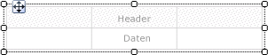
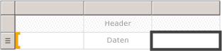
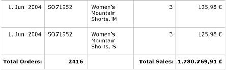
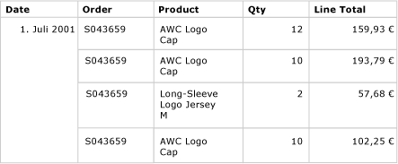
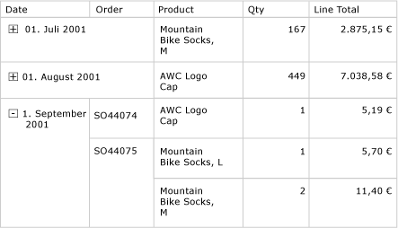

# Tabellen (Berichts-Generator und SSRS)
 Sie können in [!INCLUDE[ssRSnoversion_md](../../includes/ssrsnoversion-md.md)]eine Tabelle zum Anzeigen von Detaildaten oder gruppierten Daten verwenden, oder eine Kombination von beiden Daten in einem paginierten Bericht.   
   
 Sie können Daten nach einzelnen Feldern, mehreren Feldern oder unter Verwendung eigener Ausdrücke gruppieren. Sie können geschachtelte Gruppen oder unabhängige angrenzende Gruppen erstellen. Wenn Sie aggregierte Werte für gruppierte Daten anzeigen möchten, fügen Sie Gruppen Gesamtwerte hinzu. Formatieren Sie die Zeilen und Spalten, um die Daten zu markieren, die Sie hervorheben möchten. Sie können Detaildaten oder gruppierte Daten zunächst ausblenden und Benutzern mithilfe von Drilldownelementen eine interaktive Auswahl der anzuzeigenden Elemente ermöglichen.  
  
 Um schnell mit den Tabellen zu beginnen, gehen Sie zu [Tutorial: Erstellen eines einfachen Tabellenberichts &#40;Berichts-Generator&#41;](../../reporting-services/tutorial-creating-a-basic-table-report-report-builder.md) oder [Erstellen eines einfachen Tabellenberichts &#40;SSRS-Tutorial&#41;](../../reporting-services/create-a-basic-table-report-ssrs-tutorial.md).  
  
> [!NOTE]  
>  Sie können Tabellen in einem Bericht als Berichtsteile getrennt veröffentlichen. Erfahren Sie mehr über [Berichtsteile](../../reporting-services/report-design/report-parts-report-builder-and-ssrs.md).  
  
  
##   Hinzufügen einer Tabelle zum Anzeigen von Detaildaten  
 Fügen Sie der Entwurfsoberfläche über die Registerkarte "Einfügen" auf dem Menüband eine Tabelle hinzu. Sie können eine Tabelle mit dem Tabellen- oder Matrix-Assistenten hinzufügen (einschließlich der Erstellung einer Datenquellenverbindung und eines Datasets und der Konfiguration der Tabelle) oder eine Tabelle auf Grundlage der Tabellenvorlage hinzufügen, die Sie manuell konfigurieren.  
  
> [!NOTE]  
>  Der Assistent ist nur in Berichts-Generator verfügbar.  
  
 Für die Beschreibung der Konfiguration einer Tabelle von Anfang bis Ende wird in diesem Thema die Tabellenvorlage verwendet.  
  
 Neue Tabellen weisen standardmäßig eine feste Anzahl an Spalten mit einer Kopfzeile für Bezeichnungen sowie einer Datenzeile für Detaildaten auf. Die folgende Abbildung zeigt eine neue Tabelle, die der Entwurfsoberfläche hinzugefügt wurde.  
  
   
  
 Wenn Sie die Tabelle auswählen, werden Zeilen- und Spaltenhandles an der Außenseite der Tabelle angezeigt; in den Zellen werden Klammern angezeigt. Zeilenhandles zeigen Grafiken an, die Ihnen helfen, den Zweck der einzelnen Zeilen zu verstehen. Klammern geben die Gruppenmitgliedschaft für eine ausgewählte Zelle an. Die folgende Abbildung zeigt eine ausgewählte leere Zelle in einer Standardtabelle an.  
  
   
  
 Der Zeilenziehpunkt für die Datenzeile zeigt das Detailsymbol (). Ziehen Sie Felder aus dem Berichtsdatenbereich in die Zellen der Tabelle in der Kopf- oder Detailzeile, um Daten in diesen Zeilen anzuzeigen. Beide Zeilen werden gleichzeitig gefüllt. Ziehen Sie das Feld in die Tabelle, bis eine Einfügemarke angezeigt wird, um weitere Spalten hinzuzufügen. Nach dem Hinzufügen von Datasetfeldern zur Tabelle können Sie die Standardformate für Datum und Währung für die Anzeige im Bericht ändern. Das folgende Diagramm zeigt einen Tabellendatenbereich mit folgenden Feldern: Date, Order, Product, Qty und Line Total.  
  
   
  
 Überprüfen Sie den Entwurf, indem Sie den Bericht in der Vorschau anzeigen. Die Tabelle wird nach Bedarf nach unten erweitert. Die Bezeichnungszeile und die Detailzeile werden für jede Zeile im Resultset für die Datasetabfrage jeweils einmal angezeigt. Jedes Produkt, das im Rahmen der Bestellung verkauft wird, wird unter Angabe der Menge und Zeilensumme für das Element in einer eigenen Zeile angezeigt, wie die folgende Abbildung zeigt:  
  
   
  
 Die Tabelle, die Sie zu Beginn verwenden, stellt eine Vorlage auf Grundlage des Tablix-Datenbereichs dar. Sie können die Tabelle durch Hinzufügen von Funktionen erweitern, die vom zugrunde liegenden Tablix-Datenbereich unterstützt werden. Weitere Informationen finden Sie unter [Steuern der Tablix-Datenbereichsanzeige auf einer Berichtsseite &#40;Berichts-Generator und SSRS&#41;](../../reporting-services/report-design/controlling-the-tablix-data-region-display-on-a-report-page.md). Sie können die Tabelle auch weiterentwickeln, indem Sie Zeilengruppen und/oder Spaltengruppen hinzufügen oder indem Sie Detailgruppen hinzufügen oder entfernen. Weitere Informationen finden Sie unter [Untersuchen der Flexibilität eines Tablix-Datenbereichs &#40;Berichts-Generator und SSRS&#41;](../../reporting-services/report-design/exploring-the-flexibility-of-a-tablix-data-region-report-builder-and-ssrs.md).  
  
### Hinzufügen von Gesamtwerten für Detaildaten  
 Wählen Sie Zellen mit numerischen Daten aus, um Gesamtwerte hinzuzufügen, und fügen Sie anschließend mithilfe des Kontextmenüs Bezeichnungen und Gesamtwerte für Detaildaten von numerischen Feldern hinzu. Weitere Bezeichnungen und Gesamtwerte können auch manuell angegeben werden. Die folgende Abbildung zeigt eine Standardergebniszeile mit Gesamtwerten an, die sowohl manuell als auch automatisch angegeben wurden:  
  
   
  
 In der Vorschau werden im Bericht die Kopfzeile und die Detailzeile für jede Zeile im Resultset für die Datasetabfrage jeweils einmal angezeigt; außerdem wird die Ergebniszeile angezeigt. Die folgende Abbildung zeigt die letzten Zeilen der Tabelle einschließlich des Zeilengesamtergebnisses.  
  
   
  
 Weitere Informationen finden Sie unter [Hinzufügen eines Gesamtergebnisses zu einer Gruppe oder einem Tablix-Datenbereich &#40;Berichts-Generator und SSRS&#41;](../../reporting-services/report-design/add-a-total-to-a-group-or-tablix-data-region-report-builder-and-ssrs.md).  
  
##   Hinzufügen von Zeilengruppen zu einer Tabelle  
 Analog zum Anzeigen von Detaildaten durch Ziehen eines Felds aus dem Berichtsdatenbereich in eine Zelle können Sie auch Felder in den Gruppierungsbereich ziehen, um Gruppen hinzuzufügen. Ziehen Sie das Feld bei einer Tabelle in den Bereich Zeilengruppen. Nach dem Hinzufügen einer Gruppe werden neuen Spalten im Zeilengruppenbereich von der Tabelle automatisch Zellen hinzugefügt, in denen die Gruppenwerte angezeigt werden. Weitere Informationen zu Bereichen finden Sie unter [Zonen des Tablix-Datenbereichs (Berichts-Generator und SSRS)](../../reporting-services/report-design/tablix-data-region-areas-report-builder-and-ssrs.md).  
  
 Die folgende Abbildung zeigt eine Tabelle mit zwei geschachtelten Zeilengruppen in der Entwurfsansicht. Die Zeilengruppen wurden erstellt, indem zunächst das Feld Order und anschließend das Feld Date in den Zeilengruppenbereich gezogen und jede Gruppe als übergeordnetes Element der vorhandenen Gruppen hinzugefügt wurden. Die Abbildung zeigt eine übergeordnete Gruppe auf Basis des Datums sowie eine untergeordnete Gruppe auf Basis der Bestellnummer an; außerdem wird die standardmäßig definierte Detailgruppe angezeigt.  
  
   
  
 In der Vorschau werden die Bestelldaten im Bericht zunächst nach Datum und anschließend nach Bestellung angeordnet angezeigt, wie die folgende Abbildung zeigt.  
  
   
  
 Gruppierte Daten können auch durch Festlegen eines Einzugs für die Gruppenhierarchie angezeigt werden, um die geschachtelte Beziehung von Gruppen statt einzelner Werte in eigenen Spalten darzustellen. Diese Art der Formatierung wird als abgestufter Bericht bezeichnet. Weitere Informationen zum Formatieren von Gruppeninformationen als abgestufter Bericht finden Sie unter [Erstellen von abgestuften Berichten (Berichts-Generator und SSRS)](../../reporting-services/report-design/create-a-stepped-report-report-builder-and-ssrs.md).  
  
### Hinzufügen von Gesamtwerten zu Zeilengruppen  
 Mit dem kontextabhängigen Befehl **Gesamtergebnis hinzufügen** können Sie Gesamtwerte für eine Gruppe anzeigen. Bei einer Zeilengruppe wird mit dem Befehl Gesamtergebnis hinzufügen eine Zeile außerhalb der Gruppe hinzugefügt, sodass diese in Bezug auf die Gruppe nur einmal wiederholt wird. Bei geschachtelten Gruppen befindet sich das Zeilengesamtergebnis für die untergeordnete Gruppe außerhalb dieser Gruppe, jedoch innerhalb der übergeordneten Gruppe. Das Festlegen der Hintergrundfarbe für das Zeilengesamtergebnis der untergeordneten Gruppe erleichtert in diesem Fall eine Unterscheidung von den Detailzeilen. Sie können auch eine andere Hintergrundfarbe verwenden, um die Tabellenkopf- und Fußzeile zu unterscheiden. Die folgende Abbildung zeigt die Tabelle mit einem Zeilengesamtergebnis an, das auf Basis von Bestellzahlen für die Gruppe hinzugefügt wurde.  
  
   
  
 Wenn Sie den Bericht anzeigen, wird die Zeile mit den Teilergebnissen für die Bestellung je Bestellnummer einmal dargestellt. Die Tabellenfußzeile zeigt Gesamtwerte für alle Daten an. Die letzten Zeilen der letzten drei Detailzeilen in der folgenden Abbildung enthalten das Teilergebnis für die letzte Bestellnummer SO71952 sowie die Gesamtwerte für alle Daten in der Tabelle.  
  
   
  
 Weitere Informationen finden Sie unter [Hinzufügen eines Gesamtergebnisses zu einer Gruppe oder einem Tablix-Datenbereich &#40;Berichts-Generator und SSRS&#41;](../../reporting-services/report-design/add-a-total-to-a-group-or-tablix-data-region-report-builder-and-ssrs.md).  
  
##   Entfernen oder Ausblenden von Detailzeilen  
 Nachdem Sie eine Tabelle in einem Bericht in der Vorschau angezeigt haben, können Sie vorhandene Detailzeilen entfernen. Sie können vorhandene Detailzeilen auch standardmäßig ausblenden und Benutzern analog zu einem Drilldownbericht das Ein- und Ausblenden von Details ermöglichen.  
  
 Mithilfe des Gruppierungsbereichs können Sie Detailzeilen aus einer Tabelle entfernen. Wählen Sie die Detailgruppe aus, und löschen Sie die Gruppe sowie die Zeilen, in denen die Detaildaten angezeigt werden, mithilfe des Kontextmenüs. Die folgende Abbildung zeigt die Entwurfsansicht für eine Tabelle nach Datum und Bestellnummer gruppiert ohne Detailzeilen. Dieser Tabelle wurden keine Gesamtwertzeilen hinzugefügt.  
  
   
  
 Nachdem Sie die Detailzeile gelöscht haben, werden die Werte auf die Zeilengruppen beschränkt. Die Detaildaten werden nicht mehr angezeigt.  
  
> [!NOTE]  
>  Vergewissern Sie sich nach dem Entfernen einer Detailzeile, dass mit dem Ausdruck in den jeweiligen Zellen ggf. ein Aggregatausdruck angegeben wird. Bearbeiten Sie ggf. den Ausdruck, sodass dieser die benötigten Aggregatfunktionen angibt.  
  
 Die folgende Abbildung zeigt den Bericht in der Vorschau an.  
  
   
  
 Zum Hinzufügen oder Entfernen von Zeilen aus der Tabelle, gehen Sie unter [Einfügen oder Löschen einer Zeile &#40;Berichts-Generator und SSRS&#41;](../../reporting-services/report-design/insert-or-delete-a-row-report-builder-and-ssrs.md).  
  
 Sie können die Detailzeilen auch ausblenden, wenn der Bericht zum ersten Mal angezeigt wird. Erstellen Sie dazu einen Drilldownbericht, indem nur die Daten der übergeordneten Gruppe angezeigt werden. Fügen Sie für jede innere Gruppe (einschließlich der Detailgruppe) der Gruppierungszelle der enthaltenden Gruppe einen Sichtbarkeitsumschalter hinzu. Fügen Sie beispielsweise für die Detailgruppe dem Textfeld ein Umschaltelement hinzu, in dem der Gruppenwert für die Bestellnummer angezeigt wird. Fügen Sie für die Bestellnummerngruppen dem Textfeld ein Umschaltelement hinzu, das den Gruppenwert für das Datum enthält. Die folgende Abbildung zeigt die Zeile für den 1. September 2001. Die Zeile wurde erweitert, um die ersten Bestellungen anzuzeigen.  
  
   
  
 Weitere Informationen finden Sie unter [Hinzufügen einer Erweiterungs- oder Reduzieraktion zu einem Element &#40;Berichts-Generator und SSRS&#41;](../../reporting-services/report-design/add-an-expand-or-collapse-action-to-an-item-report-builder-and-ssrs.md).  
  
## Siehe auch  
 [Filtern, Gruppieren und Sortieren von Daten &#40;Berichts-Generator und SSRS&#41;](../../reporting-services/report-design/filter-group-and-sort-data-report-builder-and-ssrs.md)   
 [Ausdrücke &#40;Berichts-Generator und SSRS&#41;](../../reporting-services/report-design/expressions-report-builder-and-ssrs.md)   
 [Beispiele für Ausdrücke &#40;Berichts-Generator und SSRS&#41;](../../reporting-services/report-design/expression-examples-report-builder-and-ssrs.md)   
 [Tabellen, Matrizen und Listen &#40;Berichts-Generator und SSRS&#41;](../../reporting-services/report-design/tables-matrices-and-lists-report-builder-and-ssrs.md)  
  
  
