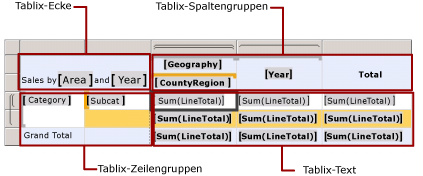
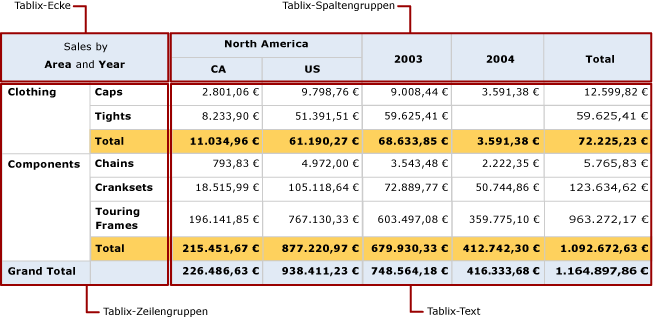

# Zonen des Tablix-Datenbereichs (Berichts-Generator und SSRS)
 In einem paginierten [!INCLUDE[ssRSnoversion_md](../../includes/ssrsnoversion-md.md)] -Bericht hat ein Tablix-Datenbereich vier Bereiche mit Tablix-Zellen:   
* Ecke  
* Zeilengruppenbereich  
* Spaltengruppenbereich  
* Textbereich   
  
Die Zellen in den einzelnen Bereichen verfügen über unterschiedliche Funktionen. Durch Hinzufügen von Zellen zum Tablix-Textbereich können Detail- und Gruppendaten angezeigt werden. Wenn Sie eine Gruppe erstellen, um Werte von Gruppeninstanzen anzuzeigen, werden dem Zeilen- oder Spaltengruppenbereich von Berichts-Generator und Berichts-Designer Zellen hinzugefügt. Tablix-Eckzellen werden von Berichts-Generator und Berichts-Designer erstellt, wenn sowohl Zeilengruppen als auch Spaltengruppen vorhanden sind.  
  
Gepunktete Linien auf der Entwurfsoberfläche bezeichnen die vier Bereiche eines ausgewählten Tablix-Datenbereichs. Die folgende Abbildung zeigt die Bereiche für einen Tablix-Bereich mit geschachtelten Zeilengruppen auf der Basis von Category und Subcategory an sowie geschachtelte Spaltengruppen auf der Basis von Geography und CountryRegion und eine angrenzende Spaltengruppe auf der Basis von Year.  
  
   
  
 Die einzelnen Bereiche werden in der folgenden Liste beschrieben:  
  
-   **Tablix-Eckbereich**. (Optional) Tablix-Ecken befinden sich in der linken oberen Ecke oder, bei Layouts mit Leserichtung von rechts nach links (RTL), in der rechten oberen Ecke. Dieser Bereich wird automatisch erstellt, wenn Sie einem Tablix-Datenbereich sowohl Zeilen- als auch Spaltengruppen hinzufügen. Zellen in diesem Bereich können zusammengeführt werden, und es kann eine Bezeichnung erstellt oder ein anderes Berichtselement eingebettet werden. Verbundene Zellen in der Abbildung zeigen in der Ecke die Bezeichnung Sales by Area and Year an.  
  
-   **Tablix-Spaltengruppenbereich**. (Optional) Tablix-Spaltengruppen befinden sich in der rechten oberen Ecke oder, bei Layouts mit Leserichtung von rechts nach links (RTL), in der linken oberen Ecke. Dieser Bereich wird automatisch erstellt, wenn Sie eine Spaltengruppe hinzufügen. Zellen in diesem Bereich stellen Elemente der Spaltengruppenhierarchie dar und zeigen die Spaltengruppeninstanzwerte an. Die Zellen in der Abbildung, in denen [Geography] und [CountryRegion] angezeigt wird, sind geschachtelte Spaltengruppen, und die Zelle, in der [Year] angezeigt wird, ist eine angrenzende Spaltengruppe. In der Spalte [Total] werden die aggregierten Gesamtwerte für die einzelnen Zeilen angezeigt.  
  
-   **Tablix-Zeilengruppenbereich**. (Optional) Tablix-Zeilengruppen befinden sich in der linken unteren Ecke oder, bei Layouts mit Leserichtung von rechts nach links (RTL), in der rechten unteren Ecke. Dieser Bereich wird automatisch erstellt, wenn Sie eine Zeilengruppe hinzufügen. Zellen in diesem Bereich stellen Elemente der Zeilengruppenhierarchie dar und zeigen Zeilengruppeninstanzwerte an. Die Zellen in der Abbildung, in denen [Category] und [Subcat] angezeigt werden, sind geschachtelte Zeilengruppen. Die Ergebniszeile unterhalb von [Subcat] wird für jede Kategoriegruppe wiederholt, um die aggregierten Teilergebnisse für die einzelnen Spalten anzuzeigen. Die Gesamtergebniszeile zeigt die Gesamtwerte für alle Kategorien an.  
  
-   **Tablix-Textbereich**. Der Tablix-Textbereich befindet sich in der rechten unteren Ecke oder, bei RTL-Layouts, in der linken unteren Ecke. Im Tablix-Text werden Detail- und Gruppendaten angezeigt. In diesem Beispiel werden nur aggregierte Daten verwendet. Der Bereich für den Ausdruck wird von den innersten Gruppen bestimmt, zu denen das Textfeld gehört. Zellen im Tablix-Text zeigen Detaildaten an, wenn Sie Elemente einer Detailzeile darstellen, und stellen Aggregatdaten dar, wenn es sich um Elemente einer Zeile oder Spalte handelt, die einer Gruppe zugeordnet wurden. Zellen in einer Gruppenzeile oder -spalte mit einfachen Ausdrücken ohne Aggregatfunktion werden standardmäßig zum ersten Wert in der Gruppe ausgewertet. Die Zellen in der Abbildung zeigen die aggregierten Gesamtwerte für Zeilengesamtwerte für alle Bestellungen an.  
  
 Bei der Ausführung des Berichts werden Spaltengruppen für so viele Spalten nach rechts erweitert, wie eindeutige Werte für einen Gruppenausdruck vorhanden sind (bzw. nach links, wenn die Direction-Eigenschaft des Tablix-Datenbereichs auf RTL festgelegt ist). Zeilengruppen werden auf der Seite nach unten erweitert. Weitere Informationen finden Sie unter [Zellen, Zeilen und Spalten des Tablix-Datenbereichs (Berichts-Generator und SSRS)](../../reporting-services/report-design/tablix-data-region-cells-rows-and-columns-report-builder-and-ssrs.md).  
  
 Die folgende Abbildung zeigt den Tablix-Datenbereich in der Vorschau an.  
  
   
  
 Der Zeilengruppenbereich zeigt zwei Kategoriegruppeninstanzen für Clothing und Components an. Die Spaltengruppe zeigt eine Instanz der Gruppe Geography für North America mit zwei geschachtelten Instanzen der Gruppe CountryRegion für Canada (CA) und United States (US) an. Außerdem zeigt die angrenzende Spalte zwei Jahre Gruppeninstanzen für 2003 und 2004 an. Die Spalte Total enthält die Zeilengesamtwerte. Die Ergebniszeile, die mit der Kategoriegruppe wiederholt wird, enthält die Gesamtwerte der Unterkategorie, und in der Gesamtergebniszeile werden die Kategoriegesamtwerte einmal für den Datenbereich angezeigt.  
  
## Siehe auch  
 [Tabellen, Matrizen und Listen &#40;Berichts-Generator und SSRS&#41;](../../reporting-services/report-design/tables-matrices-and-lists-report-builder-and-ssrs.md)   
 [Lernprogramme für den Berichts-Generator](../../reporting-services/report-builder-tutorials.md)   
 [Tabellen (Berichts-Generator und SSRS)](../../reporting-services/report-design/tables-report-builder-and-ssrs.md)   
 [Erstellen einer Matrix](../../reporting-services/report-design/create-a-matrix-report-builder-and-ssrs.md)   
 [Erstellen von Rechnungen und Formularen mit Listen](../../reporting-services/report-design/create-invoices-and-forms-with-lists-report-builder-and-ssrs.md)   
 [Tablix-Datenbereich &#40;Berichts-Generator und SSRS&#41;](../../reporting-services/report-design/tablix-data-region-report-builder-and-ssrs.md)  
  
  
