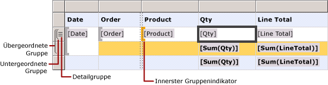
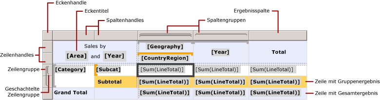
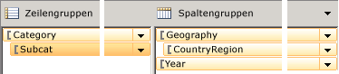
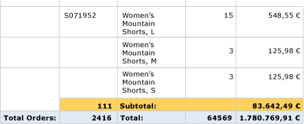

# Zellen, Zeilen und Spalten des Tablix-Datenbereichs (Berichts-Generator und SSRS)
  Sie müssen sich mit dem Verfahren zum Angeben von Zeilen und Spalten für Detaildaten, Gruppendetails, Bezeichnungen und Gesamtwerte vertraut machen, um zu steuern, wie Daten in den Zeilen und Spalten eines Tablix-Datenbereichs in einem paginierten [!INCLUDE[ssRSnoversion_md](../../includes/ssrsnoversion-md.md)] -Bericht angezeigt werden. In vielen Fällen verwenden Sie die Standardstrukturen einer Tabelle, Matrix oder Liste, um die Daten anzuzeigen. Weitere Informationen finden Sie unter [Tabellen &#40;Berichts-Generator und SSRS&#41;](../../reporting-services/report-design/tables-report-builder-and-ssrs.md), [Erstellen einer Matrix &#40;Berichts-Generator und SSRS&#41;](../../reporting-services/report-design/create-a-matrix-report-builder-and-ssrs.md) und unter [Erstellen von Rechnungen und Formulare mit Listen &#40;Berichts-Generator und SSRS&#41;](../../reporting-services/report-design/create-invoices-and-forms-with-lists-report-builder-and-ssrs.md).  
  
 In einem Tablix-Datenbereich werden Detaildaten in Detailzeilen und Detailspalten sowie gruppierte Daten in Gruppenzeilen und Gruppenspalten angezeigt. Wenn Sie einem Tablix-Datenbereich Zeilengruppen und Spaltengruppen hinzufügen, werden Zeilen und Spalten zum Anzeigen der Daten automatisch hinzugefügt. Sie können manuell Zeilen und Spalten hinzufügen oder entfernen, um einen Tablix-Datenbereich anzupassen und die Anzeige der Daten im Bericht zu konfigurieren.  
  
 Um sich damit vertraut zu machen, wie ein Tablix-Datenbereich angepasst werden kann, müssen Sie erst verstehen, wie die visuellen Hinweise zu interpretieren sind, die Sie beim Auswählen eines Tablix-Datenbereichs auf der Entwurfsoberfläche erhalten.  
  
> [!NOTE]  
>  [!INCLUDE[ssRBRDDup](../../includes/ssrbrddup-md.md)]  
  
## Grundlegendes zu visuellen Hinweisen in Tablix-Datenbereichen  
 Visuelle Hinweise in einem Tablix-Datenbereich erleichtern es Ihnen, im Tablix-Datenbereich genau die gewünschten Daten anzuzeigen.  
  
### Zeilen- und Spaltenhandles  
 Wenn Sie einen Tablix-Datenbereich auswählen, geben die Grafiken der Zeilen- und Spaltenhandles den Zweck der jeweiligen Zeile bzw. Spalte an. Handles geben Zeilen und Spalten an, die sich in einer Gruppe oder außerhalb einer Gruppe befinden. In der folgenden Tabelle wird eine Vielzahl angezeigter Handles aufgelistet.  
  
|Symbol|Description|  
|----------|-----------------|  
||Nur die Detailgruppe in der Zeilengruppenhierarchie|  
||Eine äußere Gruppe und die untergeordnete Detailgruppe|  
||Eine äußere Gruppe, eine innere Gruppe, keine Detailgruppe|  
||Eine äußere Gruppe, eine innere Gruppe und die untergeordnete Detailgruppe|  
||Eine äußere Gruppe mit einer Fußzeile für Gesamtergebnisse und eine innere Gruppe|  
||Eine äußere Gruppe mit einer Fußzeile für Gesamtergebnisse, eine innere Gruppe mit einer Fußzeile für Gesamtergebnisse und eine Detailzeile|  
||Eine äußere Gruppe mit einer Kopfzeile für Bezeichnungen und einer Fußzeile für Gesamtergebnisse, eine innere Gruppe, keine Detailgruppe|  
  
### Gruppenzeilen  
 Zeilen innerhalb einer Gruppe werden einmal für jeden eindeutigen Gruppenwert wiederholt. Sie werden typischerweise für Zusammenfassungen von Aggregaten verwendet. Zeilen außerhalb einer Gruppe werden einmal in Bezug auf die Gruppe wiederholt und für Bezeichnungen und Teilergebnisse verwendet. Wenn Sie eine Tablix-Zelle auswählen, zeigen die Zeilen- und Spaltenhandles sowie die eckigen Klammern im Tablix-Datenbereich die Gruppen an, zu denen die Zelle gehört. In dieser Abbildung werden die folgenden visuellen Hinweise veranschaulicht:  
  
-   Zeilen- und Spaltenhandles, mit denen Gruppenzuordnungen angegeben werden  
  
-   Hervorgehobene Gruppenindikatoren, die die innerste Gruppenmitgliedschaft für eine ausgewählte Zelle anzeigen  
  
-   Gruppenindikatoren, die alle Gruppenmitgliedschaften für eine ausgewählte Zelle anzeigen  
  
   
  
### Ergebniszeilen  
 Nach dem Hinzufügen von Zeilen- und Spaltengruppen können Sie eine Zeile für die Ergebnisse von Spalten und eine Spalte für die Ergebnisse von Zeilen hinzufügen. In der folgenden Abbildung ist eine Matrix mit Zeilen- und Spaltengruppen sowie einer Ergebniszeile und einer Ergebnisspalte veranschaulicht.  
  
   
  
### Gruppierungsbereich  
 Im Bereich Gruppierung werden die Zeilen- und Spaltengruppen für den derzeit ausgewählten Tablix-Datenbereich auf der Entwurfsoberfläche angezeigt. In der folgenden Abbildung wird der Bereich Gruppierung für diesen Tablix-Datenbereich veranschaulicht.  
  
   
  
 Im Bereich Zeilengruppen werden die übergeordnete Gruppe Category und die untergeordnete Gruppe Subcat angezeigt. Im Bereich Spaltengruppen werden die übergeordnete Gruppe Geography und die untergeordnete Gruppe CountryRegion sowie die Gruppe Year angezeigt, die eine angrenzende Gruppe der Gruppe Geography ist. Wenn Sie im Bereich Zeilengruppen die Gruppe Subcat auswählen, wechselt die Farbe der Gruppenleiste zu einem dunkleren Orangeton, und die Zelle des entsprechenden Zeilengruppenelements wird auf der Entwurfsoberfläche ausgewählt.  
  
## Anzeigen von Daten in Zeilen und Spalten  
 Zeilen und Zeilengruppen und Spalten und Spaltengruppen weisen identische Beziehungen auf. Im Folgenden wird erläutert, wie Sie Zeilen hinzufügen, um Detail- und Gruppendaten in einem Tablix-Datenbereich in Zeilen anzuzeigen. Einige Grundsätze gelten jedoch auch für das Hinzufügen von Spalten, um Detail- und Gruppendaten anzuzeigen.  
  
 In einem Tablix-Datenbereich befindet sich jede Zeile entweder innerhalb oder außerhalb einer Zeilengruppe. Wenn sich die Zeile innerhalb einer Zeilengruppe befindet, wird sie für jeden eindeutigen Wert der Gruppe wiederholt (als *Gruppeninstanz*bezeichnet). Wenn sich die Zeile außerhalb einer Zeilengruppe befindet, wird sie in Bezug auf die betreffende Gruppe nur einmal wiederholt. Zeilen, die außerhalb aller Zeilengruppen liegen, sind statisch und werden nur einmal für den Datenbereich wiederholt. Eine Kopf- oder Fußzeile einer Tabelle ist beispielsweise eine statische Zeile. Zeilen, die für mindestens eine Gruppe wiederholt werden, sind dynamisch.  
  
 Bei geschachtelten Gruppen kann sich die Zeile innerhalb einer übergeordneten Gruppe, jedoch außerhalb einer untergeordneten Gruppe befinden. Die Zeile wird für jeden Gruppenwert in der übergeordneten Gruppe wiederholt, wird in Bezug auf die untergeordnete Gruppe jedoch nur einmal angezeigt. Zum Anzeigen von Bezeichnungen oder Gesamtwerten für eine Gruppe fügen Sie eine Zeile außerhalb der Gruppe hinzu. Wenn Sie Daten anzeigen möchten, die für jede Gruppeninstanz geändert werden, fügen Sie eine Zeile innerhalb der Gruppe hinzu.  
  
 Wenn Sie über Detailgruppen verfügen, befindet sich jede Detailzeile innerhalb der Detailgruppe. Die Zeile wird für jeden Wert im Resultset für die Datasetabfrage wiederholt.  
  
 Weitere Informationen zu Gruppenhierarchien finden Sie unter [Grundlegendes zu Gruppen &#40;Berichts-Generator und SSRS&#41;](../../reporting-services/report-design/understanding-groups-report-builder-and-ssrs.md).  
  
 Die folgende Abbildung zeigt einen Tablix-Datenbereich mit geschachtelten Zeilengruppen und einer Detailgruppe.  
  
   
  
 Für einen Tablix-Datenbereich, in dem Detaildaten angezeigt werden, ist die Detailgruppe die innerste untergeordnete Gruppe. Zeilen, die Sie einer Detailgruppe hinzufügen, werden im Resultset für die Abfrage des Datasets, das mit diesem Tablix-Datenbereich verknüpft ist, einmal pro Zeile wiederholt. In der folgenden Abbildung wird die letzte Seite des gerenderten Berichts veranschaulicht. In dieser Abbildung sind die letzten Detailzeilen und die Teilergebniszeile für die letzte Bestellung dargestellt.  
  
   
  
 Für jede Spalte in einem Tablix-Datenbereich gelten dieselben Prinzipien. Eine Spalte befindet sich beispielsweise entweder innerhalb oder außerhalb einer Spaltengruppe. Wenn Ergebnisse angezeigt werden sollen, fügen Sie eine Spalte außerhalb der Gruppe hinzu.  
  
 Wenn Sie Zeilen und Spalten entfernen möchten, die einer Gruppe zugeordnet sind, können Sie die Gruppe löschen. Beim Löschen einer Gruppe können Sie entweder nur die Gruppendefinition oder die Gruppe und alle zugeordneten Zeilen und Spalten löschen. Wenn Sie nur die Gruppe löschen, wird das Zeilen- und Spaltenlayout im Datenbereich beibehalten. Wenn Sie die Gruppe und die zugehörigen Zeilen und Spalten löschen, löschen Sie damit alle statischen Zeilen und Spalten (einschließlich der Kopf- und Fußzeilen der Gruppe) und die dynamischen Zeilen und Spalten (einschließlich der Gruppeninstanzen), die der betreffenden Gruppe zugeordnet sind.  
  
 Eine Schritt-für-Schritt-Anleitung zum Hinzufügen oder Löschen von Zeilen und Spalten finden Sie unter [Einfügen oder Löschen einer Zeile &#40;Berichts-Generator und SSRS&#41;](../../reporting-services/report-design/insert-or-delete-a-row-report-builder-and-ssrs.md) und [Einfügen oder Löschen einer Spalte &#40;Berichts-Generator und SSRS&#41;](../../reporting-services/report-design/insert-or-delete-a-column-report-builder-and-ssrs.md).  
  
## Grundlegendes zu Tablix-Zellen  
 Tablix-Zellen gehören zu einem von vier Tablix-Bereichen: dem Tablix-Textbereich, dem Tablix-Zeilengruppenbereich, dem Tablix-Spaltengruppenbereich oder dem Tablix-Eckbereich. In einer Zelle kann potenziell zwar jeder Wert im Dataset angezeigt werden. Die Standardfunktion einer Zelle wird jedoch durch ihre Position bestimmt. Ausführlichere Informationen zu Tablixbereichen finden Sie unter [Zonen des Tablix-Datenbereichs &#40;Berichts-Generator und SSRS&#41;](../../reporting-services/report-design/tablix-data-region-areas-report-builder-and-ssrs.md).  
  
 Standardmäßig stellen Zellen in Tablix-Zeilengruppenbereichen und Tablix-Spaltengruppenbereichen Gruppenelemente dar. Gruppenelemente werden in der Berichtsdefinition in mehreren Strukturen organisiert. Die Zeilengruppenhierarchie wird horizontal erweitert. Die Spaltengruppenhierarchie wird vertikal erweitert. Diese Zellen werden automatisch hinzugefügt, wenn Sie eine Gruppe erstellen. In ihnen werden zur Laufzeit die eindeutigen Werte für eine Gruppe angezeigt.  
  
 Zellen in der Tablix-Ecke werden erstellt, wenn sowohl ein Zeilengruppenbereich als auch ein Spaltengruppenbereich vorhanden ist. Sie können Zellen in diesem Bereich zusammenführen, um eine Bezeichnung zu erstellen oder ein anderes Berichtselement einzubetten.  
  
 In Zellen im Tablix-Textbereich können Detaildaten angezeigt werden, wenn sich die jeweilige Zelle in einer Detailzeile bzw. -spalte befindet. In der Zelle können aggregierte Gruppendaten angezeigt werden, wenn sie sich in einer Gruppenzeile oder -spalte befindet. Der Gültigkeitsbereich für die Daten in einer Zelle wird durch die Schnittmenge der innersten Zeilengruppe und der innersten Spaltengruppe gebildet, zu denen die Zelle gehört.  
  
> [!NOTE]  
>  Die tatsächlich für eine Zelle angezeigten Daten stellen den ausgewerteten Ausdruck für das Berichtselement dar, das in der Zelle enthalten ist (i. d. R. ein Textfeld). In einer Zelle, die zu einer Detailzeile oder -spalte gehört, entspricht der Ausdruck standardmäßig den Detaildaten (z.B. **[LineTotal]**). In einer Zelle, die nicht zu einer Detailzeile oder -spalte gehört, entspricht der Ausdruck standardmäßig einer Aggregatfunktion (z.B. **Sum[LineTotal]**). Wenn ein Ausdruck keine Aggregatfunktion angibt, obwohl die Zelle zu einer Gruppenzeile oder -spalte gehört, wird der erste Wert in der Gruppe angezeigt. Weitere Informationen zum Aggregaten finden Sie unter [Ausdrucksbereich für Gesamtwerte, Aggregate und integrierte Sammlungen &#40;Berichts-Generator und SSRS&#41;](../../reporting-services/report-design/expression-scope-for-totals-aggregates-and-built-in-collections.md).  
  
### Zusammenführen und Teilen von Zellen  
 In einem Tablix-Bereich können Sie mehrere angrenzende Zellen zusammenführen. Sie können z. B. Zellen für Bezeichnungen erstellen, die sich über mehrere Spalten oder Zeilen erstrecken.  
  
 Im Tablix-Eckbereich können Zellen nur in jeweils einer Richtung miteinander kombiniert werden: horizontal über Spalten oder vertikal nach unten über Zeilen. Wenn Sie einen Block von Zellen zusammenführen möchten, führen Sie die Zellen zuerst horizontal zusammen. Wenn alle Zellen in den einzelnen Zeilen zu einer einzigen Zelle zusammengeführt wurden, wählen Sie angrenzende Zellen aus (Sie können alle angrenzenden Zellen in einer Spalte auswählen), und führen Sie sie zusammen.  
  
 Im Tablix-Textbereich können Zellen nur horizontal zusammengeführt werden. Das vertikale Zusammenführen von Zellen wird nicht unterstützt.  
  
 Weitere Informationen finden Sie unter [Zusammenführen von Zellen in einem Datenbereich &#40;Berichts-Generator und SSRS&#41;](../../reporting-services/report-design/merge-cells-in-a-data-region-report-builder-and-ssrs.md).  
  
 Sie können eine zuvor zusammengeführte Zelle teilen. Sie können Zellen horizontal über Spalten oder vertikal nach unten über Zeilen teilen. Wenn Sie eine Zelle in einen Block von Zellen teilen möchten, teilen Sie die Zelle zuerst horizontal, und teilen Sie sie dann so oft wie nötig vertikal.  
  
## Siehe auch  
 [Tablix-Datenbereich &#40;Berichts-Generator und SSRS&#41;](../../reporting-services/report-design/tablix-data-region-report-builder-and-ssrs.md)  
  
  
