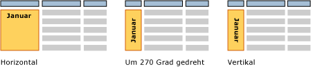

# Textfelder (Berichts-Generator und SSRS)
  Wenn Sie an ein Textfeld denken, stellen Sie sich wahrscheinlich ein eigenständiges Feld mit Text vor, wie es zum Beispiel in [!INCLUDE[msCoName](../../includes/msconame-md.md)] Office PowerPoint verwendet wird. Im paginierten [!INCLUDE[ssRSnoversion_md](../../includes/ssrsnoversion-md.md)] -Berichten entsprechen einige Textfelder dieser Vorstellung und können statischen Text für Titel, Beschreibungen und Beschriftungen oder dynamischen Text basierend auf Ausdrücken enthalten. Jede Zelle in einer Tabelle oder Matrix (einem Tablix-Datenbereich) enthält jedoch auch ein Textfeld, das auf dieselbe Weise formatiert werden kann wie eigenständige Textfelder in einem Bericht.  
  
> [!NOTE]  
>  Wenn Sie einen Feldwert für ein Berichtsdataset direkt auf die Berichtsentwurfsoberfläche ziehen oder auf ein Textfeld auf der Berichtsentwurfsoberfläche, können Sie beim Ausführen des Berichts nur den ersten Wert im Resultset sehen. Um alle Werte für ein Feld anzuzeigen, müssen Sie zuerst eine Tabelle, Matrix oder einen Listendatenbereich erstellen und dann das Feld auf eine Zelle im Datenbereich ziehen. Auf diese Weise werden beim Ausführen des Berichts alle Werte in diesem Feld angezeigt.  
  
 Um wiederholten Text in einem Freiformlayout anzuzeigen, erstellen Sie einen Listendatenbereich, in dem Sie das Textfeld platzieren. Verwenden Sie eine Liste, wenn Sie ein Formular für mehrere Werte wiederholen möchten, z. B. ein Kundenrechnungsformular, das einmal pro Kunde wiederholt wird. Erfahren Sie mehr über das [Erstellen von Rechnungen und Formularen mit Listen](../../reporting-services/report-design/create-invoices-and-forms-with-lists-report-builder-and-ssrs.md).  
  
 Verwenden Sie einen rechteckigen Container, wenn Sie das Textfeldlayout steuern möchten und unterhalb des letzten Textfelds ein Abstand gelassen werden soll. Weitere Informationen finden Sie unter [Rechtecke und Linien &#40; Berichts-Generator und SSRS &#41; ](../../reporting-services/report-design/rectangles-and-lines-report-builder-and-ssrs.md).  
  
 Die Ausdrücke in einem Textfeld können Literaltext enthalten, auf ein Feld in der Datenbank verweisen oder Daten berechnen. Alle Ausdrücke werden als Platzhaltertext angezeigt, sodass Sie Zahlen, Farben und andere Darstellungseigenschaften formatieren können. Im gleichen Textfeld können Sie auch Platzhalter mit Literaltext kombinieren.  
  
 Sie können den Text in einem einzelnen Textfeld anhand von mehreren Schriftarten, Farben, Stilen und Aktionen formatieren. Weitere Informationen finden Sie unter [Formatieren von Text und Platzhaltern &#40;Berichts-Generator und SSRS&#41;](../../reporting-services/report-design/formatting-text-and-placeholders-report-builder-and-ssrs.md).  
  
> [!NOTE]  
>  [!INCLUDE[ssRBRDDup](../../includes/ssrbrddup-md.md)]  
  
##   Vergrößern und Verkleinern eines Textfelds  
 Standardmäßig haben Textfelder eine feste Größe. Sie können zulassen, dass ein Textfeld auf Grundlage seines Inhalts verkleinert oder vertikal erweitert wird. Weitere Informationen finden Sie unter [Zulassen, dass Textfelder vergrößert oder verkleinert werden &#40;Berichts-Generator und SSRS&#41;](../../reporting-services/report-design/allow-a-text-box-to-grow-or-shrink-report-builder-and-ssrs.md).  
  
## Drehen eines Textfelds  
 Durch das Drehen von Textfeldern können Sie die Lesbarkeit von Berichten verbessern, gebietsschemaspezifische Textausrichtungen unterstützen, in einem gedruckten Bericht mit fester Seitengröße eine größere Spaltenanzahl unterbringen und grafisch ansprechendere Berichte erstellen. Ein Textfeld kann in verschiedene Richtungen gedreht werden: horizontal, vertikal (um 90 Grad) und um 270 Grad. Die Option für die vertikale Ausrichtung wird am häufigsten für ostasiatische Sprachen verwendet, deren Schreibrichtung von oben nach unten verläuft. In den meisten Renderern wird die Eigenschaft für das Drehen von Symbolen durch die Option für die vertikale Ausrichtung behandelt, damit der Text von oben nach unten geschrieben wird, die Zeichen jedoch nicht auf der Seite liegen. Bei anderen Sprachen wird Text, auf den die Optionen für vertikale Ausrichtung und Drehung um 270 Grad angewendet werden, seitwärts geschrieben.  
  
 Sie können Textfelder drehen, die statischen Text, Felder aus einem Berichtsdataset oder berechnete Daten enthalten. Das Textfeld kann eigenständig im Hauptteil des Berichts, in einer Tabelle oder Matrix oder in einem Berichtskopf und -fuß verwendet werden.  
  
 Die folgende Abbildung zeigt drei Versionen eines Tabellenberichts, in dem Daten nach Monat gruppiert sind. Für das Textfeld, das den Monatswert enthält, wird eine abweichende Textfeldausrichtung verwendet.  
  
   
  
 Die Ausrichtung wird für das Textfeld festgelegt und gilt für den gesamten Text im Textfeld. Sie können keine andere Ausrichtung für Teile des Textfelds angeben.  
  
 Informationen zum Einstieg finden Sie im Abschnitt zum Drehen von Text im [Tutorial: Formatieren von Text &#40;Berichts-Generator&#41;](../../reporting-services/tutorial-format-text-report-builder.md) und unter [Festlegen der Textfeldausrichtung &#40;Berichts-Generator und SSRS&#41;](../../reporting-services/report-design/set-text-box-orientation-report-builder-and-ssrs.md).  
  
##   Themen zur Vorgehensweise  
 [Hinzufügen, Verschieben oder Löschen von Textfeldern &#40;Berichts-Generator und SSRS&#41;](../../reporting-services/report-design/add-move-or-delete-a-text-box-report-builder-and-ssrs.md)  
  
 [Formatieren von Text in einem Textfeld &#40;Berichts-Generator und SSRS&#41;](../../reporting-services/report-design/format-text-in-a-text-box-report-builder-and-ssrs.md)  
  
 [Festlegen der Textfeldausrichtung &#40;Berichts-Generator und SSRS&#41;](../../reporting-services/report-design/set-text-box-orientation-report-builder-and-ssrs.md)  
  
 [Zulassen, dass Textfelder vergrößert oder verkleinert werden &#40;Berichts-Generator und SSRS&#41;](../../reporting-services/report-design/allow-a-text-box-to-grow-or-shrink-report-builder-and-ssrs.md)  
  
## Siehe auch  
 [Formatieren von Text und Platzhaltern &#40;Berichts-Generator und SSRS&#41;](../../reporting-services/report-design/formatting-text-and-placeholders-report-builder-and-ssrs.md)   
 [Formatieren von Zahlen und Datumsangaben &#40; Berichts-Generator und SSRS &#41;](../../reporting-services/report-design/formatting-numbers-and-dates-report-builder-and-ssrs.md)  
  
  

