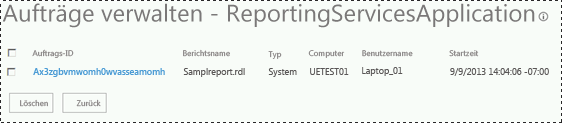

# <a name="manage-a-reporting-services-sharepoint-service-application"></a>Verwalten einer Reporting Services-SharePoint-Dienstanwendung
  [!INCLUDE[ssRSnoversion](../../includes/ssrsnoversion-md.md)] -Dienstanwendungen werden über die SharePoint-Zentraladministration verwaltet. Die Seiten für die Verwaltung und Eigenschaften ermöglichen es Ihnen, die Konfiguration der Dienstanwendung sowie allgemeine Verwaltungsaufgaben zu aktualisieren.  
  
 Dieses Thema enthält folgende Informationen:  
  
-   [So öffnen Sie Verwaltungsseiten für Dienstanwendungen](#bkmk_openpages)  
  
-   [Seite "Systemeinstellungen"](#bkmk_systemsettings)  
  
-   [Verwalten von Aufträgen](#bkmk_managejobs)  
  
-   [Schlüsselverwaltung](#bkmk_keymgt)  
  
-   [Ausführungskonto](#bkmk_executionaccount)  
  
-   [E-Mail-Einstellungen](#bkmk_email)  
  
-   [Abonnements und Warnungen bereitstellen](#bkmk_provisionsubscriptions)  
  
## <a name="to-open-service-application-properties-page"></a>So öffnen Sie die Eigenschaftenseite für Dienstanwendungen  
 Zum Öffnen der Eigenschaftenseite für eine [!INCLUDE[ssRSnoversion](../../includes/ssrsnoversion-md.md)] -Dienstanwendung gehen Sie wie folgt vor:  
  
1.  Klicken Sie in der Zentraladministration in der Gruppe **Anwendungsverwaltung**auf Dienstanwendungen verwalten.  
  
2.  Klicken Sie neben dem Namen der Dienstanwendung oder auf die Spalte **Typ** . Dadurch wird die gesamte Zeile ausgewählt. Klicken Sie anschließend im SharePoint-Menüband auf **Eigenschaften** .  
  
 Weitere Informationen zu Dienstanwendungseigenschaften finden Sie unter [Step 3: Create a Reporting Services Service Application](../../reporting-services/install-windows/install-the-first-report-server-in-sharepoint-mode.md#bkmk_create_serrviceapplication).  
  
##  <a name="bkmk_openpages"></a> So öffnen Sie Verwaltungsseiten für Dienstanwendungen  
 Zum Öffnen der Verwaltungsseiten für eine [!INCLUDE[ssRSnoversion](../../includes/ssrsnoversion-md.md)] -Dienstanwendung gehen Sie wie folgt vor:  
  
1.  Klicken Sie in der Zentraladministration in der Gruppe **Anwendungsverwaltung**auf Dienstanwendungen verwalten.  
  
2.  Klicken Sie auf den Namen der Dienstanwendung. Die Seite **Reporting Services-Anwendung verwalten** wird geöffnet.  
  
3.  Klicken Sie alternativ neben den Namen der Dienstanwendung oder auf die Spalte **Typ** für die Dienstanwendung. Dadurch wird die gesamte Zeile ausgewählt. Klicken Sie anschließend im SharePoint-Menüband auf **Verwalten** .  
  
##  <a name="bkmk_systemsettings"></a> Seite "Systemeinstellungen"  
 Die Seite für die Systemeinstellungen ermöglicht es Ihnen, das Verhalten und die Benutzerfreundlichkeit der Dienstanwendung einschließlich verschiedener Timeouts zu konfigurieren.  
  
-   [Berichtseinstellungen](#bkmk_report_settings_section)  
  
-   [Sitzungseinstellungen](#bkmk_session_settings_section)  
  
-   [Systemeinstellungen für die Protokollierung](#bkmk_logging_settings_section)  
  
-   [Sicherheitseinstellungen](#bkmk_security_settings_section)  
  
-   [Clienteinstellungen](#bkmk_client_settings_section)  
  
###  <a name="bkmk_report_settings_section"></a> Berichtseinstellungen  
  
|Einstellung|Kommentare|  
|-------------|--------------|  
|Timeout für externe Bilder|Der Standardwert ist 600 Sekunden.|  
|Momentaufnahmekomprimierung|Der Standardwert ist SQL.|  
|Systemberichtstimeout|Der Standardwert ist 1800 Sekunden.<br /><br /> Geben Sie eine bestimmte Anzahl von Sekunden als Timeoutwert für die Berichtsverarbeitung auf dem Berichtsserver an. Dieser Wert gilt für die Berichtsverarbeitung auf einem Berichtsserver. Er hat keine Auswirkung auf die Datenverarbeitung auf dem Datenbankserver, der die Daten für den Bericht zur Verfügung stellt. Der Zeitgeber für die Berichtsverarbeitung läuft ab dem Zeitpunkt der Auswahl des Berichts und wird mit dem Öffnen des Berichts beendet. Der angegebene Wert muss genügend Zeit sowohl für die Daten- als auch für die Berichtsverarbeitung zur Verfügung stellen.|  
|Grenzwerte für Systemmomentaufnahmen|Der Standard ist -1. Dies stellt kein Limit dar.<br /><br /> Wählen Sie für die gesamte Website einen Standardwert für die Anzahl der Kopien aus, die im Berichtsverlauf gespeichert werden. Der Standardwert ist die ursprüngliche Einstellung, mit der die Anzahl der Momentaufnahmen festgelegt wird, die für jeden Bericht gespeichert werden können. Sie können verschiedene Grenzwerte auf Eigenschaftenseiten für bestimmte Berichte angeben.|  
|Lebensdauer für gespeicherte Parameter|Der Standardwert ist 180.|  
|Schwellenwert für gespeicherte Parameter|Der Standard ist 1500 Tage.|  
  
###  <a name="bkmk_session_settings_section"></a> Sitzungseinstellungen  
  
|Einstellung|Kommentare|  
|-------------|--------------|  
|Sitzungstimeout|Der Standardwert ist 600 Sekunden.|  
|Sitzungscookies verwenden|Der Standardwert ist TRUE.|  
|EDLX-Berichtstimeout|Der Standardwert ist 1800 Sekunden.|  
  
###  <a name="bkmk_logging_settings_section"></a> Systemeinstellungen für die Protokollierung  
  
|Einstellung|Kommentare|  
|-------------|--------------|  
|Protokollierung der Ausführung aktivieren|Der Standardwert ist TRUE.<br /><br /> Geben Sie an, ob der Berichtsserver Ablaufverfolgungsprotokolle generiert, und geben Sie die Anzahl von Tagen für die Beibehaltung der Protokolle an. auf Dienstanwendungen verwalten. Die Protokolle werden auf dem Berichtsservercomputer im Ordner \Microsoft SQL Server\MSSQL.n\ReportServer\Log gespeichert. Bei jedem Neustart des Diensts wird eine neue Protokolldatei begonnen. Weitere Informationen zu Protokolldateien finden Sie unter [Report Server Service Trace Log](../../reporting-services/report-server/report-server-service-trace-log.md).|  
|Beibehaltungsdauer des Ausführungsprotokolls in Tagen|Der Standard ist 60 Tage.|  
  
 [!INCLUDE[ssRSnoversion](../../includes/ssrsnoversion-md.md)] unterstützt die SharePoint-ULS-Protokollierung.  Weitere Informationen finden Sie unter [Gewusst wie: Aktivieren von Reporting Services-Ereignissen für das SharePoint-Ablaufverfolgungsprotokoll &#40;ULS&#41;](../../reporting-services/report-server/turn-on-reporting-services-events-for-the-sharepoint-trace-log-uls.md).  
  
###  <a name="bkmk_security_settings_section"></a> Sicherheitseinstellungen  
  
|Einstellung|Kommentare|  
|-------------|--------------|  
|Integrierte Sicherheit aktivieren|Der Standardwert ist TRUE.<br /><br /> Gibt an, ob eine Verbindung mit einer Berichtsdatenquelle mithilfe des Windows-Sicherheitstokens des Benutzers hergestellt werden kann, der den Bericht angefordert hat.|  
|Laden der Berichtsdefinition aktivieren|Der Standardwert ist TRUE.|  
|Remotefehler aktivieren|Der Standardwert ist FALSE.|  
|Detaillierte Fehler bei Verbindungstests aktivieren|Der Standardwert ist TRUE.|  
  
###  <a name="bkmk_client_settings_section"></a> Clienteinstellungen  
  
|Einstellung|Kommentare|  
|-------------|--------------|  
|Berichts-Generator-Download aktivieren|Der Standardwert ist TRUE.<br /><br /> Gibt an, ob Clients die Schaltfläche zum Herunterladen der Berichts-Generator-Anwendung erkennen.|  
|Start-URL des Berichts-Generators|Geben Sie eine benutzerdefinierte URL an, wenn der Berichtsserver nicht die Standard-URL des Berichts-Generators verwendet. Dies ist eine optionale Einstellung. Wenn Sie keinen Wert angeben, wird die Standard-URL verwendet, mit der Berichts-Generator gestartet wird. Zum Starten von Berichts-Generator 3.0 als mit einem Klick-nachdem-Anwendung einsetzen möchten, geben Sie den folgenden Wert: http://\<Computername > / ReportServer/ReportBuilder/ReportBuilder_3_0_0_0.application.|  
|Clientdruck aktivieren|Der Standard lautet TRUE.<br /><br /> Gibt an, ob Benutzer das clientseitige Steuerelement herunterladen können, das Druckoptionen bereitstellt.|  
|Sitzungstimeout bearbeiten|Der Standardwert ist 7.200 Sekunden.|  
|Sitzungscachelimit bearbeiten|Der Standardwert ist 5.|  
  
##  <a name="bkmk_managejobs"></a> Verwalten von Aufträgen  
 Sie können aktive Aufträge anzeigen und löschen, beispielsweise Aufträge, die von Berichtsabonnements und datengesteuerten Abonnements erstellt werden. Die Seite wird nicht zum Verwalten von Abonnements, sondern von Aufträgen verwendet, die von einem Abonnement ausgelöst werden. Beispielsweise generiert ein Abonnement, das planmäßig stündlich einmal ausgeführt wird, jede Stunde einen Auftrag, der auf der Seite **Aufträge verwalten** angezeigt wird.  
  
   
  
##  <a name="bkmk_keymgt"></a> Schlüsselverwaltung  
 Die folgende Tabelle fasst die Schlüsselverwaltungsseiten zusammen.  
  
> [!IMPORTANT]  
>  Aus Sicherheitsgründen empfiehlt es sich, den Reporting Services-Verschlüsselungsschlüssel in regelmäßigen Abständen zu ändern. Ein guter Zeitpunkt, um den Schlüssel zu ändern, liegt direkt im Anschluss an ein größeres Versionsupgrade von Reporting Services. Indem der Schlüssel nach einem Upgrade geändert wird, lassen sich zusätzliche Dienstunterbrechungen, die durch eine Änderung des Reporting Services-Verschlüsselungsschlüssels außerhalb des Upgradezyklus verursacht würden, minimieren.  
  
|Seite|Description|  
|----------|-----------------|  
|Sichern des Verschlüsselungsschlüssels|1.) Geben Sie in die Felder **Kennwort:** und **Kennwort bestätigen:** ein Kennwort ein, und klicken Sie auf **Exportieren**. Eine Warnung wird angezeigt, wenn das eingegebene Kennwort nicht den Komplexitätsanforderungen der Domänenrichtlinie entspricht.<br /><br /> 2.) Sie werden aufgefordert, einen Dateispeicherort zum Speichern der Schlüsseldatei anzugeben. Speichern Sie ggf. die Schlüsseldatei auf einem separaten Computer und nicht auf dem Computer, auf dem [!INCLUDE[ssRSnoversion](../../includes/ssrsnoversion-md.md)]ausgeführt wird. Der Standarddateiname entspricht dem Namen der Dienstanwendung.|  
|Wiederherstellen von Verschlüsselungsschlüsseln|1.) Geben Sie den Speicherort der Schlüsseldatei in das Feld **Dateispeicherort** ein, oder navigieren Sie zum Speicherort.<br /><br /> 2.) Geben Sie im Feld **Kennwort** das Kennwort ein, mit dem die Verschlüsselungsdatei gesichert wurde.<br /><br /> 3.) Klicken Sie auf **OK**.|  
|Ändern des Verschlüsselungsschlüssels|Dieser Vorgang erstellt einen neuen Schlüssel und verschlüsselt den verschlüsselten Inhalt erneut. Verfügen Sie über umfangreiche Inhalte, dauert dieser Vorgang u. U. mehrere Stunden.<br /><br /> Nach Abschluss der Änderung des Verschlüsselungsschlüssels wird empfohlen, eine Sicherung des neuen Schlüssels zu erstellen.|  
|Gelöschter verschlüsselter Inhalt|Gelöschter Inhalt kann nicht wiederhergestellt werden.<br /><br /> **\*\* Wichtig \*\*** Das Löschen und Neuerstellen des symmetrischen Schlüssels kann nicht umgekehrt oder rückgängig gemacht werden. Das Löschen oder Neuerstellen des Schlüssels kann sich erheblich auf die aktuelle Installation auswirken. Wenn Sie den Schlüssel löschen, werden alle vorhandenen, durch den symmetrischen Schlüssel verschlüsselten Daten ebenfalls gelöscht. Zu den gelöschten Daten zählen Verbindungszeichenfolgen zu externen Berichtsdatenquellen, gespeicherte Verbindungszeichenfolgen und einige Abonnementinformationen.|  
  
##  <a name="bkmk_executionaccount"></a> Ausführungskonto  
 Verwenden Sie diese Seite, um ein Konto zu konfigurieren, das für unbeaufsichtigte Verarbeitungen verwendet werden soll. Dieses Konto wird unter bestimmten Umständen verwendet, wenn keine andere Quellen für Anmeldeinformationen verfügbar sind:  
  
-   Wenn der Berichtsserver eine Verbindung mit einer Datenquelle herstellt, für die keine Anmeldeinformationen erforderlich sind. Beispiele für Datenquellen, die möglicherweise keine Anmeldeinformationen erfordern, sind XML-Dokumente und einige clientseitige Datenbankanwendungen.  
  
-   Wenn der Berichtsserver eine Verbindung mit einem anderen Server herstellt, um externe Imagedateien oder andere Ressourcen abzurufen, auf die in einem Bericht verwiesen wird.  
  
 Das Festlegen dieses Kontos ist optional. Wenn es nicht festgelegt wird, werden die Verwendung externer Images und Verbindungen mit einigen Datenquellen eingeschränkt. Beim Abrufen externer Imagedateien überprüft der Berichtsserver, ob eine anonyme Verbindung hergestellt werden kann. Wenn die Verbindung kennwortgeschützt ist, verwendet der Berichtsserver das Konto für die unbeaufsichtigte Berichtsverarbeitung, um die Verbindung mit dem Remoteserver herzustellen. Wenn Daten für einen Bericht abgerufen werden, wechselt der Berichtsserver entweder die Identität des aktuellen Benutzers, fordert den Benutzer auf, Anmeldeinformationen anzugeben, verwendet gespeicherte Anmeldeinformationen oder verwendet das Konto für die unbeaufsichtigte Verarbeitung, wenn die Datenquellenverbindung **Keine** als Anmeldeinformationstyp angibt. Der Berichtsserver lässt beim Herstellen der Verbindung mit anderen Computern nicht zu, dass seine Dienstkonto-Anmeldeinformationen delegiert werden oder eine andere Identität annehmen. Daher muss das Konto für die unbeaufsichtigte Verarbeitung verwendet werden, wenn keine anderen Anmeldeinformationen verfügbar sind.  
  
 Das von Ihnen angegebene Konto darf nicht das Konto sein, das zum Ausführen des Dienstkontos verwendet wird. Wenn Sie den Berichtsserver in einer Bereitstellung für horizontales Skalieren ausführen, müssen Sie dieses Konto auf jedem Berichtsserver auf gleiche Weise konfigurieren.  
  
 Sie können jedes beliebige Windows-Benutzerkonto verwenden. Für optimale Ergebnisse wählen Sie ein Konto aus, das über Leseberechtigungen und Netzwerkanmeldungsberechtigungen verfügt, um Verbindungen mit anderen Computern zu unterstützen. Es muss über Leseberechtigungen für ein externes Image oder eine Datendatei verfügen, das bzw. die in einem Bericht verwendet werden soll. Geben Sie nur dann ein lokales Konto ein, wenn alle Berichtsdatenquellen und externen Images auf dem Berichtsservercomputer gespeichert sind. Verwenden Sie das Konto nur für die unbeaufsichtigte Berichtsverarbeitung.  
  
   
  
 Nachfolgend finden Sie einen beispielhaften PowerShell-Befehl, mit dem die Liste von [!INCLUDE[ssRSnoversion](../../includes/ssrsnoversion-md.md)] -Dienstanwendungen mit der UEAccount-Eigenschaft zurückgegeben wird:  
  
```  
Get-SPRSServiceApplication | select typename, name, service, ueaccountname  
```  
  
 Weitere Informationen finden Sie unter [PowerShell-Cmdlets für SharePoint-Modus von Reporting Services](../../reporting-services/report-server-sharepoint/powershell-cmdlets-for-reporting-services-sharepoint-mode.md).  
  
### <a name="options"></a>enthalten  
 **Ausführungskonto angeben**  
 Wählen Sie diese Option aus, um ein Konto anzugeben.  
  
 **Konto**  
 Geben Sie ein Windows-Domänenbenutzerkonto an. Verwenden Sie dieses Format:  *\<Domäne >\\< Benutzerkonto\>*.  
  
 **Kennwort**  
 Geben Sie das Kennwort ein.  
  
 **Kennwort bestätigen**  
 Geben Sie das Kennwort erneut ein.  
  
##  <a name="bkmk_email"></a> E-Mail-Einstellungen  
 Verwenden Sie diese Seite, um die SMTP (Simple Mail Transport Protocol)-Einstellungen anzugeben, mit denen die E-Mail-Übermittlung des Berichtsservers aktiviert wird. Mit der E-Mail-Übermittlungserweiterung des Berichtsservers können Sie Berichte oder Benachrichtigungen über Berichtsverarbeitungen mithilfe von E-Mail-Abonnements verteilen. Für die Berichtsserver-E-Mail-Übermittlungserweiterung sind ein SMTP-Server und eine E-Mail-Adresse erforderlich, die im Feld "Von:" verwendet wird.  
  
### <a name="options"></a>enthalten  
 **SMTP-Server verwenden**  
 Gibt an, ob die Berichtsserver-E-Mail über einen SMTP-Server geleitet wird.  
  
 **Ausgehender SMTP-Server**  
 Geben Sie den zu verwendenden SMTP-Server oder -Gateway an. Sie können einen lokalen Server oder einen SMTP-Server in Ihrem Netzwerk verwenden.  
  
 **Absenderadresse**  
 Gibt die E-Mail-Adresse an, die im Feld Von: einer generierten E-Mail verwendet werden soll. Sie müssen ein Benutzerkonto angeben, das über die Berechtigung zum Senden von E-Mails vom SMTP-Server verfügt.  
  
##  <a name="bkmk_provisionsubscriptions"></a> Abonnements und Warnungen bereitstellen  
 Überprüfen Sie auf dieser Seite, ob der SQL Server-Agent ausgeführt wird, und um den Zugriff auf Reporting Services für die Verwendung des SQL Server-Agent zu gewähren. Der SQL Server-Agent ist für [!INCLUDE[ssRSnoversion](../../includes/ssrsnoversion-md.md)] -Abonnements, -Zeitpläne und -Datenwarnungen erforderlich. [Bereitstellen von Abonnements und Warnungen für SSRS-Dienstanwendungen](../../reporting-services/install-windows/provision-subscriptions-and-alerts-for-ssrs-service-applications.md)  
  
## <a name="proxy-association"></a>Proxyzuordnung  
 Als Sie die Reporting Services-Dienstanwendung erstellt haben, haben Sie die Webanwendung ausgewählt, um Berechtigungen für den Zugriff durch die Reporting Services-Dienstanwendung zuzuordnen und bereitzustellen. Soll keine Zuordnung erfolgen, oder möchten Sie die Zuordnung ändern, gehen Sie wie folgt vor.  
  
1.  Klicken Sie in der SharePoint-Zentraladministration in der Anwendungsverwaltung auf **Zuordnungen von Dienstanwendungen konfigurieren**.  
  
2.  Ändern Sie auf der Seite Zuordnungen von Dienstanwendungen die Ansicht in **Dienstanwendungen**.  
  
3.  Suchen und klicken Sie auf den Namen der neuen [!INCLUDE[ssRSnoversion](../../includes/ssrsnoversion-md.md)] -Dienstanwendung. Sie können auch auf den Namen der Anwendungsproxygruppe **default** klicken, um den Proxy zur Standardgruppe hinzuzufügen, anstatt die folgenden Schritte auszuführen.  
  
4.  Wählen Sie im Auswahlfeld **Folgende Gruppe von Verbindungen bearbeiten** die Option **Benutzerdefiniert**.  
  
5.  Aktivieren Sie das Kontrollkästchen für den Proxy, und klicken Sie auf **OK**.  
  
  
