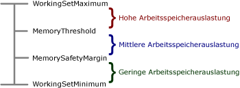

# <a name="configure-available-memory-for-report-server-applications"></a>Konfigurieren von verfügbarem Speicher für Berichtsserveranwendungen
  [!INCLUDE[ssRSnoversion](../../includes/ssrsnoversion-md.md)] kann zwar den gesamten verfügbaren Arbeitsspeicher verwenden, Sie können das Standardverhalten jedoch überschreiben, indem Sie eine Höchstgrenze für die Speicherressourcen festlegen, die [!INCLUDE[ssRSnoversion](../../includes/ssrsnoversion-md.md)] -Serveranwendungen zugeordnet werden sollen. Sie können außerdem Schwellenwerte festlegen, anhand derer der Berichtsserver je nach Arbeitsspeicherauslastung (hoch, mittel, gering) Anforderungen priorisiert und verarbeitet. Bei geringer Arbeitsspeicherauslastung weist der Berichtsserver der interaktiven oder der bedarfsgesteuerten Berichtsverarbeitung eine leicht höhere Priorität zu. Bei hoher Arbeitsspeicherauslastung setzt der Berichtsserver verschiedene Techniken ein, um trotz der eingeschränkten Ressourcen arbeitsfähig zu sein.  
  
 In diesem Thema werden die möglichen Konfigurationseinstellungen und die Verhaltensweisen des Berichtsservers bei Verarbeitungsanforderungen in Abhängigkeit von der Arbeitsspeicherauslastung beschrieben.  
  
## <a name="memory-management-policies"></a>Richtlinien für die Arbeitsspeicherverwaltung  
 [!INCLUDE[ssRSnoversion](../../includes/ssrsnoversion-md.md)] reagiert auf eingeschränkte Systemressourcen durch Anpassung der Speichermenge, die bestimmten Anwendungen und Arten von zu verarbeitenden Anforderungen zugeordnet ist. Folgende Anwendungen werden im Berichtsserverdienst ausgeführt und sind Gegenstand der Arbeitsspeicherverwaltung:  
  
-   Berichts-Manager, eine Front-End-Webanwendung für den Berichtsserver.  
  
-   Berichtsserver-Webdienst, der für die interaktive Berichtsverarbeitung und bedarfsgesteuerte Anforderungen verwendet wird.  
  
-   Eine Hintergrundverarbeitungsanwendung, die für die geplante Berichtsverarbeitung, Abonnementübermittlung und Datenbankwartung verwendet wird.  
  
 Die Richtlinien für die Arbeitsspeicherverwaltung gelten für den Berichtsserverdienst als Ganzes und nicht für einzelne Anwendungen, die innerhalb des Prozesses ausgeführt werden.  
  
 Wenn im System keine Engpässe in Bezug auf den Arbeitsspeicher bestehen, fordert jede Anwendung beim Starten und vor dem Empfang von Anforderungen eine bestimmte Menge an Arbeitsspeicher an, damit beim Eingang von Anforderungen eine ideale Leistung geboten werden kann. Wenn sich die Arbeitsspeicherauslastung erhöht, passt der Berichtsserver sein Verarbeitungsmodell wie in der folgenden Tabelle beschrieben an.  
  
|Arbeitsspeicherauslastung|Reaktion des Servers|  
|---------------------|---------------------|  
|Low|Aktuelle Anforderungen werden weiterhin verarbeitet. Neue Anforderungen werden fast immer akzeptiert. Anforderungen, die an die Hintergrundverarbeitungsanwendung gerichtet sind, wird eine geringere Priorität eingeräumt als Anforderungen, die sich an den Report Server-Webdienst richten.|  
|Medium|Aktuelle Anforderungen werden weiterhin verarbeitet. Neue Anforderungen werden unter Umständen akzeptiert. Anforderungen, die an die Hintergrundverarbeitungsanwendung gerichtet sind, wird eine geringere Priorität eingeräumt als Anforderungen, die sich an den Report Server-Webdienst richten. Die Speicherbelegungen für alle drei Serveranwendungen werden reduziert, wobei vor allem der Arbeitsspeicher für die Hintergrundverarbeitung reduziert wird, damit mehr Arbeitsspeicher für Webdienstanforderungen zur Verfügung steht.|  
|High|Die Speicherbelegung wird weiter reduziert. Serveranwendungen, die mehr Arbeitsspeicher anfordern, werden abgelehnt. Aktuelle Anforderungen werden langsamer verarbeitet und abgeschlossen. Neue Anforderungen werden nicht akzeptiert. Der Berichtsserver lagert Datendateien aus dem Arbeitsspeicher auf die Festplatte aus.<br /><br /> Wenn die Speichereinschränkungen gravierend werden und kein Arbeitsspeicher mehr zum Verarbeiten neuer Anforderungen zur Verfügung steht, gibt der Berichtsserver einen HTTP 503-Fehler (Server nicht verfügbar) aus, während aktuelle Anforderungen abgeschlossen werden. In einigen Fällen können die Anwendungsdomänen wiederverwendet werden, um die Arbeitsspeicherauslastung zu reduzieren.|  
  
 Sie können die Reaktionen des Berichtsservers auf verschiedene Arbeitsspeicherauslastungs-Szenarien zwar nicht anpassen, aber Sie können Konfigurationseinstellungen festlegen, mit denen hohe, mittlere und geringe Arbeitsspeicherauslastungen definiert werden.  
  
## <a name="when-to-customize-memory-management-settings"></a>Wann Einstellungen für die Arbeitsspeicherverwaltung angepasst werden sollten  
 Die Standardeinstellungen enthalten ungleiche Bereiche für eine geringe, mittlere und hohe Arbeitsspeicherauslastung. Standardmäßig ist der Bereich für eine geringe Arbeitsspeicherauslastung größer als die Bereiche für eine mittlere oder hohe Arbeitsspeicherauslastung. Diese Konfiguration ist optimal zum Verarbeiten von Lasten, die gleichmäßig verteilt sind oder schrittweise wachsen oder sinken. In diesem Szenario verläuft der Übergang zwischen den Bereichen stufenweise, und der Server kann seine Reaktion daran anpassen.  
  
 Das Ändern der Standardeinstellungen ist hilfreich, wenn das Auslastungsmuster Spitzen aufweist. Bei Spitzen in der Verarbeitungsauslastung kann es vorkommen, dass sich die Bedingungen schnell von einer geringen Speicherauslastung zu Fehlern bei der Speicherbelegung ändern. Dies kann auftreten, wenn mehrere Instanzen eines speicherintensiven Berichts gleichzeitig ausgeführt werden. Für diese Art der Verarbeitungslast ist es am besten, wenn der Berichtsserver so schnell wie möglich reagiert und die Verarbeitung verlangsamt. Dies ermöglicht es, mehr Anforderungen abzuschließen. Hierzu müssen Sie den Wert für **MemorySafetyMargin** verringern, sodass der Bereich für eine geringe Speicherauslastung im Vergleich zu den anderen Bereichen kleiner ist. Auf diese Weise werden Reaktionen, die einer mittleren oder hohen Speicherauslastung entsprechen, schneller ausgelöst.  
  
## <a name="configuration-settings-for-memory-management"></a>Konfigurationseinstellungen für die Speicherverwaltung  
 Zu den Konfigurationseinstellungen für die Speicherbelegung des Berichtsservers zählen **WorkingSetMaximum**, **WorkingSetMinimum**, **MemorySafetyMargin**und **MemoryThreshold**.  
  
-   **WorkingSetMaximum** und **WorkingSetMinimum** definieren den Bereich des verfügbaren Arbeitsspeichers. Sie können diese Einstellungen konfigurieren, um den Bereich des verfügbaren Arbeitsspeichers für die Berichtsserveranwendungen festzulegen. Dies kann hilfreich sein, wenn Sie mehrere Anwendungen auf einem Computer hosten und feststellen, dass der Berichtsserver im Vergleich zu anderen Anwendungen auf dem Computer eine unverhältnismäßig große Speichermenge beansprucht.  
  
-   **MemorySafetyMargin** und **MemoryThreshold** legen die Begrenzungen für eine geringe, mittlere und hohe Arbeitsspeicherauslastung fest. Für jeden dieser Zustände nimmt [!INCLUDE[ssRSnoversion](../../includes/ssrsnoversion-md.md)] korrigierende Maßnahmen vor, sodass Verarbeitungs- und andere Anforderungen entsprechend der verfügbaren Speichermenge auf dem Computer behandelt werden. Sie können Konfigurationseinstellungen angeben, die die Abgrenzung zwischen geringer, hoher und mittlerer Arbeitsspeicherauslastung bestimmen.  
  
     Das Ändern der Konfigurationseinstellungen hat allerdings keine Auswirkungen auf die Berichtsverarbeitungsleistung. Das Ändern der Konfigurationseinstellungen ist nur hilfreich, wenn Anforderungen vor dem Abschließen abgebrochen werden. Wenn Sie die Serverleistung verbessern möchten, müssen Sie den Berichtsserver oder einzelne Berichtsserveranwendungen auf dedizierten Computern bereitstellen.  
  
 In der folgenden Abbildung wird gezeigt, wie die Einstellungen zum Unterscheiden zwischen geringer, mittlerer und hoher Arbeitsspeicherauslastung eingesetzt werden können:  
  
   
  
 In der folgenden Tabelle werden die Einstellungen **WorkingSetMaximum**, **WorkingSetMinimum**, **MemorySafetyMargin**und **MemoryThreshold** beschrieben. Die Konfigurationseinstellungen werden in der Datei [RSReportServer.config](../../reporting-services/report-server/rsreportserver-config-configuration-file.md)angegeben.  
  
|Element|Description|  
|-------------|-----------------|  
|**WorkingSetMaximum**|Gibt einen Arbeitsspeicherschwellenwert an, ab dem keine neuen Speicherbelegungsanforderungen für Berichtsserveranwendungen mehr möglich sind.<br /><br /> Standardmäßig legt der Berichtsserver die Einstellung **WorkingSetMaximum** auf den gesamten verfügbaren Arbeitsspeicher auf dem Computer fest. Dieser Wert wird erkannt, wenn der Dienst gestartet wird.<br /><br /> Diese Einstellung ist nicht in der Datei RSReportServer.config vorhanden, es sei denn, Sie fügen sie manuell ein. Wenn Sie möchten, dass der Berichtsserver weniger Arbeitsspeicher beansprucht, können Sie der Datei RSReportServer.config dieses Element und einen entsprechenden Wert hinzufügen. Gültige Werte sind 0 bis zu einer maximalen ganzen Zahl. Dieser Wert wird in Kilobyte angegeben.<br /><br /> Nach Erreichen des Werts für **WorkingSetMaximum** nimmt der Berichtsserver keine neuen Anforderungen mehr an. Zurzeit ausgeführte Anforderungen werden aber abgeschlossen. Neue Anforderungen werden nur angenommen, wenn die Arbeitsspeicherverwendung unter den durch **WorkingSetMaximum**angegebenen Wert fällt.<br /><br /> Wenn vorhandene Anforderungen auch nach Erreichen des Werts für **WorkingSetMaximum** zusätzlichen Arbeitsspeicher beanspruchen, werden alle Anwendungsdomänen wiederverwendet. Weitere Informationen finden Sie unter [Application Domains for Report Server Applications](../../reporting-services/report-server/application-domains-for-report-server-applications.md).|  
|**WorkingSetMinimum**|Gibt eine Untergrenze für die Ressourcenbeanspruchung an. Der Berichtsserver gibt nur Speicher frei, wenn die allgemeine Speicherauslastung unter dieser Grenze liegt.<br /><br /> Standardmäßig wird der Wert bei Dienststart berechnet. In der Regel beträgt die anfängliche Speicherbelegungsanforderung 60 Prozent von **WorkingSetMaximum**.<br /><br /> Diese Einstellung ist nicht in der Datei RSReportServer.config vorhanden, es sei denn, Sie fügen sie manuell ein. Wenn Sie diesen Wert anpassen möchten, müssen Sie der Datei RSReportServer.config das **WorkingSetMinimum** -Element hinzufügen. Gültige Werte sind 0 bis zu einer maximalen ganzen Zahl. Dieser Wert wird in Kilobyte angegeben.|  
|**MemoryThreshold**|Gibt einen Prozentwert von **WorkingSetMaximum** an, der die Grenze zwischen hoher und mittlerer Arbeitsspeicherauslastung definiert. Wenn die Arbeitsspeicherauslastung des Berichtsservers diesen Wert erreicht, verlangsamt der Berichtsserver die Anforderungsverarbeitung und ändert die Speichermenge, die den verschiedenen Serveranwendungen zugeordnet ist. Der Standardwert ist 90. Dieser Wert sollte höher sein als der Wert für **MemorySafetyMargin**.|  
|**MemorySafetyMargin**|Gibt einen Prozentsatz von **WorkingSetMaximum** an, der die Grenze zwischen mittlerer und geringer Arbeitsspeicherauslastung definiert. Dieser Wert ist der Prozentsatz an verfügbarem Speicher, der für das System reserviert ist und nicht für Berichtsservervorgänge verwendet werden kann. Der Standardwert ist 80.|  
  
> [!NOTE]  
>  Die Einstellungen **MemoryLimit** und **MaximumMemoryLimit** sind in [!INCLUDE[ssKatmai](../../includes/sskatmai-md.md)] und späteren Versionen veraltet. Wenn Sie eine vorhandene Installation aktualisiert haben oder eine RSReportServer.config-Datei verwenden, die diese Einstellungen enthält, berücksichtigt der Berichtsserver diese Werte nicht mehr.  
  
#### <a name="example-of-memory-configuration-settings"></a>Beispiel für Konfigurationseinstellungen des Arbeitsspeichers  
 Im folgenden Beispiel werden die Konfigurationseinstellungen für einen Berichtsserver gezeigt, in denen benutzerdefinierte Werte für die Speicherkonfiguration verwendet werden. Wenn Sie **WorkingSetMaximum** oder **WorkingSetMinimum**hinzufügen möchten, müssen Sie die Elemente und Werte in die Datei RSReportServer.config eingeben. Beide Werte sind ganze Zahlen, die angeben, wie viel Kilobyte RAM den Serveranwendungen zugeordnet werden. Im folgenden Beispiel wird angegeben, dass die gesamte Speicherbelegung für die Berichtsserveranwendungen 4 Gigabyte nicht übersteigen darf. Wenn der Standardwert für **WorkingSetMinimum** (60 % von **WorkingSetMaximum**) akzeptabel ist, können Sie ihn auslassen und nur **WorkingSetMaximum** in der Datei „RSReportServer.config“ angeben. In diesem Beispiel ist auch **WorkingSetMinimum** enthalten, um zu zeigen, wie dieser Eintrag aussieht, wenn Sie ihn hinzufügen:  
  
```  
      <MemorySafetyMargin>80</MemorySafetyMargin>  
      <MemoryThreshold>90</MemoryThreshold>  
      <WorkingSetMaximum>4000000</WorkingSetMaximum>  
      <WorkingSetMinimum>2400000</WorkingSetMinimum>  
```  
  
#### <a name="about-aspnet-memory-configuration-settings"></a>Informationen zu Arbeitsspeicher-Konfigurationseinstellungen in ASP.NET  
 Obwohl der Berichtsserver-Webdienst und der Berichts-Manager [!INCLUDE[vstecasp](../../includes/vstecasp-md.md)] -Anwendungen sind, reagiert keine Anwendung auf Arbeitsspeicher-Konfigurationseinstellungen, die Sie im Abschnitt **processModel** von „machine.config“ für [!INCLUDE[vstecasp](../../includes/vstecasp-md.md)] -Anwendungen angeben, die im IIS 5.0-Kompatibilitätsmodus ausgeführt werden. [!INCLUDE[ssRSnoversion](../../includes/ssrsnoversion-md.md)] liest nur Arbeitsspeicher-Konfigurationseinstellungen von der Datei "RSReportServer.config".  
  
## <a name="see-also"></a>Weitere Informationen finden Sie unter  
 [RsReportServer.config-Konfigurationsdatei](../../reporting-services/report-server/rsreportserver-config-configuration-file.md)   
 [RsReportServer.config-Konfigurationsdatei](../../reporting-services/report-server/rsreportserver-config-configuration-file.md)   
 [Ändern einer Reporting Services-Konfigurationsdatei &#40;RSreportserver.config&#41;](../../reporting-services/report-server/modify-a-reporting-services-configuration-file-rsreportserver-config.md)   
 [Application Domains for Report Server Applications (Anwendungsdomänen für Berichtsserveranwendungen)](../../reporting-services/report-server/application-domains-for-report-server-applications.md)  
  
  
