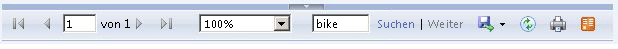

# Aktivieren und Deaktivieren des clientseitige Drucks f&#252;r Reporting Services
  Die Schaltfläche „Drucken“ auf der Symbolleiste des Berichts-Viewers verwendet das Format „Portable Document Format“ (PDF) für clientseitiges Drucken von [!INCLUDE[ssRSnoversion](../../includes/ssrsnoversion-md.md)]-Berichten, die in einem Browser angezeigt werden. Die neue Umgebung für Remotedrucken verwendet die PDF-Renderingerweiterung, die in [!INCLUDE[ssRSnoversion](../../includes/ssrsnoversion-md.md)] enthalten ist, um den Bericht im PDF-Format zu rendern. Sie können ein .PDF-Formular des Berichts herunterladen. Wenn Sie über eine Anwendung für das Anzeigen von .PDF-Dateien verfügen, zeigt die Schaltfläche „Drucken“ ein Dialogfeld „Drucken“ für die Seite mit den üblicherweise zur Verfügung stehenden Druckeinstellungen wie Seitengröße und Ausrichtung an sowie eine Vorschau der .PDF-Datei. Clientseitiges Drucken ist standardmäßig aktiviert, Sie können diese Funktion jedoch auf Wunsch deaktivieren.  
  
 Frühere Versionen von [!INCLUDE[ssRSnoversion](../../includes/ssrsnoversion-md.md)] haben ein ActiveX-Steuerelement verwendet, das vom Berichtsserver auf den Clientcomputer heruntergeladen werden musste. Wenn Sie Ihren Berichtsserver auf [!INCLUDE[ssCurrent](../../includes/sscurrent-md.md)] upgraden, wird das Drucksteuerelement nicht aus dem Berichtsserver oder Clientcomputern entfernt.  
  
##  <a name="bkmk_top"></a> In diesem Thema  
  
-   [Ablauf des Druckens](#bkmk_clientside_printexpereince)  
  
-   [Fehlerbehebung der clientseitigen Druckfunktion](#bkmk_troubleshoot_clientsideprinting)  
  
-   [Aktivieren und Deaktivieren von clientseitigem Drucken](#bkmk_enable)  
  
##  <a name="bkmk_clientside_printexpereince"></a> Ablauf des Druckens  
 Wenn Sie auf der Symbolleiste des Berichtsservers auf die Schaltfläche „Drucken“  klicken, variiert die Druckerfahrung je nachdem welche Anwendungen zum Anzeigen von .PDF auf dem Clientcomputer installiert sind und welchen Browser Sie verwenden.   Sie können die .PDF-Datei herunterladen oder Druckoptionen über ein Dialogfeld oder auch beides tun, je nachdem wie Sie den Clientcomputer konfigurieren.  
  
   
  
|||  
|-|-|  
|Das erste Dialogfeld gilt für alle Browser und ermöglicht Ihnen, grundlegende Layout-Eigenschaften wie z.B. die Ausrichtung zu ändern. Wenn Sie auf **Drucken** klicken, wird die Druckerfahrung je nach Browser einen minimalen Unterschied aufweisen.||  
|In Chrome öffnet sich ein detailliertes Dialogfenster zum Drucken aus dem Browser heraus.   Sie können die Druckerkonfiguration ändern, drucken und das Dialogfeld „Drucken“ im Betriebssystem öffnen.| |  
|Wenn Sie eine Anwendung zum Lesen von PDF-Dateien installiert haben, öffnet die Schaltfläche „Drucken“ ein Vorschau-Fenster der PDF-Datei, und Sie können sie speichern oder drucken.||  
|Im Folgenden finden Sie zwei Erfahrungsberichte von Benutzern, falls Sie keine PDF-Reader-Anwendung installiert haben:<br /><br /> Der Bericht wird automatisch den Downloadprozess Ihres Browsers rendern und benutzen, um die PDF-Datei herunterzuladen.   **Hinweis:** Je komplizierter der Bericht ist, desto länger ist die Verzögerung zwischen dem Zeitraum, in dem Sie auf **Drucken** klicken und dem Zeitraum, in dem der Bericht zum Download angezeigt wird. Sie können den Download auch erneut erzwingen, indem Sie auf **Hier klicken, um PDF-Datei Ihres Berichts anzuzeigen.** klicken.<br /><br /> Erzwingen Sie den Download erneut, indem Sie auf **Hier klicken, um PDF-Datei Ihres Berichts anzuzeigen.** klicken.||  
  
##  <a name="bkmk_troubleshoot_clientsideprinting"></a> Fehlerbehebung der clientseitigen Druckfunktion  
 Wenn die Schaltfläche „Drucken“ auf der Symbolleiste des Berichts-Viewers deaktiviert ist, überprüfen Sie Folgendes:  
  
-   Clientseitiges Drucken ist für den Berichtsserver in [!INCLUDE[ssManStudio](../../includes/ssmanstudio-md.md)] deaktiviert. Informationen finden Sie unter [Aktivieren und Deaktivieren von clientseitigem Drucken](#bkmk_enable) in diesem Thema.  
  
-   Die [!INCLUDE[ssRSCurrent](../../includes/ssrscurrent-md.md)]-PDF-Renderingerweiterung ist deaktiviert. Prüfen Sie den Abschnitt `<Extension Name="PDF"` der Datei **rsreportserver.config**.  
  
-   Sie sehen die Berichterstattung im Kompatibilitätsmodus, der das alte [!INCLUDE[ssRSCurrent](../../includes/ssrscurrent-md.md)]-HTML4-Renderingmodul verwendet. Die PDF-Druckerfahrung erfordert das HTML 5-Renderingmodul.  Klicken Sie auf der Symbolleiste auf die Schaltfläche **Try Preview** (Vorschau testen).  
  
       
  
##  <a name="bkmk_enable"></a> Aktivieren und Deaktivieren von clientseitigem Drucken  
 Die Berichtsserveradministratoren können die Remote-Druckfunktion deaktivieren, indem sie die Berichtsserver-Systemeigenschaft **EnableClientPrinting** auf **FALSE** festlegen. Dadurch wird das clientseitige Drucken für alle von diesem Server verwalteten Berichte deaktiviert. Standardmäßig ist **EnableClientPrinting** auf **TRUE** festgelegt. Sie können das clientseitige Drucken folgendermaßen deaktivieren:  
  
-   Für einen **Berichtsserver im einheitlichen Modus**:  
  
    1.  Starten Sie [!INCLUDE[ssManStudio](../../includes/ssmanstudio-md.md)] mit Administratorrechten.  
  
    2.  Stellen Sie eine Verbindung mit einer Berichtsserverinstanz in [!INCLUDE[ssManStudio](../../includes/ssmanstudio-md.md)] her.  
  
    3.  Klicken Sie mit der rechten Maustaste auf den Berichtsserverknoten, und klicken Sie anschließend auf **Eigenschaften**. Wenn die Option **Eigenschaften** deaktiviert ist, überprüfen Sie, ob [!INCLUDE[ssManStudio](../../includes/ssmanstudio-md.md)] mit Administratorrechten gestartet wurde.  
  
    4.  Klicken Sie auf **Erweitert**.  
  
    5.  Wählen Sie **EnableClientPrinting** aus.  
  
    6.  Wählen Sie dem Wert TRUE oder FALSE, und klicken Sie anschließend auf **OK**.  
  
           
  
-   Für einen **Berichtsserver im SharePoint-Modus**:  
  
    1.  Klicken Sie in der SharePoint-Zentraladministration auf **Anwendungsverwaltung**.  
  
    2.  Klicken Sie auf **Dienstanwendungen verwalten**.  
  
    3.  Klicken Sie auf den Namen der [!INCLUDE[ssRSnoversion](../../includes/ssrsnoversion-md.md)]-Dienstanwendung und anschließend im SharePoint-Menüband auf **Verwalten**.  
  
    4.  Klicken Sie auf **Systemeinstellungen**.  
  
    5.  Wählen Sie **Clientdruck aktivieren** aus. Die Option **Clientdruck aktivieren** befindet sich weiter unten auf der Seite.  
  
    6.  Klicken Sie auf **OK**.  
  
-   Schreiben eines Skripts oder Codeabschnitts zum Festlegen der Berichtsserver-Systemeigenschaft **EnableClientPrinting** auf **FALSE**.  
  
 Im folgenden Beispielskript wird eine Methode zum Deaktivieren des clientseitigen Druckens erläutert. Kompilieren Sie den folgenden [!INCLUDE[msCoName](../../includes/msconame-md.md)] [!INCLUDE[vbprvb](../../includes/vbprvb-md.md)]-Code, und führen Sie ihn anschließend aus, um die **EnableClientPrinting**-Eigenschaft auf **FALSE** festzulegen. Führen Sie nach der Ausführung des Codes einen Neustart von IIS aus.  
  
### Beispielskript  
  
```  
Imports System  
Imports System.Web.Services.Protocols  
Class Sample  
   Public Shared Sub Main()  
Dim rs As New ReportingService()  
      rs.Credentials = System.Net.CredentialCache.DefaultCredentials  
        Dim props(0) As [Property]  
        Dim setProp As New [Property]  
        setProp.Name = "EnableClientPrinting"  
        setProp.Value = “False”   
        props(0) = setProp  
        Try  
            rs.SetSystemProperties(props)  
        Catch ex As System.Web.Services.Protocols.SoapException  
            Console.Write(ex.Detail.InnerXml)  
        Catch e as Exception  
            Console.Write(e.Message)  
        End Try  
    End Sub 'Main  
End Class 'Sample  
```  
  
  