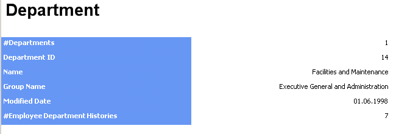
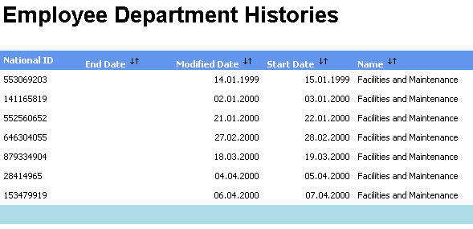

# Berichte mit Durchklicken (SSRS)
  Ein Bericht, der detaillierte Informationen zu den im Hauptbericht enthaltenen Daten bereitstellt, wird als Bericht mit Durchklicken bezeichnet. Ein Bericht mit Durchklicken wird angezeigt, wenn der Benutzer auf die im Hauptbericht angezeigten interaktiven Daten klickt. Diese Berichte werden vom Berichtsserver automatisch generiert. Beim Erstellen eines Modells bestimmen Sie durch Festlegen der Eigenschaften **DefaultDetailAttribute** und **DefaultAggregateAttribute** , die Sie einer Entität im Berichtsmodell zuweisen, was in Berichten mit Durchklicken angezeigt wird.  
  
> [!NOTE]  
>  Durchklickberichte sind nicht in jeder Edition von [!INCLUDE[msCoName](../../includes/msconame-md.md)][!INCLUDE[ssNoVersion](../../includes/ssnoversion-md.md)]. Eine Liste der Funktionen, die von den [!INCLUDE[ssNoVersion](../../includes/ssnoversion-md.md)]-Editionen unterstützt werden, finden Sie unter [Von den SQL Server 2016-Editionen unterstützte Funktionen](~/sql-server/editions-and-supported-features-for-sql-server-2016.md). Wenn Sie nicht genau wissen, welche Edition von [!INCLUDE[ssNoVersion](../../includes/ssnoversion-md.md)] in Ihrer Organisation verwendet wird, sollten Sie sich mit dem Datenbankadministrator in Verbindung setzen.  
  
## Verwenden von Standardvorlagen  
 Der Berichtsserver generiert standardmäßig für jede Entität zwei Vorlagentypen für Berichte mit Durchklicken: eine Einzelinstanzvorlage sowie eine Multiinstanzvorlage. Das Element, auf das geklickt wird, bestimmt, welche Vorlage verwendet wird. Wenn der Leser des Berichts auf ein skalares Attribut klickt, wird die Einzelinstanzvorlage verwendet. Wenn der Leser des Berichts auf ein Aggregatattribut klickt, wird die Multiinstanzvorlage verwendet.  
  
#### Einzelinstanzvorlagen  
 Eine Einzelinstanzvorlage zeigt alle Attribute der Zielentität sowie alle Standardaggregatattribute an, die für die verbundenen Entitäten angegeben sind, die zu der Zielentität in einer 1:n-Beziehung stehen. Eine Einzelinstanzvorlage könnte wie in der folgenden Abbildung aussehen.  
  
   
  
#### Multiinstanzvorlagen  
 Eine Multiinstanzvorlage zeigt nur die Standarddetailattribute der Zielentität sowie alle Standardaggregatattribute an, die für die verbundenen Entitäten angegeben sind, die zu der Zielentität in einer 1:n-Beziehung stehen. Eine Multiinstanzvorlage könnte wie in der folgenden Abbildung aussehen.  
  
   
  
## Anpassen von Berichten mit Durchklicken  
 Anstatt die vom Berichtsserver generierten Standardvorlagen zu verwenden, können Sie im Berichts-Generator einen Bericht erstellen und ihn als angepassten Bericht mit Durchklicken verwenden. Anschließend können Sie den Bericht mit dem Modell als Drillthroughbericht im Berichts-Manager verknüpfen.  
  
 Um einen im Berichts-Generator erstellten Bericht in einen Bericht mit Durchklicken umzuwandeln, müssen Sie im Dialogfeld **Eigenschaften** des Berichts-Generators die Option **Benutzern einen Drillthrough von anderen Berichten zu diesem Bericht ermöglichen** auswählen. Wenn diese Option ausgewählt ist, wird dem Bericht ein Drillthroughparameter hinzugefügt, und der Bericht kann nicht mehr direkt im Berichts-Generator ausgeführt werden. Der Drillthroughparameter wird automatisch vom Berichtsserver berechnet, wenn der Leser des Berichts in einem Berichts-Generator-Bericht auf ein Element klickt.  
  
> [!IMPORTANT]  
>  Bei der im Bericht verwendeten primären Entität bzw. Basisentität muss es sich um dieselbe Entität handeln, mit der Sie den Bericht verknüpfen.  
  
## Weitere Informationen finden Sie unter  
 [Verknüpfen eines Berichts mit einem Modell als Bericht mit Durchklicken](http://msdn.microsoft.com/library/3af42de3-67ef-41c2-bc8a-7045baec6f63)  
  
  
