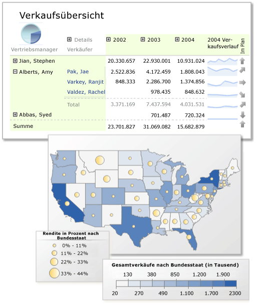

# Reporting Services-Berichte (SSRS)
  [!INCLUDE[ssNoVersion](../../includes/ssnoversion-md.md)] [!INCLUDE[ssRSnoversion](../../includes/ssrsnoversion-md.md)] -Berichte (paginiert) sind XML-basierte Berichtsdefinitionen, die Berichtsdaten und Berichtslayoutelemente enthalten. Auf einem Clientdateisystem verfügen Berichtsdefinitionen über die Dateierweiterung ".rdl". Nachdem ein paginierter Bericht veröffentlicht wurde, wird er zu einem auf dem Berichtsserver oder der SharePoint-Website gespeicherten Berichtselement. Paginierte Berichte stellen einen Teil der von [!INCLUDE[ssRSnoversion](../../includes/ssrsnoversion-md.md)] bereitgestellten serverbasierten Berichtsplattform dar. Sie haben außerdem die Möglichkeit zum [Create mobile reports with SQL Server Mobile Report Publisher](../../reporting-services/mobile-reports/create-mobile-reports-with-sql-server-mobile-report-publisher.md).  
  
 Wenn Sie noch nicht mit [!INCLUDE[ssRSnoversion](../../includes/ssrsnoversion-md.md)] vertraut sind, lesen Sie die Informationen in [Konzepte von Reporting Services &#40;SSRS&#41;](../../reporting-services/reporting-services-concepts-ssrs.md).  
  
## Vorteile von paginierten Reporting Services-Berichten  
 [!INCLUDE[ssRSnoversion](../../includes/ssrsnoversion-md.md)] -Berichtslösungen bieten folgende Möglichkeiten:  
  
-   Verwenden Sie eine Gruppe von Datenquellen, die eine einheitliche Version der Fakten bereitstellen. Verwenden Sie als Berichtsgrundlage Datenquellen, die eine einheitliche Sicht der Daten bieten und Sie bei Geschäftsentscheidungen unterstützen.  
  
-   Visualisieren Sie Daten in mehreren, miteinander verbundenen Datenbereichen. Zeigen Sie in Tabellen, Matrizen oder Kreuztabellen angeordnete Daten an, erweitern oder reduzieren Sie Gruppen, Diagramme, Messgeräte, Indikatoren oder KPIs und Karten, oder schachteln Sie Diagramme in Tabellen.  
  
-   Zeigen Sie Berichte zur eigenen Verwendung an, oder veröffentlichen Sie Berichte auf einem Berichtsserver oder in einer SharePoint-Website, um sie gemeinsam mit Ihrem Team oder innerhalb Ihrer Organisation zu nutzen.  
  
-   Definieren Sie einen einzelnen Bericht, und lassen Sie ihn in unterschiedlichen Layouts anzeigen. Sie können den Bericht in mehrere Dateiformate exportieren oder Abonnenten per E-Mail oder als freigegebene Datei zur Verfügung stellen. Sie können mehrere verknüpfte Berichte erstellen, durch die separate Parametersätze auf die gleiche Berichtsdefinition angewendet werden.  
  
-   Verwenden Sie Berichtsteile, freigegebene Datenquellen und Abfragen sowie Unterberichte, um wiederverwendbare Datenvisualisierungen zu definieren.  
  
-   Verwalten Sie Berichtsdatenquellen getrennt von der Berichtsdefinition. Beispielsweise können Sie von einer Testdatenquelle zu einer Produktionsdatenquelle wechseln, ohne den Bericht zu ändern.  
  
-   Entwerfen Sie Berichte in einem Freiformlayout. Das Berichtslayout ist nicht auf Informationsbereiche beschränkt. Sie können die Darstellung der Daten auf der Seite anpassen, sodass sie besser zu verstehen, zu interpretieren und zu verwenden sind.  
  
-   Aktivieren Sie Drillthroughaktionen, erweitern oder reduzieren Sie Umschaltflächen, Sortierschaltflächen, QuickInfos und Berichtsparameter, um Interaktionen zwischen Berichtsleser und Bericht zu ermöglichen. Verwenden Sie Berichtsparameter in Kombination mit selbst programmierten Ausdrücken, um es Berichtslesern zu ermöglichen, die Filterung, Gruppierung und Sortierung der Daten zu steuern.  
  
-   Definieren Sie Ausdrücke, mit denen die Filterung, Gruppierung und Sortierung von Berichtsdaten angepasst werden kann.  
  
   
  
##   Phasen der Berichtsverarbeitung  
 Wenn Sie einen Bericht erstellen, definieren Sie eine Berichtsdefinitionsdatei (.rdl) im XML-Format. Diese Datei enthält alle Informationen, die für den Berichtsprozessor zum Kombinieren der Berichtsdaten und des Berichtslayouts erforderlich sind. Der Bericht durchläuft vor der Anzeige folgende Phasen:  
  
-   **Kompilieren** Ausdrücke in der Berichtsdefinition werden ausgewertet und das kompilierte Zwischenformat intern auf dem Berichtsserver gespeichert.  
  
-   **Prozess:** Datasetabfragen werden ausgeführt und das Zwischenformat mit den Daten und dem Layout kombiniert.  
  
-   **Rendern** Der verarbeitete Bericht wird an eine Renderingerweiterung gesendet, um zu bestimmen, wie viele Informationen auf den einzelnen Seiten dargestellt werden können, und um den mehrseitigen Bericht zu erstellen.  
  
-   **Exportieren (optional).** Der Bericht wird in ein anderes Dateiformat exportiert.  
  
 Weitere Informationen finden Sie unter [Berichtsphasen](../../reporting-services/reporting-services-concepts-ssrs.md#bkmk_StagesofReports) in [Konzepte von Reporting Services &#40;SSRS&#41;](../../reporting-services/reporting-services-concepts-ssrs.md).  
  
## Erstellen paginierter Berichte  
 So erstellen Sie einen paginierten Bericht  
  
-   **Bestimmen Sie den Zweck des Berichts.** Bestimmen Sie, an welche Zielgruppe sich der Bericht richtet. Ein sorgfältig geplanter Bericht vermittelt den Lesern Informationen, die fundierte Einblicke und eine Handlungsgrundlage bieten. In dieser Phase getroffene Entwurfsentscheidungen wirken sich auf die Auswahl der Berichtsparameter, den Entwurf des Berichtslayouts und auf die Lesbarkeit des Berichts aus. Weitere Informationen finden Sie unter [Planen eines Berichts &#40;Berichts-Generator&#41;](../../reporting-services/report-design/planning-a-report-report-builder.md) und [Berichtsentwurfstipps &#40;Berichts-Generator und SSRS&#41;](../../reporting-services/report-design/report-design-tips-report-builder-and-ssrs.md).  
  
-   **Wählen Sie den Abfragetyp aus.** Bestimmen Sie, ob Sie eine verallgemeinerte freigegebene Datasetabfrage oder eine für Ihren Berichtssatz spezifische Datasetabfrage verwenden. Ein freigegebenes Dataset mit einer verallgemeinerten Abfrage, die für mehrere Berichte verwendet werden kann, ist zwar einfacher zu verwalten, allerdings müssen die Daten von jedem Berichtsentwickler entsprechend dem jeweiligen Berichtssatz gefiltert werden. Weitere Informationen finden Sie unter [Berichtsdaten &#40;SSRS&#41;](../../reporting-services/report-data/report-data-ssrs.md).  
  
-   **Planen Sie Sichten verknüpfter Daten.** Achten Sie auf eine optimale Berichtsanzeige für die Leser. Zusammenfassungsberichte, die Drilldowns auf Detaildaten ermöglichen, sind hilfreich bei der Verarbeitung großer Datenmengen. Weitere Informationen finden Sie unter [Drillthrough, Drilldown, Unterberichte und geschachtelte Datenbereiche &#40;Berichts-Generator und SSRS&#41;](../../reporting-services/report-design/drillthrough, drilldown, subreports, and nested data regions.md).  
  
-   **Konfigurieren Sie Berechtigungen.** Entwerfen Sie eine Strategie zum Erteilen der richtigen Berechtigungen. Eine allgemeine Strategie besteht darin, auf dem Berichtsserver eine Ordnerstruktur zu erstellen und Zugriff auf Berichte und berichtsbezogene Elemente auf Grundlage der Rollen und Ordnersicherheit zu gewähren. Weitere Informationen finden Sie unter [Sichern von Berichten](#bkmk_SecureReportsSummary).  
  
-   **Wählen Sie eine Erstellungsumgebung aus.** Die Erstellungstools unterstützen unterschiedliche Funktionen. Weitere Informationen finden Sie unter [Reporting Services-Tools](../../reporting-services/tools/reporting-services-tools.md).  
  
-   Folgendes gilt für jeden Bericht:  
  
    -   **Geben Sie die Datenquellen an.** Definieren Sie für jede einzelne Datenquelle Berichtsdatenquellen. Weitere Informationen finden Sie unter [Datenverbindungen, Datenquellen und Verbindungszeichenfolgen &#40;Berichts-Generator und SSRS&#41;](../../reporting-services/report-data/data-connections-data-sources-and-connection-strings-report-builder-and-ssrs.md).  
  
    -   **Wählen Sie aus, welche Daten aus der jeweiligen Quelle verwendet werden.** Definieren Sie für jede Datenquelle Berichtsdatasets. Jedes Dataset enthält eine Abfrage, um die zu verwendenden Daten anzugeben. Wenn Sie Berichtsparameter verwenden, definieren Sie ein Dataset, um die verfügbare Werteliste für jeden Parameter aufzufüllen. Weitere Informationen finden Sie unter [Berichtsdatasets &#40;SSRS&#41;](../../reporting-services/report-data/report-datasets-ssrs.md) und [Berichtsparameter &#40;Berichts-Generator und Berichts-Designer&#41;](../../reporting-services/report-design/report-parameters-report-builder-and-report-designer.md).  
  
    -   **Wählen Sie eine Datenvisualisierung aus.** Wählen Sie für jedes Dataset aus, welcher Datenbereich zum Anzeigen der Daten verwendet werden soll. Wählen Sie aus Liste der Tabellen, Diagramme, Messgeräte und Karten aus. Weitere Informationen finden Sie in folgenden Themen:  
  
        -   [Tabellen, Matrizen und Listen &#40;Berichts-Generator und SSRS&#41;](../../reporting-services/report-design/tables-matrices-and-lists-report-builder-and-ssrs.md)  
  
        -   [Diagramme &#40;Berichts-Generator und SSRS&#41;](../../reporting-services/report-design/charts-report-builder-and-ssrs.md)  
  
        -   [Sparklines und Datenbalken &#40;Berichts-Generator und SSRS&#41;](../../reporting-services/report-design/sparklines-and-data-bars-report-builder-and-ssrs.md)  
  
        -   [Indikatoren &#40;Berichts-Generator und SSRS&#41;](../../reporting-services/report-design/indicators-report-builder-and-ssrs.md)  
  
        -   [Karten &#40;Berichts-Generator und SSRS&#41;](../../reporting-services/report-design/maps-report-builder-and-ssrs.md)  
  
        -   [Messgeräte &#40;Berichts-Generator und SSRS&#41;](../../reporting-services/report-design/gauges-report-builder-and-ssrs.md)  
  
    -   **Passen Sie die Daten und das Layout an.** Entwerfen Sie das Berichtslayout. Eine Berichtsdefinition verfügt über einen Berichtshauptteil, Datenquellen, Datasets, Datenbereiche, Textfelder, Linien und Bilder. Rechtecke werden als Container für Layoutelemente sowie für visuelle Elemente verwendet. Passen Sie die einzelnen Datenbereiche an, indem Sie Ausdrücke schreiben, mit denen die Filterung, Gruppierung, Sortierung, Formatierung und Anzeige der Daten gesteuert wird. Fügen Sie Berichtsnamen, Speicherorte und andere Identifikationsinformationen hinzu, mit deren Hilfe Dutzende oder sogar Hunderte von Berichten verwaltet werden können. Fügen Sie visuelle Elemente und Container hinzu, um die Layoutelemente auf der Seite zu organisieren. Weitere Informationen finden Sie in folgenden Themen:  
  
        -   [Filtern, Gruppieren und Sortieren von Daten &#40;Berichts-Generator und SSRS&#41;](../../reporting-services/report-design/filter-group-and-sort-data-report-builder-and-ssrs.md)  
  
        -   [Berichtsparameter &#40;Berichts-Generator und Berichts-Designer&#41;](../../reporting-services/report-design/report-parameters-report-builder-and-report-designer.md)  
  
        -   [Ausdrücke &#40;Berichts-Generator und SSRS&#41;](../../reporting-services/report-design/expressions-report-builder-and-ssrs.md)  
  
        -   [Formatieren von Berichtselementen &#40;Berichts-Generator und SSRS&#41;](../../reporting-services/report-design/formatting-report-items-report-builder-and-ssrs.md)  
  
        -   [Bilder, Textfelder, Rechtecke und Linien &#40;Berichts-Generator und SSRS&#41;](../../reporting-services/report-design/images-text-boxes-rectangles-and-lines-report-builder-and-ssrs.md)  
  
        -   [Seitenlayout und Rendering &#40;Berichts-Generator und SSRS&#41;](../../reporting-services/report-design/page-layout-and-rendering-report-builder-and-ssrs.md)  
  
    -   **Konfigurieren Sie Interaktivitätsfunktionen.** Fügen Sie Interaktivitätsfunktionen für die Leser des Berichts hinzu. Fügen Sie beispielsweise Sortierschaltflächen oder Elemente zum Ein-/Ausschalten hinzu, um die Abfragen anzuzeigen. Weitere Informationen finden Sie unter [Interaktive Sortierung, Dokumentstrukturen und Links &#40;Berichts-Generator und SSRS&#41;](../../reporting-services/report-design/interactive-sort-document-maps-and-links-report-builder-and-ssrs.md).  
  
    -   **Überprüfen und beurteilen Sie den Entwurf.** Zeigen Sie eine Vorschau des Berichts an. Veröffentlichen Sie eine vorläufige Version, um Feedback von Ihren Berichtslesern einzuholen. Gehen Sie die Entwurfsschritte durch.  
  
-   **Überprüfen Sie die Berichtslösung.** Achten Sie auf eine reibungslose Interaktion zwischen den Berichten.  
  
-   **Überlegen Sie, welche Komponenten wiederverwendet werden können.**  Bestimmen Sie, ob Datenquellen oder Datasetabfragen zur erneuten Verwendung freigegeben werden können. Erstellen Sie in diesem Fall auf dem Berichtsserver oder auf der SharePoint-Website freigegebene Datenquellen und Datasets. Bestimmen Sie, ob die Datenbereiche geeignet sind, als Berichtsteile wiederverwendet zu werden. Weitere Informationen finden Sie unter [Berichtsteile im Berichts-Designer &#40;SSRS&#41;](../../reporting-services/report-design/report-parts-in-report-designer-ssrs.md).  
  
## Anzeigen von Berichten in der Vorschau  
 Die Berichtsvorschau wird von allen Berichterstellungstools unterstützt. Weitere Informationen finden Sie im Abschnitt [Vorschau](../../reporting-services/tools/design-reports-with-report-designer-ssrs.md#bkmk_Preview) von [Entwerfen von Berichten mithilfe des Berichts-Designers &#40;SSRS&#41;](../../reporting-services/tools/design-reports-with-report-designer-ssrs.md) und [Anzeigen einer Berichtsvorschau im Berichts-Generator](../../reporting-services/report-builder/previewing-reports-in-report-builder.md).  
  
## Speichern oder Veröffentlichen von Berichten  
 Jedes Erstellungstool unterstützt das lokale Speichern eines Berichts oder das Veröffentlichen des Berichts auf einem Berichtsserver oder einer SharePoint-Website. Weitere Informationen finden Sie im Abschnitt [Speichern und Bereitstellen](../../reporting-services/tools/design-reports-with-report-designer-ssrs.md#bkmk_SaveandDeploy) von [Entwerfen von Berichten mithilfe des Berichts-Designers &#40;SSRS&#41;](../../reporting-services/tools/design-reports-with-report-designer-ssrs.md) und unter [Speichern von Berichten &#40;Berichts-Generator&#41;](../../reporting-services/report-builder/saving-reports-report-builder.md).  
  
## Anzeigen von Berichten  
 Sie können einen lokal gespeicherten oder auf einem Berichtsserver veröffentlichten Bericht nicht nur in der Vorschau anzeigen, sondern den Berichtslesern eine Vielzahl von Anzeigemöglichkeiten zur Verfügung stellen. So zeigen Sie einen Bericht an  
  
-   **Browser**  Zeigen Sie veröffentlichte Berichte mithilfe des Berichtsserver-Webdiensts oder der SharePoint-Website an. Auf einer SharePoint-Website können Sie auch ein Webpart für die Anzeige veröffentlichter Berichte konfigurieren. Weitere Informationen finden Sie unter [Browserunterstützung für Reporting Services und Power View](../../reporting-services/browser-support-for-reporting-services-and-power-view.md), [Berichts-Manager &#40;einheitlicher SSRS-Modus&#41;](../Topic/Report%20Manager%20%20\(SSRS%20Native%20Mode\).md) und [URL-Zugriff &#40;SSRS&#41;](../../reporting-services/url-access-ssrs.md).  
  
-   **Übermittlung**  Konfigurieren Sie ein Abonnement, um den Lesern Berichte per E-Mail oder über einen freigegebenen Dateiordner zur Verfügung zu stellen.  Weitere Informationen finden Sie unter [Abonnements und Übermittlung &#40;Reporting Services&#41;](../../reporting-services/subscriptions/subscriptions-and-delivery-reporting-services.md).  
  
-   **Exportieren**  Mithilfe der Berichts-Viewer-Symbolleiste können Leser einen Bericht in ein anderes Dateiformat exportieren. Die Exportdateiformate können vom Berichtsserveradministrator konfiguriert werden. Weitere Informationen finden Sie unter [Exportieren von Berichten &#40;Berichts-Generator und SSRS&#41;](../../reporting-services/report-builder/export-reports-report-builder-and-ssrs.md).  
  
-   **Drucken**  Leser können einen Bericht abhängig von der Anzeigemethode vollständig oder seitenweise drucken. Weitere Informationen finden Sie unter [Drucken von Berichten &#40;Berichts-Generator und SSRS&#41;](../../reporting-services/report-builder/print-reports-report-builder-and-ssrs.md).  
  
-   **Web Forms- oder Windows Forms-Anwendung**  Verwenden Sie Visual Studio, um eine ASP.NET AJAX-Anwendung oder Windows Forms-Anwendung zum Hosten des Steuerelements des Berichts-Viewers zu entwickeln. Das Steuerelement kann auf veröffentlichte Berichte auf einem Berichtsserver verweisen. Weitere Informationen finden Sie unter [Microsoft Reports](http://go.microsoft.com/fwlink/?LinkID=205399).  
  
## Verwalten von Berichten  
 So verwalten Sie einen veröffentlichten Bericht  
  
-   **Datenquellen.** Freigegebene und eingebettete Datenquellen werden unabhängig von der Berichtsdefinition verwaltet.  
  
-   **Datasets.**  Freigegebene Datasets werden unabhängig von der Berichtsdefinition verwaltet.  
  
-   **Parameter**  Parameter werden unabhängig von der Berichtsdefinition verwaltet. Nachdem Parameter auf dem Berichtsserver geändert wurden, können die auf dem Server vorgenommenen Änderungen von Berichterstellungsclients nicht durch neue Veröffentlichungen überschrieben werden.  
  
-   **Ressourcen**  Bilder und räumliche Daten in ESRI-Shape-Dateien sind Ressourcen, die unabhängig von der Berichtsdefinition veröffentlicht und verwaltet werden können.  
  
-   **Berichtscache**  Wenn Sie umfangreiche Berichte so planen möchten, dass sie außerhalb von Spitzenzeiten ausgeführt werden, können Sie die Auswirkung der Verarbeitung auf den Berichtsserver während der Kernarbeitszeiten verringern.  
  
-   **Momentaufnahmen**  Verwenden Sie Berichtmomentaufnahmen, wenn Sie konsistente Ergebnisse für viele Benutzer liefern möchten, die mit identischen Datensätzen arbeiten müssen. Bei flüchtigen Daten kann ein bedarfsgesteuerter Bericht von einer Minute zur nächsten unterschiedliche Ergebnisse liefern. Dagegen können Sie mit einer Berichtsmomentaufnahme gültige Vergleiche mit anderen Berichten oder Analysetools ausführen, die Daten desselben Zeitpunkts enthalten.  
  
-   **Berichtsverlauf.** Durch Erstellen einer Folge von Berichtsmomentaufnahmen können Sie einen Verlauf eines Berichts erstellen, der die Änderung der Daten über die Zeit aufzeigt.  
  
 Weitere Informationen zur Leistung finden Sie unter [Leistung, Momentaufnahmen, Zwischenspeichern &#40;Reporting Services&#41;](../../reporting-services/report-server/performance-snapshots-caching-reporting-services.md).  
  
##   Sichern von Berichten  
 So sichern Sie einen Bericht  
  
-   Erfragen Sie beim Berichtsserveradministrator, welches Autorisierungs- und Authentifizierungssystem für die [!INCLUDE[ssRSnoversion](../../includes/ssrsnoversion-md.md)] -Installation verwendet wird. [!INCLUDE[ssRSnoversion](../../includes/ssrsnoversion-md.md)] verwendet standardmäßig Windows-Authentifizierung, integrierte Sicherheit und Rollenzuweisungen, um den Zugriff auf veröffentlichte Berichte zu steuern. Weitere Informationen finden Sie unter [Rollen und Berechtigungen &#40;Reporting Services&#41;](../../reporting-services/security/roles-and-permissions-reporting-services.md) und [Sicherheit und Schutz für Reporting Services](../../reporting-services/security/reporting-services-security-and-protection.md).  
  
## Erstellen von Benachrichtigungen auf Grundlage von Berichtsdaten  
 Sie können Datenwarnungen für veröffentlichte Berichte auf einer SharePoint-Website erstellen. Datenwarnungen basieren auf Datenfeeds aus Datenbereichen im Bericht. Datenbereiche werden standardmäßig automatisch benannt. Berichtsautoren können die Erstellung von Datenwarnungen in Berichten vereinfachen, indem sie Datenbereiche entsprechend ihrem geschäftlichen Zweck benennen. Wenn Sie eine Datenwarnung erstellen, werden Sie per E-Mail benachrichtigt, sobald Daten die von Ihnen angegebenen Bedingungen erfüllen. Weitere Informationen finden Sie unter [Generieren von Datenfeeds aus Berichten &#40;Berichts-Generator und SSRS&#41;](../../reporting-services/report-builder/generating-data-feeds-from-reports-report-builder-and-ssrs.md), [Erstellen einer Datenwarnung im Datenwarnungs-Designer](../../reporting-services/create-a-data-alert-in-data-alert-designer.md) und [Reporting Services-Datenwarnungen](../../reporting-services/reporting-services-data-alerts.md).  
  
## Aktualisieren von Berichten  
 [!INCLUDE[ssRSnoversion](../../includes/ssrsnoversion-md.md)] unterstützt mehrere Versionen von Berichtsdefinitionen, Berichtsservern und SharePoint-Websites. So aktualisieren Sie einen Bericht  
  
-   Aktualisieren Sie eine Berichtsserverinstallation. Auf dem Berichtsserver gespeicherte kompilierte Berichte werden automatisch bei der ersten Verwendung aktualisiert. Die Berichtsdefinition (.rdl) wird nicht geändert. Weitere Informationen finden Sie unter [Upgrade and Migrate Reporting Services](../../reporting-services/install-windows/upgrade-and-migrate-reporting-services.md).  
  
-   Öffnen Sie einen Bericht in einer Berichterstellungsumgebung. Die Berichtsdefinition wird in den meisten Fällen aktualisiert. Weitere Informationen finden Sie unter [Aktualisieren von Berichten](../../reporting-services/install-windows/upgrade-reports.md) und [Bereitstellung und Versionsunterstützung in SQL Server Data Tools &#40;SSRS&#41;](../../reporting-services/tools/deployment-and-version-support-in-sql-server-data-tools-ssrs.md).  
  
## Problembehandlung bei Berichten  
 So beheben Sie Probleme mit einem Bericht  
  
-   **Bestimmen Sie, wo das Problem auftritt.** Lesen Sie die Informationen unter [Phasen eines Berichts](#bkmk_StagesSummary).  
  
-   **Stellen Sie fest, wo Sie zusätzliche Informationen erhalten.** Bei einem Berichtsentwurf, der Ausdrücke umfasst, erhalten Sie im Berichts-Designer beispielsweise ausführlichere Informationen zu Problemen bei der Ausdrucksauswertung als im Berichts-Generator. Bei Problemen mit der Berichtsverarbeitung finden Sie in den Protokolldateien ausführliche Informationen.  
  
## Siehe auch  
 [Reporting Services-Tools](../../reporting-services/tools/reporting-services-tools.md)   
 [Erweiterungen &#40;SSRS&#41;](../../reporting-services/extensions-ssrs.md)   
 [Reporting Services-Berichtsserver](../../reporting-services/report-server-sharepoint/reporting-services-berichtsserver.md)  
  
  