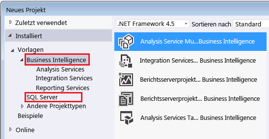

# <a name="reporting-services-in-sql-server-data-tools-ssdt"></a>Reporting Services in SQL Server-Datentools (SSDT)

  [!INCLUDE[ssBIDevStudioFull](../../includes/ssbidevstudiofull-md.md)] is a [!INCLUDE[msCoName](../../includes/msconame-md.md)] [!INCLUDE[vsprvs](../../includes/vsprvs-md.md)] environment for creating business intelligence solutions. SSDT verfügt über die Erstellungsumgebung des Bericht-Designers, in dem Sie paginierte [!INCLUDE[ssRSnoversion_md](../../includes/ssrsnoversion-md.md)] -Berichtsdefinitionen, freigegebene Datenquellen, freigegebene Datasets und Berichtsteile öffnen, ändern, vorher ansehen, speichern und bereitstellen können. [!INCLUDE[ssBIDevStudioFull](../../includes/ssbidevstudiofull-md.md)]nicht ist mit SQL Server enthalten. Herunterladen von [SQL Server Data Tools](http://go.microsoft.com/fwlink/?LinkID=616714). 
  
 In diesem Thema werden die [!INCLUDE[ssBIDevStudio](../../includes/ssbidevstudio-md.md)] -Lösungen, -Projekte, -Projektvorlagen und -Konfigurationen beschrieben, die für [!INCLUDE[ssRSnoversion](../../includes/ssrsnoversion-md.md)]verwendet werden, sowie die Ansichten, Menüs, Symbolleisten und Tastenkombinationen, die Sie im Berichts-Designer verwenden können.  
  
 Eine Einführung in das Entwerfen von Berichten finden Sie unter [Entwerfen von Berichten mithilfe des Berichts-Designers &#40;SSRS&#41;](../../reporting-services/tools/design-reporting-services-paginated-reports-with-report-designer-ssrs.md).  
  
##  <a name="bkmk_SolutionsandProjects"></a> Lösungen und Projekte  
 Ein Berichtsprojekt dient als Container für Berichtsdefinitionen und Ressourcen. Jede Datei im Berichtsprojekt wird bei der Bereitstellung des Projekts auf dem Berichtsserver veröffentlicht. Wenn Sie zum ersten Mal ein Projekt erstellen, wird zusätzlich eine Projektmappe als Container für das Projekt erstellt. Sie können mehrere Projekte zu einer Projektmappe hinzufügen.  
  
  
##  <a name="bkmk_Configurations"></a> Konfigurationen  
 Wenn Sie mehrere Sätze von Projekteigenschaften für unterschiedliche Bereitstellungsvarianten (etwa Test- und Produktionsberichtsserver im Unternehmen) erstellen möchten, verwenden Sie den Konfigurations-Manager. Weitere Informationen finden Sie unter [Bereitstellung und Versionsunterstützung in SQL Server Data Tools &#40;SSRS&#41;](../../reporting-services/tools/deployment-and-version-support-in-sql-server-data-tools-ssrs.md)enthalten.  
  
##  <a name="bkmk_ReportServerProjects"></a> Berichtsserverprojekte  
 Bei der Installation von [!INCLUDE[ssRSnoversion](../../includes/ssrsnoversion-md.md)]werden die folgenden Projektvorlagen in [!INCLUDE[ssBIDevStudioFull](../../includes/ssbidevstudiofull-md.md)]verfügbar gemacht:  
  
-   **Berichtsserverprojekt.** Wenn Sie ein Berichtsserverprojekt auswählen, wird der Berichts-Designer geöffnet. Bei einem Berichtsserverprojekt handelt es sich um eine von [!INCLUDE[vsprvs](../../includes/vsprvs-md.md)] installierte Business Intelligence-Projektvorlage, die über das Dialogfeld **Neues Projekt** aufgerufen werden kann. Weitere Informationen finden Sie unter [Hinzufügen eines neuen oder vorhandenen Berichts zu einem Berichtsprojekt &#40;SSRS&#41;](../../reporting-services/tools/add-a-new-or-existing-report-to-a-report-project-ssrs.md). Berichtsserverprojekteigenschaften gelten für alle Berichte und alle freigegebenen Datenquellen in einem [!INCLUDE[ssBIDevStudioFull](../../includes/ssbidevstudiofull-md.md)]-Projekt. Zu diesen Eigenschaften zählen die URL für den Berichtsserver sowie die Ordnernamen für Berichte und freigegebene Datenquellen. Verwenden Sie das Dialogfeld **Eigenschaftenseiten für Projekt** , um die aktuellen Eigenschaftenwerte anzuzeigen. Klicken Sie zum Öffnen dieses Dialogfelds im Menü **Projekt** auf **Eigenschaften**.  
  
-   **Berichtsserverprojekt-Assistent.** Wenn Sie ein Berichtsserver-Assistenten-Projekt auswählen, wird automatisch ein Berichtsserverprojekt erstellt und der Berichts-Assistent geöffnet. Mithilfe des Assistenten können Sie einen Bericht erstellen. Befolgen Sie hierzu die Anweisungen auf den einzelnen Seiten, um eine Verbindungszeichenfolge für eine Datenquelle zu erstellen, Datenquellen-Anmeldeinformationen festzulegen, eine Abfrage zu entwerfen, einen Tabellen- oder Matrixdatenbereich hinzuzufügen, Berichtsdaten und -gruppen anzugeben, Schriftart und Farbe auszuwählen, den Bericht auf einem Berichtsserver zu veröffentlichen und den Bericht lokal in der Vorschau anzuzeigen. Nachdem Sie mithilfe des Assistenten einen Bericht erstellt haben, können Sie die Berichtsdaten und den Berichts-Designer ändern, und zwar mithilfe des Berichts-Designers im Berichtsserverprojekt.  
  
   
  
  
##  <a name="bkmk_ReportDesignerWindowsandPanes"></a> Fenster und Bereiche des Berichts-Designers  
 Im Berichts-Designer werden zwei Ansichten unterstützt: **Entwurf** zum Definieren der Berichtsdaten und des Berichtslayouts sowie **Vorschau** zum Anzeigen einer gerenderten Ansicht des Berichts. In jeder Ansicht können Sie mehrere Fenster anzeigen, die Sie beim Entwerfen unterstützen. Außerdem können Sie einen gerenderten Bericht anzeigen.  
  
###  <a name="bkmk_ReportDataPane"></a> Berichtsdatenbereich  
 im Berichtsdatenbereich werden integrierte Felder, Datenquellen, Datasets, Feldauflistungen, Berichtsparameter und Bilder angezeigt.  
  
 Verwenden Sie den Berichtsdatenbereich, um Folgendes anzuzeigen:  
  
-   **Integrierte Felder** Vordefinierte Berichtsdefinitionen, etwa den Namen des Berichts oder den Zeitpunkt der Berichtsverarbeitung.  
  
-   **Datenquellen** Eine Datenquelle stellt einen Namen und eine Verbindung zu einer Quelle mit Daten dar.  
  
-   **Datasets** Jedes Dataset enthält eine Abfrage, aus der hervorgeht, welche Daten aus der Datenquelle abgerufen werden sollen. Erweitern Sie das Dataset, um die von der Datasetabfrage angegebene Feldauflistung anzuzeigen.  
  
     In einigen Abfrage-Designern für mehrdimensionale Datenquellen können Sie im Filterbereich Filter angeben und auswählen, ob Berichtsparameter erstellt werden sollen. Wenn Sie die Berichtsparameteroption angeben, wird automatisch ein spezielles Dataset erstellt, um die Liste mit den gültigen Werten des Parameters aufzufüllen.  Standardmäßig wird dieses Dataset nicht im Berichtsdatenbereich angezeigt. Weitere Informationen finden Sie unter [Anzeigen von ausgeblendeten Datasets für Parameterwerte für mehrdimensionale Daten &#40;Berichts-Generator und SSRS&#41;](../../reporting-services/report-data/show-hidden-datasets-for-parameter-values-multidimensional-data.md).  
  
-   **Berichtsparameter** Die Liste der Berichtsparameter. Parameter können manuell oder automatisch erstellt werden, wenn eine Datasetabfrage Abfrageparameter einschließt.  
  
-   **Bilder** Die Liste der Bilder, die als Bildberichtselement in einen Bericht eingeschlossen werden können.  
  
 Datenquellen und Datasets im Berichtsdatenbereich stellen die Elemente in der Berichtsdefinition dar. Der Berichtsdatenbereich ist eine Funktion, die von mehreren Berichtserstellungsumgebungen unterstützt wird. Im Berichts-Generator ist dies der einzige Bereich der zum Verwalten von Datenquellen und Datasets verfügbar ist. In Berichts-Designer kann der Berichtsdatenbereich mit dem Projektmappen-Explorer verwendet werden, der freigegebene Datenquellen und freigegebene Datasets als Dateien auflistet. Freigegebene Datenquellen und freigegebene Datasets im Berichtsdatenbereich müssen auf ihre entsprechenden freigegebenen Datenquellen und freigegebenen Datasets im Projektmappen-Explorer zeigen. Die Elemente des Berichtsdatenbereichs enthalten dann einen Verweis auf die Datendateien im Projektmappen-Explorer. Die Projekteigenschaften bestimmen, ob die freigegebenen Datenquellen und freigegebenen Datasets auf der Berichtsserver- oder SharePoint-Website bereitgestellt werden. Weitere Informationen finden Sie unter [Konvertieren von Datenquellen &#40;Berichts-Generator und SSRS&#41;](../../reporting-services/report-data/convert-data-sources-report-builder-and-ssrs.md).  
  
> [!NOTE]  
>  Wenn der Berichtsdatenbereich nicht angezeigt wird, klicken Sie in den Entwurfsbereich und dann im Menü **Sicht** auf **Berichtsdaten**. Wenn der Berichtsdatenbereich unverankert ist, können Sie ihn verankern. Weitere Informationen finden Sie unter [Andocken des Berichtsdatenbereichs im Berichts-Designer &#40;SSRS&#41;](../../reporting-services/tools/dock-the-report-data-pane-in-report-designer-ssrs.md).  
  
  
###  <a name="bkmk_GroupingPane"></a> Gruppierungsbereich  
 Verwenden Sie den Gruppierungsbereich, um Gruppen für einen Tablix-Datenbereich zu definieren. Sie können Zeilengruppen und Detailgruppen für Tabellen sowie Zeilen- und Spaltengruppen für Matrizen definieren. Sie können den Gruppierungsbereich nicht verwenden, um Gruppen für Diagramme und andere Datenbereiche zu definieren. Weitere Informationen finden Sie unter [Grundlegendes zu Gruppen &#40;Berichts-Generator und SSRS&#41;](../../reporting-services/report-design/understanding-groups-report-builder-and-ssrs.md).  
  
 Der Gruppierungsbereich unterstützt zwei Modi:  
  
-   **Standard.** Verwenden Sie das Dialogfeld **Standard** , um alle Zeilen- und Spaltengruppen in einem hierarchischen Format anzuzeigen, das die Beziehung zwischen übergeordneten Gruppen, untergeordneten Gruppen, angrenzenden Gruppen und Detailgruppen aufzeigt. Eine untergeordnete Gruppe wird im Vergleich zu ihrer übergeordneten Gruppe unter und auf der nächsten Einzugsebene angezeigt. Eine angrenzende Gruppe wird auf der gleichen Einzugsebene wie ihre Peergruppen oder gleichgeordneten Gruppen angezeigt.  
  
     Verwenden Sie den Standardmodus, um Gruppen hinzuzufügen, zu bearbeiten oder zu löschen. Für Gruppen, die auf einem einzelnen Datasetfeld basieren, ziehen Sie das Feld in die Bereiche für Zeilengruppen und Spaltengruppen. Sie können die Gruppe über oder unter einer vorhandenen Gruppe einfügen. Zum Hinzufügen einer angrenzenden Gruppe klicken Sie mit der rechten Maustaste auf die gleichgeordnete Gruppe, und verwenden Sie dann das Kontextmenü. Um anzuzeigen, welche Tablixzellen zu einer Gruppe gehören, wählen Sie die Gruppe im Gruppierungsbereich aus.  
  
-   **Erweitert.** Verwenden Sie das Dialogfeld **Erweitert** , um statische und dynamische Zeilen- und Gruppenelemente des ausgewählten Tablix-Datenbereichs anzuzeigen.  Sie müssen Gruppenelemente verwenden, um Eigenschaften zur Steuerung der Sichtbarkeit der Zeilen und Spalten für eine Gruppe oder ein Gruppenmitglied oder die Regeln festzulegen, die von Renderern verwendet werden, um Gruppen auf einer Seite zusammenzuhalten. Gruppenelemente werden in der Entwurfsoberfläche als Zellen in den Zeilen- und Spaltengruppenbereichen angezeigt.  
  
> [!NOTE]  
>  Klicken Sie mit der rechten Maustaste auf den Pfeil nach unten, der sich rechts neben dem Symbol **Spaltengruppen** befindet, um zwischen den Modi **Standard** und **Erweitert** umzuschalten.  
  
 Weitere Informationen finden Sie unter [Grouping Pane](../../reporting-services/tools/grouping-pane.md).  
  
  
###  <a name="bkmk_Toolbox"></a> Toolbox  
 Die Toolbox enthält Berichtselemente, die Sie auf die Entwurfsoberfläche ziehen können. Datenbereiche sind Berichtselemente, die Sie verwenden, um die Daten im Bericht zu organisieren. Tabelle, Matrix, Liste, Diagramm, Messgerät, Datenleiste, Sparkline und Indikator sind Datenbereiche. Andere Berichtselemente schließen Karte, Textfeld, Rechteck, Linie, Bild und Unterbericht ein. Diese Liste kann auch benutzerdefinierte Berichtselemente enthalten, wenn diese vom Systemadministrator installiert und registriert wurden.  
  
###  <a name="bkmk_PropertiesPane"></a> Eigenschaftenbereich  
 Der Eigenschaftenbereich ist ein Standardfenster von [!INCLUDE[vsprvs](../../includes/vsprvs-md.md)] , in dem die Eigenschaftsnamen und Werte für das aktuell auf der Entwurfsoberfläche ausgewählte Berichtselement angezeigt werden. In den meisten Fällen entsprechen Eigenschaftsnamen den Elementen und Attributen in der RDL-Datei (Report Definition Language, Berichtsdefinitionssprache). Die am häufigsten verwendeten Eigenschaften können im Dialogfeld Eigenschaften für das ausgewählte Element festgelegt werden. Zum Öffnen des entsprechenden Dialogfelds klicken Sie auf die Schaltfläche **Eigenschaftenseiten** auf der Eigenschaftenbereichssymbolleiste. Erfahrene Benutzer können die Eigenschaftenwerte im Eigenschaftenbereich festlegen.  
  
 Verwenden Sie den Eigenschaftenbereich, um Folgendes durchzuführen:  
  
-   Festlegen von Eigenschaften für das aktuell ausgewählte Element auf der Entwurfsoberfläche. Einige Eigenschaften stellen eine Dropdownliste mit Werten bereit. Sie können den Wert auch direkt in die Zelle eingeben. Einige Eigenschaften enthalten eine Sammlung von Werten, die durch den Wert **(Auflistung)**angegeben wird. Die meisten Eigenschaften können einen Ausdruck akzeptieren; komplexe Ausdrücke werden durch die angegebenen  **\<Ausdruck >**. Klicken Sie auf  **\<Ausdruck >** So öffnen die **Ausdruck** (Dialogfeld). Weitere Informationen finden Sie unter [Expression Dialog Box](http://msdn.microsoft.com/library/e6c74ccb-4594-4d4f-b958-618d710e34eb).  
  
-   Verwenden Sie die Schaltflächen in der Symbolleiste des Eigenschaftenbereichs, um das Raster von Kategoriesicht in alphabetische Sicht zu ändern. In der Kategoriesicht müssen Sie möglicherweise eine Kategorie erweitern, um alle Eigenschaften darunter zu sehen. Zum Öffnen des Dialogfelds „Eigenschaften“ für ein Element klicken Sie in der Symbolleiste auf die Schaltfläche **Eigenschaftenseiten** , oder klicken Sie mit der rechten Maustaste auf das Element, und klicken Sie anschließend auf **Eigenschaften**.  
  
-   Legen Sie Eigenschaften für das aktuell ausgewählte Gruppenmitglied im Gruppierungsbereich fest. Mit Gruppenmitgliedseigenschaften können Sie steuern, wie statische Gruppenkopf- und -fußzeilen für die einzelnen Gruppeninstanzen wiederholt werden. Weitere Informationen finden Sie unter [Anzeigen von Kopf- und Fußzeilen einer Gruppe &#40;Berichts-Generator und SSRS&#41;](../../reporting-services/report-design/display-headers-and-footers-with-a-group-report-builder-and-ssrs.md).  
  
 Klicken Sie im Menü **Ansicht** auf **Eigenschaftenfenster**, um das Eigenschaftenfenster anzuzeigen. Sie können die Verankerung dieses Bereichs aufheben und ihn an eine andere Stelle im [!INCLUDE[ssBIDevStudio](../../includes/ssbidevstudio-md.md)]-Fenster verschieben oder auf der Entwurfsoberfläche als Ansicht im Registerkartenformat anzeigen.  
  
  
###  <a name="bkmk_SolutionExplorer"></a> Projektmappen-Explorer  
 Der Projektmappen-Explorer ist eine Standardkomponente von [!INCLUDE[vsprvs](../../includes/vsprvs-md.md)] , die alle Elemente im Projekt anzeigt. Für ein Berichtsserverprojekt umfasst er Ordner zum Organisieren von freigegebenen Datenquellen, freigegebenen Datasets, Berichten und Ressourcen. Berichtselemente werden automatisch alphabetisch sortiert, wenn Sie die Projektmappendatei für ein Projekt öffnen. Um Elementeigenschaften im Eigenschaftenbereich anzuzeigen, wählen Sie das Element aus.  
  
###  <a name="bkmk_Output"></a> Ausgabe  
 Im Ausgabefenster werden Verarbeitungsfehler angezeigt, wenn Sie einen Bericht in der Vorschau anzeigen, und Veröffentlichungsfehler, wenn Sie einen Bericht oder eine freigegebene Datenquelle bereitstellen.  
  
 Verwenden Sie die Ausgabe- und Dokumentgliederungsfenster, um Fehler in Ausdrücken zu debuggen.  
  
  
###  <a name="bkmk_DocumentOutline"></a> Dokumentgliederung  
 Im Dokumentgliederungsfenster wird eine hierarchische Liste aller Berichtselemente angezeigt, die Teil der Berichtsdefinition sind. Zum Öffnen des Dokumentgliederungsbereichs zeigen Sie im Menü **Ansicht** auf **Weitere Fenster** , und klicken Sie dann auf **Dokumentfenster**.  
  
 Verwenden Sie den Dokumentgliederungsbereich, um Textfelder und andere Berichtselemente nach dem Namen zu identifizieren. Wenn Sie ein Element in der Dokumentgliederung auswählen, wird das Element auch auf der Entwurfsoberfläche ausgewählt.  
  
###  <a name="bkmk_TaskList"></a> Aufgabenliste  
 Im Fenster Aufgabenliste [!INCLUDE[msCoName](../../includes/msconame-md.md)] werden Erstellungsfehler für nicht unterstützte Funktionen angezeigt, wenn Sie einen Bericht aus einer anderen Anwendung wie  Access importieren.  
  
  
##  <a name="bkmk_ReportDesignerDesignView"></a> Entwurfsansicht des Berichts-Designers  
 Wenn Sie ein Berichtsserverprojekt erstellen, wird der Berichts-Designer standardmäßig in der Entwurfsansicht geöffnet und die Entwurfsoberfläche angezeigt. Die Entwurfsoberfläche enthält standardmäßig den Berichtstext sowie den Berichtshintergrund.  
  
 Das Hintergrund-Kontextmenü enthält Optionen zum Hinzufügen einer Kopf- und Fußzeile. Im Ansicht-Menü finden Sie ein Lineal und den Bereich für die Gruppierung.  
  
 Verwenden Sie das Zoomsteuerelement, um die Berichtsanzeige zu vergrößern oder zu verkleinern.  
  
 Um einen Bericht zu entwerfen, können Sie Berichtselemente aus der Toolbox auf die Entwurfsoberfläche ziehen. Im Anschluss können Sie ihre Eigenschaften konfigurieren und ihre Anordnung im Bericht ändern.  
  
  
##  <a name="bkmk_ReportDesignerPreview"></a> Berichts-Designer-Vorschau  
 Verwenden Sie die Vorschau, um einen Bericht auszuführen und den gerenderten Bericht im Berichts-Viewer anzuzeigen. Mit Vorschau werden Berichtsdaten lokal zwischengespeichert. Sie können auch Konfigurationseigenschaften festlegen, um den Bericht in der Debugansicht auszuführen (über einen Browser).  
  
 Wenn Sie einen Bericht in der Vorschau anzeigen, wird vom Berichts-Designer eine Verbindung mit den Berichtsdatenquellen hergestellt und dann werden die Datasetabfragen ausgeführt, die Daten im Cache des lokalen Computers gespeichert, der Bericht verarbeitet, um Daten und Layout zu kombinieren, und der Bericht schließlich gerendert. Sie können den Bericht auf der Registerkarte Vorschau anzeigen oder Projekteigenschaften festlegen, um den Bericht im Debugmodus direkt in einem Browser anzuzeigen.  
  
-   **Anzeigen einer Vorschau für parametrisierte Berichte.** Wenn Sie eine Vorschau eines Berichts anzeigen, wird der Bericht automatisch verarbeitet, wenn alle Berichtsparameter über gültige Standardwerte verfügen. Wenn ein oder mehrere Berichtsparameter über keinen gültigen Standardwert verfügen, müssen Sie für jeden nicht zugewiesenen Parameter einen Wert auswählen und dann in der Symbolleiste des Berichts auf **Bericht anzeigen**klicken.  
  
-   **Verstehen des lokalen Datencaches** Wenn Sie einen Bericht in der Vorschau anzeigen, werden vom Berichtsprozessor alle Datasetabfragen im Bericht mithilfe der aktuellen Parameterstandardwerte ausgeführt, und die Ergebnisse werden als lokale Datencachedatei (.rdl.data) gespeichert. Wenn Sie keine Änderungen an den Datasetabfragen des Berichts oder an den Berichtsparametern vornehmen, können Sie mit dem Entwerfen Ihres Berichts fortfahren, ohne diese Daten erneut abzurufen.  
  
-   **Anzeigen des Berichts in der Vorschau mithilfe des Konfigurations-Managers und Debuggen.** In [!INCLUDE[ssBIDevStudioFull](../../includes/ssbidevstudiofull-md.md)]definieren Sie über Projekteigenschaften, wie Sie die Berichte bereitstellen und debuggen möchten. Diese Eigenschaften gelten für alle Berichte und freigegebenen Datenquellen im Projekt. Klicken Sie zum Festlegen der Projekteigenschaften im Menü **Projekt** auf **Eigenschaften**. Verwenden Sie diese Einstellungen, um Ihre Berichte zu testen und sie auf dem Berichtsserver zu veröffentlichen.  
  
-   **Überwachen des Ausgabebereichs für Fehlermeldungen.** Wenn Sie eine Vorschau für einen Bericht anzeigen und vom Berichtsprozessor ein Problem entdeckt wird, werden Fehlermeldungen in den Ausgabebereich geschrieben.  
  
  
##  <a name="bkmk_ReportDesignerMenus"></a> Berichts-Designer-Menüs  
 Wenn in [!INCLUDE[ssBIDevStudioFull](../../includes/ssbidevstudiofull-md.md)]ein Berichts-Designer-Projekt aktiviert ist, werden der Hauptsymbolleiste die folgenden Symbolleisten hinzugefügt. Die Berichts-Designer-Menüs sind nur in der Entwurfsansicht sichtbar.  
  
###  <a name="FormatMenu"></a> Menü 'Format'  
 Wenn Sie auf der Entwurfsoberfläche ein Element auswählen, enthält das Menü **Format** die folgenden Optionen:  
  
-   **Vordergrundfarbe** Wählen Sie eine Textfarbe aus. Die Standardtextfarbe ist Schwarz.  
  
-   **Hintergrundfarbe** Wählen Sie eine Hintergrundfarbe für Textfelder und Datenregionen aus.  
  
-   **Schriftart** Geben Sie an, ob der Text fett, kursiv oder unterstrichen ist.  
  
-   **Im Blocksatz ausrichten** Geben Sie an, ob der Text rechtsbündig, linksbündig oder zentriert ausgerichtet ist.  
  
-   **Ausrichten** Geben Sie an, wie ausgewählte Objekte innerhalb des Berichts in Relation zueinander ausgerichtet werden.  
  
-   **Größe angleichen** Gleichen Sie die Größe der ausgewählten Objekte innerhalb des Berichts an.  
  
-   **Horizontaler Abstand** Gleichen Sie den horizontalen Abstand zwischen ausgewählten Objekten innerhalb des Berichts an.  
  
-   **Vertikaler Abstand** Gleichen Sie den vertikalen Abstand zwischen ausgewählten Objekten innerhalb des Berichts an.  
  
-   **Auf Formular zentrieren** Zentrieren Sie das ausgewählte Objekt vertikal und horizontal im Verhältnis zum Fenster des Berichts-Designers.  
  
-   **Reihenfolge** Verschieben Sie ausgewählte Objekte in den Hintergrund oder den Vordergrund.  
  
###  <a name="ReportMenu"></a> Menü 'Bericht'  
 Wenn sich der Fokus auf der Berichtsentwurfsoberfläche befindet, enthält das Menü **Bericht** die folgenden Optionen:  
  
-   **Berichtseigenschaften** Wählen Sie diese Option aus, um das Dialogfeld **Berichtseigenschaften** zu öffnen. In diesem Dialogfeld können Sie die allgemeinen Berichtseigenschaften, wie den Namen des Autors und den Rasterabstand zuweisen, und Sie können Eigenschaften für das Berichtslayout, wie die Anzahl der Spalten und die Seitengröße angeben. Sie können darüber hinaus benutzerdefinierten Code, Verweise auf Assemblys und Klassen sowie die Namen der Datenausgabeelemente, Datentransformationen und Datenschemas einschließen.  
  
-   **Sicht** Schalten Sie hiermit zwischen den zwei Berichts-Designer-Registerkarten um: Entwurf und Vorschau.  
  
-   **Seitenkopf** Hiermit können Sie dem Bericht einen Seitenkopf hinzufügen oder den Seitenkopf löschen. Wenn Sie einen Seitenkopf löschen, werden alle Elemente im Seitenkopf gelöscht.  
  
-   **Seitenfuß** Hiermit können Sie dem Bericht einen Seitenfuß hinzufügen oder den Seitenfuß löschen. Wenn Sie einen Seitenfuß löschen, werden alle Elemente im Seitenfuß gelöscht.  
  
-   **Gruppierungsbereich** Dient zum Ein- oder Ausblenden des Gruppierungsbereichs.  
  
###  <a name="ViewMenu"></a> Menü 'Ansicht'  
 Verwenden Sie das Menü **Ansicht** , um die Berichts-Designer-Fenster und Symbolleisten anzuzeigen.  
  
-   **Fehlerliste** Verwenden Sie diese Option, um Fehler anzuzeigen, die beim Veröffentlichen oder Anzeigen eines Berichts in der Vorschau erkannt wurden.  
  
-   **Ausgabe** Verwenden Sie diese Option, um Fehler anzuzeigen, die bei der Veröffentlichung oder Verarbeitung eines Berichts entdeckt wurden, oder um weitere Informationen zu Ausdrucksfehlern anzuzeigen, wenn ein Bericht den Text „#Fehler“ anzeigt.  
  
-   **Eigenschaftenfenster** Verwenden Sie diese Option, um die Eigenschaftenwerte für das gerade ausgewählte Berichtselement auf der Entwurfsoberfläche anzuzeigen. Zum Anzeigen von Eigenschaften für geschachtelte Berichtselemente müssen Sie mehrfach auf ein Berichtselement klicken, um durch die Hierarchie des Berichtselements und seiner geschachtelten Elemente zu blättern. Überprüfen Sie den Namen des Elements, das im Eigenschaftenbereich ganz oben angezeigt wird, um festzustellen, für welches Element des Berichts die Eigenschaften angezeigt werden.  
  
-   **Toolbox** Verwenden Sie diese Option, um die Toolbox anzuzeigen.  
  
-   **Weitere Fenster** Verwenden Sie diese Option, um den folgenden Bereich anzuzeigen:  
  
    -   **Dokumentgliederung** Verwenden Sie diese Option, um eine hierarchische Ansicht der Berichtselemente und Auflistungen der Textfelder in einem Bericht anzuzeigen.  
  
-   **Symbolleisten** Verwenden Sie diese Option, um Symbolleisten anzuzeigen, die Berichts-Designer-Funktionen unterstützen, einschließlich **Berichtsrahmen** und **Berichtsformatierung**. Weitere Informationen zum finden Sie unter [Berichts-Designer-Symbolleisten](#bkmk_ReportDesignerToolbars).  
  
-   **Berichtsdaten** Verwenden Sie diese Option, um den Berichtsdatenbereich anzuzeigen, in dem Sie Berichtsparameter, Datenquellen, Datasets und Bilder hinzufügen können.  
  
###  <a name="ProjectMenu"></a> Menü 'Projekt'  
 Verwenden Sie das Menü **Projekt** , um freigegebene Datenquellen und Berichte in einem Projekt zu verwalten. Wenn Sie dem Projekt Elemente hinzufügen oder Elemente daraus entfernen, wird die hierarchische Anzeige der Projektelemente im Projektmappen-Explorer automatisch aktualisiert.  
  
-   **Neues Element hinzufügen** Fügt dem Projekt eine neue freigegebene Datenquelle oder einen neuen Bericht hinzu.  
  
-   **Vorhandenes Element hinzufügen** Fügt dem Projekt eine vorhandene freigegebene Datenquelle oder einen vorhandenen Bericht hinzu.  
  
-   **Berichte importieren** Importiert Berichte aus einer anderen Anwendung, z. B. Microsoft Access.  
  
-   **Aus Projekt ausschließen** Schließt Elemente aus dem Projekt aus. Diese Option löscht das Element nicht aus dem Dateisystem.  
  
-   **Alle Dateien anzeigen** Zeigt alle Dateien in einem Projekt an.  
  
-   **Projekt-Toolboxelemente aktualisieren** Aktualisiert den Toolboxcache, wenn Sie neue benutzerdefinierte Berichtselemente im Projekt installieren.  
  
-   **Eigenschaften** Öffnet das Dialogfeld **Eigenschaftenseiten** für dieses Projekt. Weitere Informationen finden Sie auf den [Eigenschaftsseiten für Projekt (Dialogfeld)](../../reporting-services/tools/project-property-pages-dialog-box.md).  
  
  
##  <a name="bkmk_ReportDesignerToolbars"></a> Berichts-Designer-Symbolleisten  
 Beim Entwerfen von Berichten stellt Berichts-Designer die folgenden spezialisierten Symbolleisten bereit:  
  
-   **Bericht** Hiermit können Sie einen Seitenkopf oder -fuß hinzufügen, Berichtseigenschaften festlegen, das Lineal oder den Gruppierungsbereich umschalten oder zoomen, um die Ansicht des Berichts zu wechseln.  
  
-   **Berichtsrahmen** Hiermit können Sie die Farbe, den Stil und die Breite aller ausgewählten Linien sowie die Rahmen für alle ausgewählten Berichtselemente festlegen.  
  
-   **Berichtsformatierung** Hiermit können Sie das Format ausgewählter Berichtselemente festlegen. Über diese Symbolleiste können die folgenden Formatierungen für Textfelder geändert werden: Schrifteigenschaften und Textfarbe, Hintergrundfarbe und Textausrichtung.  
  
-   **Layout** Hiermit können Sie die Zeichnungsreihenfolge von Berichtselementen und das Verbinden von Zellen innerhalb eines Datenbereichs festlegen.  
  
-   **Standard** Hiermit können Sie Projekte öffnen oder speichern, Fenster anzeigen und die Debug-Konfiguration auswählen.  
  
 Steuern Sie über das Menü **Ansicht** , ob diese Symbolleisten angezeigt werden. Andere [!INCLUDE[vsprvs](../../includes/vsprvs-md.md)] -Symbolleisten werden möglicherweise deaktiviert, wenn ihre Funktionalität nicht für Berichts-Designer-Funktionen gilt.  
  

##  <a name="bkmk_SourceControl"></a> Quellcodeverwaltung  
 [!INCLUDE[ssBIDevStudio](../../includes/ssbidevstudio-md.md)] kann in Quellen-Plug-Ins integriert werden. Verwenden Sie im Dialogfeld **Optionen** die Seiten zu Projekten und Projektmappen, um das Plug-In anzugeben und Einstellungen zu konfigurieren:  
  
##  <a name="bkmk_CustomReportTemplates"></a> Benutzerdefinierte Berichtsvorlagen  
 Wenn Sie benutzerdefinierte Berichte als Vorlagen für neue Berichte verwenden möchten, kopieren Sie diese einfach in den Ordner ReportProject auf dem Computer mit [!INCLUDE[ssBIDevStudio](../../includes/ssbidevstudio-md.md)] . Dieser Ordner befindet sich standardmäßig an folgendem Speicherort:  `<drive>:\Program Files\Microsoft Visual Studio 14.0\Common7\IDE\Private Assemblies\ProjectItems\ReportProject`. Wenn Sie dem Berichtsprojekt ein neues Element hinzufügen, wird der benutzerdefinierte Bericht im Vorlagenbereich angezeigt.  
  
 Zudem können Sie dem Berichts-Assistenten benutzerdefinierte Stile hinzufügen.  
  
  
##  <a name="bkmk_CommandLineSupportForssdt"></a> Befehlszeilenunterstützung für SQL Server-Datentools  
 [!INCLUDE[ssBIDevStudio](../../includes/ssbidevstudio-md.md)]basiert auf [!INCLUDE[msCoName](../../includes/msconame-md.md)] [!INCLUDE[vsprvs](../../includes/vsprvs-md.md)] und der zugrunde liegenden Anwendung devenv.exe. Bevor Sie diese Optionen verwenden können, müssen Sie für beide folgenden Elemente gültige Werte festlegen:  
  
-   Projekteigenschaften für OverwriteDataSources, TargetDataSourceFolder, TargetReportFolder und TargetServerURL.  
  
-   Mindestens ein Satz von Konfigurationseigenschaften, z. B. Debug oder Release.  
  
 Weitere Informationen finden Sie unter [Publishing Data Sources and Reports](../../reporting-services/reports/publishing-data-sources-and-reports.md).  
  
 Für ein Berichtsserverprojekt können Sie an der Befehlszeile die folgenden Optionen angeben:  
  
-   **/deploy** Mit dieser Option stellen Sie mit den in einer Konfigurationsdatei angegebenen Projekteigenschaften Berichte bereit. Beispielsweise werden mit dem folgenden Befehl die in der Projektmappendatei Reports.sln angegebenen Berichte bereitgestellt, wobei die in den Projekteigenschaften angegebenen Einstellungen für die Releasekonfiguration verwendet werden:  
  
    ```  
    devenv.exe "C:\Users\MyUser\Documents\Visual Studio 2015\Projects\Reports\Reports.sln" /deploy "Release"  
    ```  
  
-   **/build** Mit dieser Option erstellen Sie die Projektmappendatei, stellen diese jedoch nicht bereit. Beispielsweise werden mit dem folgenden Befehl die in der Projektmappendatei Reports.sln angegebenen Berichte erstellt, wobei die in den Projekteigenschaften angegebenen Einstellungen für die Debugkonfiguration verwendet werden:  
  
    ```  
    devenv.exe "C:\Users\MyUser\Documents\Visual Studio 2015\Projects\Reports\Reports.sln" /build "Debug"  
    ```  
  
-   **/out** Die durch Erstellen einer Projektmappe generierte Ausgabe wird in die angegebene Datei umgeleitet. Beispielsweise wird mit dem folgenden Befehl die Ausgabe des Builds im vorherigen Beispiel in die Datei mybuildlog.txt umgeleitet.  
  
    ```  
    devenv.exe "C:\Users\MyUser\Documents\Visual Studio 2015\Projects\Reports\Reports.sln" /build "Debug" /out mybuildlog.txt  
    ```  
  
##  <a name="bkmk_KeyboardShortcuts"></a> Tastenkombinationen in Reporting Services  
 Verwenden Sie Tastenkombinationen für folgende Aktionen:  
  
-   Steuern von Fenstern und Modi in [!INCLUDE[ssBIDevStudio](../../includes/ssbidevstudio-md.md)]:  
  
    |Description|Tastenkombination|  
    |-----------------|---------------------|  
    |Erstellen des ausgewählten Projekts|CTRL+UMSCHALT+B|  
    |Anzeigen des Eigenschaftenfensters|F4|  
    |Anzeigen des Datenfensters|STRG+ALT+D|  
    |Beginnen mit dem Debuggen|F5|  
    |Verschieben von einem geöffnetem Fenster zum nächsten|F6|  
  
-   Steuern von Elementen auf der Berichtsentwurfsoberfläche:  
  
    |Description|Tastenkombination|  
    |-----------------|---------------------|  
    |Fokus von einem Berichtselement zum nächsten Berichtselement verschieben|TAB|  
    |Ausgewähltes Berichtselement verschieben|Pfeiltasten|  
    |Ausgewähltes Berichtselement bewegen|STRG+Pfeiltasten|  
    |Größe des ausgewählten Berichtselements vergrößern oder verkleinern|STRG+UMSCHALT+Pfeiltasten|  
    |In einem Textfeld den Cursor an den Anfang des sichtbaren Anzeigetexts verschieben|STRG+POS1|  
    |In einem Textfeld den Cursor an das Ende des sichtbaren Anzeigetexts verschieben|STRG+ENDE|  
    |In einem Textfeld Text von der aktuellen Cursorposition bis zum Beginn des sichtbaren Anzeigetexts auswählen|UMSCHALT+POS1|  
    |In einem Textfeld Text von der aktuellen Cursorposition bis zum Ende des sichtbaren Anzeigetexts auswählen|UMSCHALT+ENDE|  
    |In einem Textfeld Text von der aktuellen Cursorposition bis zum Beginn des Ausdrucks auswählen|STRG+UMSCHALT+POS1|  
    |In einem Textfeld Text von der aktuellen Cursorposition bis zum Ende des Ausdrucks auswählen|STRG+UMSCHALT+ENDE|  
    |Das Kontextmenü für das ausgewählte Element öffnen|SHIFT+F10+Eigenschaftentaste auf neueren Tastaturen|
  
## <a name="next-steps"></a>Nächste Schritte

[Herunterladen von SQL Server Datatools](http://go.microsoft.com/fwlink/?LinkID=616714)
[Projektmappen-Explorer](http://msdn.microsoft.com/library/0df09843-0d4f-4925-bc6c-99265035a0c1)   
[Reporting Services-Berichte](../../reporting-services/reports/reporting-services-reports-ssrs.md)   
[Report Definition Language](../../reporting-services/reports/report-definition-language-ssrs.md)   
[Bereitstellung und Versionsunterstützung in SQL Server Data Tools](../../reporting-services/tools/deployment-and-version-support-in-sql-server-data-tools-ssrs.md)  

Weiteren Fragen wenden? [Versuchen Sie das Reporting Services-Forum stellen](http://go.microsoft.com/fwlink/?LinkId=620231)
