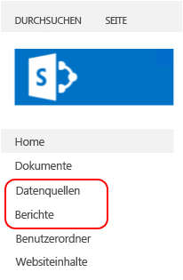

# <a name="sample-reporting-services-rsexe-script-to-copy-content-between-report-servers"></a>Reporting Services-Beispielskript für "rs.exe" zum Migrieren von Inhalten zwischen Berichtsservern

[!INCLUDE[ssrs-appliesto](../../includes/ssrs-appliesto.md)] [!INCLUDE [ssrs-appliesto-2008r2-and-later](../../includes/ssrs-appliesto-2008r2-and-later.md)] [!INCLUDE [ssrs-appliesto-sharepoint-2013-2016](../../includes/ssrs-appliesto-sharepoint-2013-2016.md)] [!INCLUDE [ssrs-appliesto-pbirs](../../includes/ssrs-appliesto-pbirs.md)]

Dieser Artikel enthält und beschreibt ein [!INCLUDE[ssRSnoversion](../../includes/ssrsnoversion-md.md)]-RSS-Beispielskript, mit dem mithilfe des Hilfsprogramms **RS.exe** Inhaltselemente und Einstellungen von einem [!INCLUDE[ssNoVersion](../../includes/ssnoversion-md.md)] [!INCLUDE[ssRSnoversion](../../includes/ssrsnoversion-md.md)]-Berichtsserver zu einem anderen Berichtsserver kopiert werden können. RS.exe wird mit [!INCLUDE[ssRSnoversion](../../includes/ssrsnoversion-md.md)]sowohl im einheitlichen als auch im SharePoint-Modus installiert. Das Skript kopiert [!INCLUDE[ssRSnoversion](../../includes/ssrsnoversion-md.md)] -Elemente, beispielsweise Berichte und Abonnements, von einem Server zu einem anderen Server. Das Skript unterstützt Berichtsserver im SharePoint-Modus und im einheitlichen Modus.  

##  <a name="bkmk_download_script"></a> So laden Sie das Skript ssrs_migration.rss herunter  
 Laden Sie das Skript von der GitHub-Website [Reporting Services RS.exe migration script (Reporting Services-Migrationsskript „RS.exe“)](https://github.com/Microsoft/sql-server-samples/tree/master/samples/features/reporting-services/ssrs-migration-rss) in einen lokalen Ordner herunter. Weitere Informationen finden Sie im Abschnitt [So verwenden Sie das Skript](#bkmk_how_to_use_the_script).  
  
##  <a name="bkmk_supported_scenarios"></a> Unterstützte Szenarien  
 Das Skript unterstützt Berichtsserver im SharePoint-Modus und im einheitlichen Modus. Das Skript unterstützt die Versionen [!INCLUDE[ssKilimanjaro](../../includes/sskilimanjaro-md.md)] und höher des Berichtsservers und des Power BI-Berichtsservers.  
  
Mit dem Skript können Inhalte zwischen Berichtsservern im gleichen Modus oder in unterschiedlichen Modi kopiert werden. Sie können das Skript z. B. ausführen, um Inhalte von einem [!INCLUDE[ssKilimanjaro](../../includes/sskilimanjaro-md.md)] -Berichtsserver im einheitlichen Modus zu einem [!INCLUDE[ssSQL11SP1](../../includes/sssql11sp1-md.md)] -Berichtsserver im SharePoint-Modus zu kopieren. Sie können das Skript auf jedem Server ausführen, auf dem RS.exe installiert ist. In der folgenden Bereitstellung haben Sie z. B. folgende Möglichkeiten:  
  
-   Führen Sie RS.exe und das Skript **AUF** Server A aus.  
  
-   So kopieren Sie Inhalte **VON** Server B  
  
-   **AUF** Server C  
  
|Servername|Berichtsserver-Modus|  
|-----------------|------------------------|  
|Server A|Systemeigenes Format|  
|Server B|SharePoint|  
|Server C|SharePoint|  
  
 Weitere Informationen zur Verwendung Hilfsprogramms RS.exe finden Sie unter [Hilfsprogramm RS.exe &#40;SSRS&#41;](../../reporting-services/tools/rs-exe-utility-ssrs.md).  
  
###  <a name="bkmk_what_is_migrated"></a> Vom Skript migrierte Elemente und Ressourcen  
 Das Skript überschreibt keine vorhandenen Inhaltselemente mit dem gleichen Namen.  Wenn das Skript auf dem Zielserver Elemente mit dem gleichen Namen erkennt, die auch auf dem Quellserver vorhanden sind, führt dies zu einer Fehlermeldung für die einzelnen Elemente, und das Skript wird weiter ausgeführt. In der folgenden Tabelle werden die Typen von Inhalten und Ressourcen aufgeführt, die zu Zielberichtsservern in den jeweiligen Modi migriert werden können.  
  
|Element|Migriert|SharePoint|Description|  
|----------|--------------|----------------|-----------------|  
|Kennwörter|**Nein**|**Nein**|Kennwörter werden **NICHT** migriert. Aktualisieren Sie nach dem Migrieren der Inhaltselemente die Anmeldeinformationen auf dem Zielserver. Beispiel: Datenquellen mit gespeicherten Anmeldeinformationen.|  
|Meine Berichte|**Nein**|**Nein**|Die Funktion "Meine Berichte" im einheitlichen Modus basiert auf einzelnen Benutzeranmeldungen. Daher hat der Skriptdienst keinen Zugriff auf Inhalte im Ordner "Meine Berichte" für Benutzer, sofern nicht der **-u** -Parameter verwendet wird, mit dem das RSS-Skript ausgeführt wird. Außerdem ist „Meine Berichte“ kein Feature des [!INCLUDE[ssRSnoversion](../../includes/ssrsnoversion-md.md)]-SharePoint-Modus, und Elemente in den Ordnern können nicht in eine SharePoint-Umgebung kopiert werden. Mit dem Skript werden daher keine Berichtselemente in den "Meine Berichte"-Ordnern auf einem Quellberichtsserver im einheitlichen Modus kopiert.<br /><br /> Führen Sie die folgenden Schritte aus, um die Inhalte der „Meine Berichte“-Ordner mit diesem Skript zu migrieren:<br /><br /> 1.  Erstellen Sie neue Ordner im Berichts-Manager. Optional können Sie Ordner oder Unterordner für jeden Benutzer erstellen.<br />2.  Melden Sie sich als einer der Benutzer mit Inhalten in „Meine Berichte“ an.<br />3.  Klicken Sie im Berichts-Manager auf den Ordner **Meine Berichte**.<br />4.  Klicken Sie auf die Ansicht **Details** für den Ordner.<br />5.  Wählen Sie die Berichte aus, die Sie kopieren möchten.<br />6.  Klicken Sie auf der Symbolleiste des Berichts-Managers auf **Verschieben**.<br />7.  Wählen Sie den gewünschten Zielordner aus.<br />8.  Wiederholen Sie die Schritte 2–7 für jeden Benutzer.<br />9. Führen Sie das Skript aus.|  
|Verlauf|**Nein**|**Nein**||  
|Verlaufseinstellungen|ja|ja|Die Verlaufseinstellungen werden migriert, die Verlaufsdetails werden jedoch NICHT migriert.|  
|Zeitpläne|ja|ja|Zum Migrieren von Zeitplänen muss der SQL Server-Agent auf dem Zielserver ausgeführt werden. Wenn der SQL Server-Agent auf dem Zielserver nicht ausgeführt wird, wird eine Fehlermeldung ähnlich wie in diesem Beispiel angezeigt:<br /><br /> `Migrating schedules: 1 items found. Migrating schedule: theMondaySchedule ... FAILURE:  The SQL Agent service isn't running. This operation requires the SQL Agent service. ---> Microsoft.ReportingServices.Diagnostics.Utilities.SchedulerNotResponding Exception: The SQL Agent service isn't running. This operation requires the SQL Agent service.`|  
|Rollen und Systemrichtlinien|ja|ja|Standardmäßig kopiert das Skript kein benutzerdefiniertes Berechtigungsschema zwischen Servern. Gemäß dem Standardverhalten werden die Elemente auf den Zielserver kopiert, wobei das Flag „Berechtigungen des übergeordneten Elements erben“ auf TRUE festgelegt ist. Wenn mit dem Skript Berechtigungen für einzelne Elemente kopiert werden sollen, verwenden Sie den SECURITY-Schalter.<br /><br /> Wenn die Quell- und Zielserver sich **nicht im gleichen Berichtsservermodus** befinden, z.B. vom einheitlichen Modus zum SharePoint-Modus, und Sie den SECURITY-Schalter verwenden, versucht das Skript, Standardrollen und -gruppen auf Grundlage des Vergleichs im folgenden Artikel zuzuordnen: [Vergleichen der Rollen und Tasks in Reporting Services mit SharePoint-Gruppen und -Berechtigungen](../../reporting-services/security/reporting-services-roles-tasks-vs-sharepoint-groups-permissions.md). Benutzerdefinierte Rollen und Gruppen werden nicht auf den Zielserver kopiert.<br /><br /> Wenn das Skript zwischen Servern **im gleichen Modus**kopiert wird und Sie den SECURITY-Schalter verwenden, erstellt das Skript neue Rollen (einheitlicher Modus) oder Gruppen (SharePoint-Modus) auf dem Zielserver.<br /><br /> Wenn eine Rolle bereits auf dem Zielserver vorhanden ist, erstellt das Skript eine Fehlermeldung wie im folgenden Beispiel und setzt das Migrieren anderer Elemente fort. Überprüfen Sie nach dem Abschließen des Skripts, ob die Rollen auf dem Zielserver Ihren Anforderungen entsprechend konfiguriert wurden. the Migrating roles: 8 items found.<br /><br /> `Migrating role: Browser ... FAILURE: The role 'Browser' already exists and cannot be created. ---> Microsoft.ReportingServices.Diagnostics.Utilities.RoleAlreadyExistsException: The role 'Browser' already exists and cannot be created.`<br /><br /> Weitere Informationen finden Sie unter [Gewähren von Benutzerzugriff auf einen Berichtsserver &#40;Berichts-Manager&#41;](../../reporting-services/security/grant-user-access-to-a-report-server-report-manager.md).<br /><br /> **Hinweis:** Wenn ein Benutzer, der auf dem Quellserver vorhanden ist, auf dem Zielserver nicht vorhanden ist, kann das Skript keine Rollenzuweisungen auf dem Zielserver anwenden. Das Skript kann keine Rollenzuweisungen anwenden, selbst wenn der SECURITY-Schalter verwendet wird.|  
|Freigegebene Datenquelle|ja|ja|Das Skript überschreibt keine vorhandenen Elemente auf dem Zielserver. Wenn auf dem Zielserver bereits ein Element mit demselben Namen vorhanden ist, wird eine Fehlermeldung wie diese angezeigt:<br /><br /> `Migrating DataSource: /Data Sources/Aworks2012_oltp ... FAILURE:The item '/Data Sources/Aworks2012_oltp' already exists. ---> Microsoft.ReportingServices.Diagnostics.Utilities.ItemAlreadyExistsException: The item '/Data Source s/Aworks2012_oltp' already exists.`<br /><br /> Anmeldeinformationen werden **NICHT** als Teil der Datenquelle kopiert. Aktualisieren Sie nach dem Migrieren der Inhaltselemente die Anmeldeinformationen auf dem Zielserver.|  
|Freigegebenes Dataset|ja|ja||  
|Ordner|ja|ja|Das Skript überschreibt keine vorhandenen Elemente auf dem Zielserver. Wenn auf dem Zielserver bereits ein Element mit demselben Namen vorhanden ist, wird eine Fehlermeldung wie diese angezeigt:<br /><br /> `Migrating Folder: /Reports ... FAILURE: The item '/Reports' already exists. ---> Microsoft.ReportingServices.Diagnostics.Utilities.ItemAlreadyExistsException: The item '/Reports' already exists.`|  
|Bericht|ja|ja|Das Skript überschreibt keine vorhandenen Elemente auf dem Zielserver. Wenn auf dem Zielserver bereits ein Element mit demselben Namen vorhanden ist, wird eine Fehlermeldung wie diese angezeigt:<br /><br /> `Migrating Report: /Reports/testThe item '/Reports/test' already exists. ---> Microsoft.ReportingServices.Diagnostics.Utilities.ItemAlreadyExistsException: The item '/Reports/test' already exists.`|  
|Parameter|ja|ja||  
|Abonnements|ja|ja||  
|Verlaufseinstellungen|ja|ja|Die Verlaufseinstellungen werden migriert, die Verlaufsdetails werden jedoch NICHT migriert.|  
|Verarbeitungsoptionen|ja|ja||  
|Optionen zur Cacheaktualisierung|ja|ja|Abhängige Einstellungen werden als Teil des Katalogelements migriert. Im Folgenden finden Sie die Beispielausgabe des Skripts, wenn ein Bericht (RDL) und dazugehörige Einstellungen wie Optionen zur Cacheaktualisierung migriert werden:<br /><br /> -   Migrating parameters for report TitleOnly.rdl 0 items found.<br />-   Migrating subscriptions for report TitleOnly.rdl: 1 items found.<br />–   Migrating subscription Save in \\\server\public\savedreports as TitleOnly ... SUCCESS<br />–   Migrating history settings for report TitleOnly.rdl ... SUCCESS<br />–   Migrating processing options for report TitleOnly.rdl ... 0 items found.<br />–   Migrating cache refresh options for report TitleOnly.rdl ... SUCCESS<br />-   Migrating cache refresh plans for report TitleOnly.rdl: 1 items found.<br />–   Migrating cache refresh plan titleonly_refresh735amM2F ... SUCCESS|  
|Cacheaktualisierungspläne|ja|ja||  
|Bilder|ja|ja||  
|Berichtsteile|ja|ja||  
  
##  <a name="bkmk_required_permissions"></a> Erforderliche Berechtigungen  
 Die erforderlichen Berechtigungen zum Lesen oder Schreiben von Elementen und Ressourcen sind nicht für alle im Skript verwendeten Methoden gleich. Die folgende Tabelle enthält eine Übersicht über die für die einzelnen Elemente und Ressourcen verwendeten Methoden sowie Links zu verwandten Inhalten. Navigieren Sie zum jeweiligen Thema, um die erforderlichen Berechtigungen anzuzeigen. Im Thema zur ListChildren-Methode werden z. B. die erforderlichen Berechtigungen aufgeführt:  
  
-   **Erforderliche Berechtigungen für einheitlichen Modus:** ReadProperties für Item  
  
-   **Erforderliche Berechtigungen für SharePoint-Modus:** ViewListItems  
  
|Element oder Ressource|Quelle|Ziel|  
|----------------------|------------|------------|  
|Katalogelemente|<xref:ReportService2010.ReportingService2010.ListChildren%2A><br /><br /> <xref:ReportService2010.ReportingService2010.GetProperties%2A><br /><br /> <xref:ReportService2010.ReportingService2010.GetItemDataSources%2A><br /><br /> <xref:ReportService2010.ReportingService2010.GetItemReferences%2A><br /><br /> <xref:ReportService2010.ReportingService2010.GetDataSourceContents%2A><br /><br /> <xref:ReportService2010.ReportingService2010.GetItemLink%2A>|<xref:ReportService2010.ReportingService2010.CreateCatalogItem%2A><br /><br /> <xref:ReportService2010.ReportingService2010.SetItemDataSources%2A><br /><br /> <xref:ReportService2010.ReportingService2010.GetItemReferences%2A><br /><br /> <xref:ReportService2010.ReportingService2010.CreateDataSource%2A><br /><br /> <xref:ReportService2010.ReportingService2010.CreateLinkedItem%2A><br /><br /> <xref:ReportService2010.ReportingService2010.CreateFolder%2A>|  
|Rolle|<xref:ReportService2010.ReportingService2010.ListRoles%2A><br /><br /> <xref:ReportService2010.ReportingService2010.GetRoleProperties%2A>|<xref:ReportService2010.ReportingService2010.CreateRole%2A>|  
|Systemrichtlinie|<xref:ReportService2010.ReportingService2010.GetSystemPolicies%2A>|<xref:ReportService2010.ReportingService2010.SetSystemPolicies%2A>|  
|Zeitplan|<xref:ReportService2010.ReportingService2010.ListSchedules%2A>|<xref:ReportService2010.ReportingService2010.CreateSchedule%2A>|  
|Abonnement|<xref:ReportService2010.ReportingService2010.ListSubscriptions%2A><br /><br /> <xref:ReportService2010.ReportingService2010.GetSubscriptionProperties%2A><br /><br /> <xref:ReportService2010.ReportingService2010.GetDataDrivenSubscriptionProperties%2A>|<xref:ReportService2010.ReportingService2010.CreateSubscription%2A><br /><br /> <xref:ReportService2010.ReportingService2010.CreateDataDrivenSubscription%2A>|  
|Cacheaktualisierungsplan|<xref:ReportService2010.ReportingService2010.ListCacheRefreshPlans%2A><br /><br /> <xref:ReportService2010.ReportingService2010.GetCacheRefreshPlanProperties%2A>|<xref:ReportService2010.ReportingService2010.CreateCacheRefreshPlan%2A>|  
|Parameter|<xref:ReportService2010.ReportingService2010.GetItemParameters%2A>|<xref:ReportService2010.ReportingService2010.SetItemParameters%2A>|  
|Ausführungsoptionen|<xref:ReportService2010.ReportingService2010.GetExecutionOptions%2A>|<xref:ReportService2010.ReportingService2010.SetExecutionOptions%2A>|  
|Cacheoptionen|<xref:ReportService2010.ReportingService2010.GetCacheOptions%2A>|<xref:ReportService2010.ReportingService2010.SetCacheOptions%2A>|  
|Verlaufseinstellungen|<xref:ReportService2010.ReportingService2010.GetItemHistoryOptions%2A>|<xref:ReportService2010.ReportingService2010.SetItemHistoryOptions%2A>|  
|Elementrichtlinie|<xref:ReportService2010.ReportingService2010.GetPolicies%2A>|<xref:ReportService2010.ReportingService2010.SetPolicies%2A>|  
  
 Weitere Informationen finden Sie unter [Vergleichen der Rollen und Aufgaben in Reporting Services mit SharePoint-Gruppen und -Berechtigungen](../../reporting-services/security/reporting-services-roles-tasks-vs-sharepoint-groups-permissions.md).  
  
##  <a name="bkmk_how_to_use_the_script"></a> So verwenden Sie das Skript  
  
1.  Laden Sie die Skriptdatei in einen lokalen Ordner herunter, z.B. **C:\rss\ssrs_migration.rss**.  
  
2.  Öffnen Sie eine Eingabeaufforderung **mit Administratorberechtigungen**.  
  
3.  Navigieren Sie zum Ordner, der die Datei ssrs_migration.rss enthält.  
  
4.  Führen Sie den Befehl mit für Ihr Szenario geeigneten Parametern aus.  
  
 **Einfaches Beispiel, Berichtsserver im einheitlichen Modus zu Berichtsserver im einheitlichen Modus:**  
  
 Im folgenden Beispiel werden Inhalte von **Sourceserver** im einheitlichen Modus zu **Targetserver**im einheitlichen Modus migriert.  
  
 `rs.exe -i ssrs_migration.rss -e Mgmt2010 -s http://SourceServer/ReportServer -u Domain\User -p password -v ts="http://TargetServer/reportserver" -v tu="Domain\Userser" -v tp="password"`  
  
 **Verwendungshinweise:**  
  
-   Das Skript wird in zwei Schritten ausgeführt.  
  
     Der erste Schritt besteht aus einer Überprüfung, mit der eine Liste der Elemente zurückgegeben wird, die migriert werden. Der zweite Schritt ist der Migrationsprozess.  
  
     Sie können **das Skript nach Schritt 1 abbrechen** , wenn Sie nur die Liste der möglichen Migrationen anzeigen oder die Parameter ändern möchten. Abhängige Einstellungen werden in Schritt 1 nicht aufgeführt. Beispielsweise werden die Cacheoptionen eines Berichts nicht aufgeführt, der Bericht selbst wird jedoch aufgeführt.  
  
    > [!TIP]  
    >  Wenn Sie nur einen einzelnen Server prüfen möchten, verwenden Sie denselben Server als Quelle und Ziel, und brechen Sie den Vorgang nach Schritt 1 ab.  
  
     Eine gute Verwendung für die Überwachungsinformationen aus Schritt 1 besteht darin, vorhandene Rollen auf dem Quell- und Zielserver im einheitlichen Modus zu überprüfen. Im Folgenden finden Sie ein Beispiel für die Überwachungsliste aus Schritts 1. Beachten Sie, dass die Liste den Abschnitt „roles“ enthält, da der Schalter -v security="True" verwendet wurde:  
  
    -   `Retrieve and report the list of items that will be migrated. You can cancel the script after step 1 if you do not want to start the actual migration.`  
  
         `Retrieving roles:`  
  
         `Role: Browser`  
  
         `Role: Content Manager`  
  
         `Role: Model Item Browser`  
  
         `Retrieve and report the list of items that will be migrated. You can cancel the script after step 1 if you do not want to start the actual migration.`  
  
         `Retrieving roles:`  
  
         `Role: Browser`  
  
         `Role: Content Manager`  
  
         `Role: CustomRole`  
  
         `Role: Model Item Browser`  
  
         `Role: My Reports`  
  
         `Role: Publisher`  
  
         `Role: Report Builder`  
  
         `Role: System Administrator`  
  
         `Role: System User`  
  
         `Retrieving system policies:`  
  
         `Retrieving system policies:`  
  
         `System policy: BUILTIN\Administrators`  
  
         `System policy: domain\user1`  
  
         `System policy: domain\ueser2`  
  
         `Retrieving schedules:`  
  
         `Schedule: theMondaySchedule`  
  
         `Retrieving catalog items. This may take a while.`  
  
         `Folder: /Data Sources`  
  
         `DataSource: /Data Sources/Aworks2012_oltp`  
  
         `Folder: /images`  
  
         `Resource: /images/Boba Fett.png`  
  
         `Resource: /images/R2-D2.png`  
  
         `Folder: /Reports`  
  
         `Report: /Reports/products`  
  
         `Report: /Reports/test`  
  
         `Report: /Reports/TitleOnly`  
  
-   Bei SOURCE_URL und TARGET_URL muss es sich um gültige Berichtsserver-URLs handeln, die auf den [!INCLUDE[ssRSnoversion](../../includes/ssrsnoversion-md.md)] -Quell- und -Zielberichtsserver zeigen. Berichtsserver-URL im einheitlichen Modus:  
  
    -   `http://servername/reportserver`  
  
     URL im SharePoint-Modus:  
  
    -   `http://servername/_vti_bin/reportserver`  
  
-   Die virtuelle Ordnerstruktur, die für den Benutzer in SharePoint dargestellt wird, kann von der zugrunde liegenden Struktur abweichen. Öffnen Sie `http://servername/_vti_bin/reportserver` oder `http://servername/sites/site_name/_vti_bin/reportserver` in einem Browser, um die nicht virtuelle Ordnerstruktur anzuzeigen. Dies ist hilfreich, wenn der Quellordner und der Zielordner bei einem Server im SharePoint-Modus auf einen anderen Wert als "/" festgelegt werden sollen.  
  
-   Kennwörter werden nicht migriert und müssen erneut eingegeben werden, z.B. Datenquellen mit gespeicherten Anmeldeinformationen.  
  
##  <a name="bkmk_parameter_description"></a> Parameterbeschreibung  
  
|Parameter|Description|Required|  
|---------------|-----------------|--------------|  
|**-s** Quell_URL|URL des Quellberichtsservers|ja|  
|**-u** Domäne\Kennwort **–p** Kennwort|Anmeldeinformationen für Quellserver.|OPTIONAL, falls nicht vorhanden, werden Standardanmeldeinformationen verwendet.|  
|**-v st**="WEBSITE"||OPTIONAL. Dieser Parameter wird nur für Berichtsserver im SharePoint-Modus verwendet.|  
|**- v f**="QUELLORDNER"|Legen Sie diesen Parameter auf "/" fest, um alle Inhalte zu migrieren, oder z. B. auf "/Ordner/Unterordner" für eine partielle Migration. Alle Elemente in diesem Ordner werden kopiert|OPTIONAL, der Standardwert lautet "/".|  
|**-v ts**="ZIEL_URL"|'URL des RS-Zielservers"||  
|**-v tu**="Domäne\Benutzername" **-v tp**="Kennwort"|'Anmeldeinformationen für den Zielserver|OPTIONAL, falls nicht vorhanden, werden Standardanmeldeinformationen verwendet. **Hinweis:** Der Benutzer wird als Ersteller von freigegebenen Zeitplänen und als "Geändert von"-Konto für Berichtselemente auf dem Zielserver aufgeführt.|  
|**-v tst**="WEBSITE"||OPTIONAL. Dieser Parameter wird nur für Berichtsserver im SharePoint-Modus verwendet.|  
|**-v tf** ="ZIELORDNER"|Legen Sie diesen Parameter zum Migrieren in die Stammebene auf "/" fest. Legen Sie den Parameter auf /Ordner/Unterordner fest, um Inhalte in einen bereits vorhandenen Ordner zu kopieren. Alle Elemente in "QUELLORDNER" werden in "ZIELORDNER" kopiert.|OPTIONAL, der Standardwert lautet "/".|  
|**-v security**= "True/False"|Wenn dieser Parameter auf "False" festgelegt ist, erben Zielkatalogelemente Sicherheitseinstellungen entsprechend den Einstellungen des Zielsystems. Dies ist die empfohlene Einstellung für Migrationen zwischen verschiedenen Berichtsservertypen, z.B. vom einheitlichen Modus zum SharePoint-Modus. Wenn der Wert auf "True" festgelegt ist, versucht das Skript, Sicherheitseinstellungen zu migrieren.|OPTIONAL, der Standardwert ist "False".|  
  
##  <a name="bkmk_more_examples"></a> Weitere Beispiele  
  
###  <a name="bkmk_native_2_native"></a> Berichtsserver im einheitlichen Modus zu Berichtsserver im einheitlichen Modus  
 Im folgenden Beispiel werden Inhalte von **Sourceserver** im einheitlichen Modus zu **Targetserver**im einheitlichen Modus migriert.  
  
```  
rs.exe -i ssrs_migration.rss -e Mgmt2010 -s http://SourceServer/ReportServer -u Domain\User -p password -v ts="http://TargetServer/reportserver" -v tu="Domain\Userser" -v tp="password"  
```  
  
 Im folgenden Beispiel wird der Sicherheitsschalter hinzugefügt:  
  
```  
rs.exe -i ssrs_migration.rss -e Mgmt2010 -s http://SourceServer/ReportServer -u Domain\User -p password -v ts="http://TargetServer/reportserver" -v tu="Domain\Userser" -v tp="password" -v security="True"  
```  
  
###  <a name="bkmk_native_2_sharepoint_root"></a> Einheitlicher Modus zu SharePoint-Modus – Stammwebsite  
 Im folgenden Beispiel werden Inhalte von einem **SourceServer** im einheitlichen Modus zur "Stammwebsite" auf einem Server im SharePoint-Modus ( **TargetServer**) migriert. Die Ordner "Reports" und "Data Sources" auf dem Server im einheitlichen Modus werden als neue Bibliotheken in der SharePoint-Bereitstellung migriert.  
  
   
  
```  
rs.exe -i ssrs_migration.rss -e Mgmt2010 -s http://SourceServer/ReportServer -u Domain\User -p Password -v ts="http://TargetServer/_vti_bin/ReportServer" -v tu="Domain\User" -v tp="Password"  
```  
  
###  <a name="bkmk_native_2_sharepoint_with_site"></a> Einheitlicher Modus zu SharePoint-Modus – "bi"-Websitesammlung  
 Im folgenden Beispiel werden Inhalte von einem Server im einheitlichen Modus zu einem SharePoint-Server migriert, der eine Websitesammlung "sites/bi" und eine freigegebene Dokumentbibliothek enthält. Das Skript erstellt Ordner in der Zieldokumentbibliothek. Das Skript erstellt z. B. die Ordner "Reports" und "Data Sources" in der Zieldokumentbibliothek.  
  
```  
rs.exe -i ssrs_migration.rss -e Mgmt2010 -s http://SourceServer/ReportServer -u Domain\User -p Password -v ts="http://TargetServer/sites/bi/_vti_bin/reportserver" -v tst="sites/bi" -v tf="Shared Documents" -v tu="Domain\User" -v tp="Password"  
```  
  
###  <a name="bkmk_sharepoint_2_sharepoint"></a> SharePoint-Modus zu SharePoint-Modus – "bi"-Websitesammlung  
 Im folgenden Beispiel werden Inhalte wie folgt migriert:  
  
-   Von dem SharePoint-Server **SourceServer** , der eine Websitesammlung „sites/bi“ und eine freigegebene Dokumentbibliothek enthält.  
  
-   Zu dem SharePoint-Server **TargetServer** , der eine Websitesammlung „sites/bi“ und eine freigegebene Dokumentbibliothek enthält.  
  
```  
rs.exe -i ssrs_migration.rss -e Mgmt2010 -s http://SourceServer/_vti_bin/reportserver -v st="sites/bi" -v f="Shared Documents" -u Domain\User1 -p Password -v ts="http://TargetServer/sites/bi/_vti_bin/reportserver" -v tst="sites/bi" -v tf="Shared Documents" -v tu="Domain\User" -v tp="Password"  
```  
  
###  <a name="bkmk_native_to_native_Azure_vm"></a> Einheitlicher Modus zu einheitlichem Modus – Virtueller Windows Azure-Computer  
 Im folgenden Beispiel werden Inhalte wie folgt migriert:  
  
-   Von einem Berichtsserver im einheitlichen Modus ( **SourceServer**).  
  
-   Zu einem Berichtsserver im einheitlichen Modus ( **TargetServer** ), der auf einem virtuellen Windows Azure-Computer ausgeführt wird. **TargetServer** wird nicht der Domäne von **SourceServer** hinzugefügt, und **User2** ist ein Administrator auf dem virtuellen Microsoft Azure-Computer **TargetServer**.  
  
```  
rs.exe -i ssrs_migration.rss -e Mgmt2010 -s http://SourceServer/ReportServer -u Domain\user1 -p Password -v ts="http://ssrsnativeazure.cloudapp.net/ReportServer" -v tu="user2" -v tp="Password2"  
```  
  
> [!TIP]  
>  Weitere Informationen zum Erstellen von [!INCLUDE[ssRSnoversion](../../includes/ssrsnoversion-md.md)] -Berichtsservern auf virtuellen Windows Azure-Computern mit Windows PowerShell finden Sie unter [Verwenden von PowerShell zum Erstellen einer Windows Azure-VM mit einem Berichtsserver im einheitlichen Modus](http://msdn.microsoft.com/library/dn449661.aspx).  
  
##  <a name="bkmk_sharepoint_site_to_native_Azure_vm"></a> SharePoint-Modus – "bi"-Websitesammlung zu Server im einheitlichen Modus auf virtuellem Windows Azure-Computer  
 Im folgenden Beispiel werden Inhalte wie folgt migriert:  
  
-   Von einem Berichtsserver im SharePoint-Modus ( **SourceServer** ), der eine Websitesammlung „sites/bi“ und eine freigegebene Dokumentbibliothek enthält.  
  
-   Zu einem Berichtsserver im einheitlichen Modus ( **TargetServer** ), der auf einem virtuellen Windows Azure-Computer ausgeführt wird. **TargetServer** wird nicht der Domäne von **SourceServer** hinzugefügt, und **User2** ist ein Administrator auf dem virtuellen Microsoft Azure-Computer **TargetServer**.  
  
```  
rs.exe -i ssrs_migration.rss -e Mgmt2010 -s http://uetesta02/_vti_bin/reportserver -u user1 -p Password -v ts="http://ssrsnativeazure.cloudapp.net/ReportServer" -v tu="user2" -v tp="Passowrd2"  
```  
  
##  <a name="bkmk_verification"></a> Überprüfung  
 In diesem Abschnitt werden einige Schritte zusammengefasst, die auf dem Zielserver ausgeführt werden müssen, um zu überprüfen, ob Inhalte und Richtlinien erfolgreich migriert wurden.  
  
### <a name="schedules"></a>Zeitpläne  
 So überprüfen Sie Zeitpläne auf dem Zielserver:  
  
 **Native Mode**  
  
1.  Navigieren Sie zum Berichts-Manager auf dem Zielserver.  
  
2.  Klicken Sie im oberen Menü auf **Siteeinstellungen** .  
  
3.  Klicken Sie im linken Bereich auf **Zeitpläne** .  
  
 **SharePoint-Modus:**  
  
1.  Rufen Sie **Siteeinstellungen**auf.  
  
2.  Klicken Sie in der Gruppe **Reporting Services** auf **Freigegebene Zeitpläne verwalten**.  
  
### <a name="roles-and-groups"></a>Rollen und Gruppen  
 **Native Mode**  
  
1.  Öffnen Sie [!INCLUDE[ssManStudioFull](../../includes/ssmanstudiofull-md.md)] , und stellen Sie eine Verbindung mit dem Berichtsserver im einheitlichen Modus her.  
  
2.  Klicken Sie im **Objekt-Explorer** auf **Sicherheit**.  
  
3.  Klicken Sie auf **Rollen**.  
  
##  <a name="bkmk_troubleshoot"></a> Problembehandlung  
 Verwenden Sie das Ablaufverfolgungsflag **–t** , um weitere Informationen abzurufen. Beispiel: Sie führen das Skript aus, und es wird eine Meldung wie die folgende angezeigt:  
  
-   Could not connect to server: http://\<servername>/ReportServer/ReportService2010.asmx (Bei der Verbindung mit dem Server http://<Servername>/ReportServer/ReportService2010.asmx ist ein Fehler aufgetreten.)  
  
 Führen Sie das Skript mit dem Flag **–t** erneut aus. Es wird eine Meldung wie diese angezeigt:  
  
-   System.Exception: Could not connect to server: http://\<servername>/ReportServer/ReportService2010.asmx ---> System.Net.WebException: **The request failed with HTTP status 401: Unauthorized**. (System.Exception: Bei der Verbindung mit dem Server http://<Servername>/ReportServer/ReportService2010.asmx ist ein Fehler aufgetreten > System.Net.WebException: Die Anforderung ist mit HTTP-Status 401: Nicht Autorisiert gescheitert.)   in System.Web.Services.Protocols.SoapHttpClientProtocol.ReadResponse (SoapClientMessage Message, WebResponse Response, Stream ResponseStream, Boolean AsyncCall) in System.Web.Services.Protocols.SoapHttpClientProtocol.Invoke (String MethodName, Object [] Parameters) in Microsoft.SqlServer.ReportingServices2010.ReportingService2010.IsSSLRequired() in Microsoft.ReportingServices.ScriptHost.Management2010Endpoint.PingService (String Url, String UserName, String Password String Domain, Int32 Timeout) in Microsoft.ReportingServices.ScriptHost.ScriptHost.DetermineServerUrlSecurity()---Ende der inneren ausnahmestapelüberwachung---  
  
## <a name="see-also"></a>Weitere Informationen finden Sie unter  
 [Hilfsprogramm RS.exe &#40;SSRS&#41;](../../reporting-services/tools/rs-exe-utility-ssrs.md)   
 [Vergleichen der Rollen und Aufgaben in Reporting Services mit SharePoint-Gruppen und -Berechtigungen](../../reporting-services/security/reporting-services-roles-tasks-vs-sharepoint-groups-permissions.md)  
  
  
