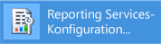
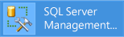

# Lernprogramm: So suchen und starten Sie Reporting Services-Tools (SSRS)

  In diesem Tutorial werden die Tools vorgestellt, mit denen Berichtsserver konfiguriert, Berichtsserverinhalte und -vorgänge verwaltet sowie paginierte und mobile [!INCLUDE[ssRSnoversion](../../includes/ssrsnoversion-md.md)] -Berichte erstellt und veröffentlicht werden. Wenn Sie mit den Tools bereits vertraut sind, können Sie zu anderen Tutorials wechseln, in denen Sie wichtige Funktionen für die Verwendung von [!INCLUDE[ssRSnoversion](../../includes/ssrsnoversion-md.md)]kennen lernen. Weitere Tutorials finden Sie unter [Reporting Services-Tutorials &#40;SSRS&#41;](../../reporting-services/reporting-services-tutorials-ssrs.md)kennen lernen.  
  
  
##   Reporting Services-Konfigurations-Manager (einheitlicher Modus)  
 Verwenden Sie den Konfigurations-Manager im einheitlichen Modus, um folgende Aufgaben auszuführen:  
  
-   Angeben des Dienstkontos.  
-   Erstellen oder Aktualisieren der Berichtsserver-Datenbank.  
-   Ändern der Verbindungseigenschaften.  
-   Angeben von URLs.  
-   Verwalten von Verschlüsselungsschlüsseln.  
-   Konfigurieren der unbeaufsichtigten Berichtsverarbeitung und E-Mail-Übermittlung von Berichten.  
  
 **Installation:** [!INCLUDE[ssRSnoversion](../../includes/ssrsnoversion-md.md)] Configuration Manager is installed when you install [!INCLUDE[ssRSnoversion](../../includes/ssrsnoversion-md.md)] Native mode. Weitere Informationen finden Sie unter [Installieren des Reporting Services-Berichtsservers im einheitlichen Modus](assetid:///8f25e6dc-b753-400e-9e9a-50f4f35bf6c4).  
  
### So starten Sie den Reporting Services-Konfigurations-Manager  
  
1.  Geben Sie im Windows-Startbildschirm **reporting** ein und klicken Sie in den Suchergebnissen in **Apps** auf **Reporting Services-Konfigurations-Manager**.  
  
       
  
     **Or**  
  
     Klicken Sie auf **Starten**, auf **Programme**, auf [!INCLUDE[ssCurrentUI](../../includes/sscurrentui-md.md)], auf **Konfigurationstools**und dann auf **Konfigurations-Manager für Reporting Services**.  
  
     Das Dialogfeld **Auswahl der Berichtsserver-Installationsinstanz** wird angezeigt, mit dem Sie die Berichtsserverinstanz auswählen können, die Sie konfigurieren möchten.  
  
2.  Geben Sie in **Servername**den Namen des Computers an, auf dem die Berichtsserverinstanz installiert ist. Standardmäßig ist der Name des lokalen Computers angegeben, Sie können jedoch auch den Namen einer Remoteinstanz von [!INCLUDE[ssNoVersion](../../includes/ssnoversion-md.md)] eingeben.  
  
     Falls Sie einen Remotecomputer angeben, klicken Sie auf **Suchen** , um eine Verbindung herzustellen. Der Berichtsserver muss zuvor für die Remoteverwaltung konfiguriert werden. Weitere Informationen finden Sie unter [Konfigurieren eines Berichtsservers für die Remoteverwaltung](../../reporting-services/report-server/configure-a-report-server-for-remote-administration.md).  
  
3.  Wählen Sie unter **Wählen Sie unterstance Name**die [!INCLUDE[ssNoVersion](../../includes/ssnoversion-md.md)] [!INCLUDE[ssRSnoversion](../../includes/ssrsnoversion-md.md)] -Instanz aus, die Sie konfigurieren möchten. Nur SQL Server 2008 und höher Berichtsserverinstanzen, die in der Liste angezeigt werden. Frühere Versionen von [!INCLUDE[ssRSnoversion](../../includes/ssrsnoversion-md.md)]können nicht konfiguriert werden.  
  
4.  Klicken Sie auf **Verbinden**.  
  
5.  Wenn Sie sicherstellen möchten, dass das Tool gestartet wurde, vergleichen Sie Ihre Ergebnisse mit dem folgenden Bild:  
  
       
  
 **Nächste Schritte:** [Konfigurieren und Verwalten eines Berichtsservers &#40;einheitlicher SSRS-Modus&#41;](../../reporting-services/report-server/configure-and-administer-a-report-server-ssrs-native-mode.md) und [Reporting Services-Konfigurations-Manager &#40;einheitlicher Modus&#41;](../../reporting-services/install-windows/reporting-services-configuration-manager-native-mode.md).  
  
##  Webportal (einheitlicher Modus)  
 Verwenden Sie das [Web portal (SSRS Native Mode)](../../reporting-services/web-portal-ssrs-native-mode.md) , um Berechtigungen festzulegen, Abonnements und Zeitpläne zu verwalten und mit Berichten zu arbeiten. Sie können das Webportal auch zum Anzeigen von Berichten verwenden.  
  
 **Installation:** das Webportal ist installiert, wenn Sie [!INCLUDE[ssRSnoversion](../../includes/ssrsnoversion-md.md)] (einheitlicher Modus) installieren: [Installieren des Reporting Services-Berichtsservers im einheitlichen Modus](assetid:///8f25e6dc-b753-400e-9e9a-50f4f35bf6c4)  
  
 Damit Sie das Webportal öffnen können, müssen Sie über ausreichende Berechtigungen verfügen (anfangs besitzen nur Mitglieder der lokalen Administratorengruppe Berechtigungen, die den Zugriff auf Webportalfunktionen ermöglichen). Das Webportal enthält verschiedene Seiten und Optionen, die sich je nach den Rollenzuweisungen des aktuellen Benutzers unterscheiden. Für Benutzer ohne Berechtigungen wird eine leere Seite angezeigt. Für Benutzer mit Berechtigungen zum Anzeigen von Berichten werden Links angezeigt, auf die sie klicken können, um die Berichte zu öffnen. Weitere Informationen zu Berechtigungen finden Sie unter [Rollen und Berechtigungen &#40;Reporting Services&#41;](../../reporting-services/security/roles-and-permissions-reporting-services.md).  
  
### So starten Sie das Webportal  
  
1.  Öffnen Sie Ihren Browser. Informationen zu unterstützten Browsern und Browserversionen finden Sie unter [Browserunterstützung für Reporting Services und Power View](../../reporting-services/browser-support-for-reporting-services-and-power-view.md).  
  
2.  Geben Sie in die Adressleiste des Webbrowsers die URL des Webportals ein. Die URL lautet standardmäßig `http://<serverName>/reports`. Zur Bestätigung des Servernamens und der URL können Sie das Reporting Services-Konfigurationstool verwenden. Weitere Informationen zu URLs in [!INCLUDE[ssRSnoversion](../../includes/ssrsnoversion-md.md)] finden Sie unter [Konfigurieren von Berichtsserver-URLs &#40;SSRS-Konfigurations-Manager&#41;](../../reporting-services/install-windows/configure-report-server-urls-ssrs-configuration-manager.md).  
  
3.  Das Webportal wird im Browserfenster geöffnet. Die Startseite entspricht dem Basisordner. In Abhängigkeit von den Berechtigungen werden möglicherweise zusätzliche Ordner, Links zu Berichten sowie Ressourcendateien auf der Startseite angezeigt. Möglicherweise werden auf der Symbolleiste auch zusätzliche Schaltflächen und Befehle angezeigt.  
  
4.  Wenn Sie das Webportal auf dem lokalen Berichtsserver ausführen, finden Sie weitere Informationen unter [Konfigurieren eines Berichtsservers im einheitlichen Modus für die lokale Verwaltung &#40;SSRS&#41;](../../reporting-services/report-server/configure-a-native-mode-report-server-for-local-administration-ssrs.md).  
   
##   Management Studio  
 Mit [!INCLUDE[ssManStudio](../../includes/ssmanstudio-md.md)] können Berichtsserveradministratoren einen Berichtsserver neben weiteren [!INCLUDE[ssNoVersion](../../includes/ssnoversion-md.md)] -Komponentenservern verwalten. Weitere Informationen finden Sie unter [Use SQL Server Management Studio](http://msdn.microsoft.com/library/f289e978-14ca-46ef-9e61-e1fe5fd593be).  
  
### So starten Sie SQL Server Management Studio  
  
1.  Geben Sie im Windows-Startbildschirm **sql server** ein, und klicken Sie in den Suchergebnissen in **Apps** auf **SQL Server Management Studio**.  
  
       
  
     **Or**  
  
     Klicken Sie auf **Start**, auf **Alle Programme**, auf [!INCLUDE[ssCurrentUI](../../includes/sscurrentui-md.md)]und klicken Sie dann auf **SQL Server Management Studio**. Das Dialogfeld **Verbindung mit Server herstellen** wird angezeigt.  
  
2.  Wenn das Dialogfeld **Verbindung mit Server herstellen** nicht angezeigt wird, klicken Sie im **Objekt-Explorer**auf **Verbinden** , und wählen Sie dann **Reporting Services**aus.  
  
3.  Wählen Sie in der Liste **Servertyp** die Option **Reporting Services**aus. Wenn [!INCLUDE[ssRSnoversion](../../includes/ssrsnoversion-md.md)] nicht in der Liste aufgeführt wird, ist es nicht installiert.  
  
4.  Wählen Sie in der Liste **Servername** eine Berichtsserverinstanz aus. In der Liste werden lokale Instanzen angezeigt. Sie können auch den Namen einer [!INCLUDE[ssNoVersion](../../includes/ssnoversion-md.md)] -Remoteinstanz eingeben.  
  
5.  Klicken Sie auf **Verbinden**. Sie können den Stammknoten erweitern, um Servereigenschaften festzulegen, Rollendefinitionen zu ändern oder Berichtsserverfunktionen zu deaktivieren.  
  
##   SQL Server-Datentools mit Berichts-Designer und Berichts-Assistent  
 Sie können zwischen zwei verschiedenen Tools zum Erstellen paginierter [!INCLUDE[ssNoVersion](../../includes/ssnoversion-md.md)] -Berichte auswählen: Berichts-Designer und [Berichts-Generator](#bkmk_report_builder).  
  
 Der Berichts-Designer steht in [!INCLUDE[ssBIDevStudioFull](../../includes/ssbidevstudiofull-md.md)] – Visual Studio zur Verfügung. Die Entwurfsoberfläche im Berichts-Designer umfasst Fenster mit Registerkarten, Assistenten und Menüs, mit denen der Zugriff auf Berichts- und Modellerstellungsfunktionen möglich ist. Das Berichts-Designer-Tool steht zur Verfügung, wenn Sie ein Berichtsserverprojekt oder eine Vorlage des Berichtsserver-Assistenten in [!INCLUDE[ssBIDevStudioFull](../../includes/ssbidevstudiofull-md.md)]auswählen. Weitere Informationen finden Sie unter [Reporting Services in SQL Server Data Tools &#40;SSDT&#41;](../../reporting-services/tools/reporting-services-in-sql-server-data-tools-ssdt.md). 
 
Herunterladen von [SQL Server Data Tools](http://go.microsoft.com/fwlink/?LinkID=616714).  
  
### So starten Sie Berichts-Designer  
  
1.  Öffnen Sie **SQL Server Data Tools**.  
  
2.  Zeigen Sie im Menü **Datei** auf **Neu**, und klicken Sie dann auf **Projekt**.  
  
3.  Klicken Sie in der Liste **Projekttypen** auf **Business Intelligence-Projekte**.  
  
4.  Klicken Sie in der Liste **Vorlagen** auf **Berichtsserverprojekt**. Mit der folgenden Grafik wird veranschaulicht, wie die Projektvorlagen im Dialogfeld angezeigt werden:  
  
     ")  
  
5.  Geben Sie einen Namen und einen Speicherort für das Projekt ein, oder klicken Sie auf **Durchsuchen** , und wählen Sie einen Speicherort aus.  
  
6.  [!INCLUDE[clickOK](../../includes/clickok-md.md)] [!INCLUDE[ssBIDevStudioFull](../../includes/ssbidevstudiofull-md.md)] wird mit der [!INCLUDE[vsprvs](../../includes/vsprvs-md.md)] -Startseite geöffnet. Der Projektmappen-Explorer umfasst Kategorien zum Erstellen von Berichten und Datenquellen. Mit diesen Kategorien können Sie neue Berichte und Datenquellen erstellen. Wenn Sie eine Berichtsdefinition erstellen, werden Fenster im Registerformat angezeigt. Die Fenster im Registerformat lauten Daten, Layout und Vorschau.  
  
 Informationen zum Erstellen Ihrer ersten Berichte finden Sie unter [Erstellen eines einfachen Tabellenberichts &#40;SSRS-Tutorial&#41;](../../reporting-services/create-a-basic-table-report-ssrs-tutorial.md). Weitere Informationen zu Abfrage-Designern, die Sie im Berichts-Designer verwenden können, finden Sie unter [Abfrageentwurfstools &#40;SSRS&#41;](../../reporting-services/report-data/query-design-tools-ssrs.md)kennen lernen.  
  
##   [!INCLUDE[ssRBnoversion](../../includes/ssrbnoversion-md.md)]  
 Der[Berichts-Generator in SQL Server 2016](../../reporting-services/report-builder/report-builder-in-sql-server-2016.md) ist eine eigenständige Anwendung zum Erstellen paginierter Berichte außerhalb von [!INCLUDE[ssNoVersion](../../includes/ssnoversion-md.md)]. Sie haben die Möglichkeit, alle vorhandenen Berichte anzupassen und zu aktualisieren. Dabei spielt es keine Rolle, ob sie im Berichts-Designer oder in früheren Versionen des [!INCLUDE[ssRBnoversion](../../includes/ssrbnoversion-md.md)]s erstellt wurden. Die Installation kann über das [!INCLUDE[ssNoVersion](../../includes/ssnoversion-md.md)] -Webportal oder über das Microsoft Download Center erfolgen.  
  
 [Laden Sie den Berichts-Generator](http://go.microsoft.com/fwlink/?LinkID=219138) aus dem Microsoft Download Center herunter.  
  
### So starten Sie den [!INCLUDE[ssRBnoversion](../../includes/ssrbnoversion-md.md)]  
  
1.  Wählen Sie im [!INCLUDE[ssNoVersion](../../includes/ssnoversion-md.md)] -Webportal im Menü  **Neu** die Option **Paginierter Bericht**.  
  
       
  
2.  Wenn der [!INCLUDE[ssRBnoversion](../../includes/ssrbnoversion-md.md)] noch nicht auf diesem Computer installiert ist, wählen Sie **[!INCLUDE[ssRBnoversion](../../includes/ssrbnoversion-md.md)] abrufen**.  
  
     oder  
  
     [Laden Sie den Berichts-Generator](http://go.microsoft.com/fwlink/?LinkID=219138) aus dem Microsoft Download Center herunter.  
  
3.  [!INCLUDE[ssRBnoversion](../../includes/ssrbnoversion-md.md)] wird geöffnet, und Sie können einen paginierten Bericht erstellen oder öffnen.  
  
##   [!INCLUDE[SS_MobileReptPub_Long](../../includes/ss-mobilereptpub-long-md.md)]  
 Verwenden Sie den [Publisher für mobile Berichte von SQL Server](http://msdn.microsoft.com/library/e23cf095-cb9a-4631-ab46-10413d8e3a7c) , um mobile Berichte zu erstellen, die Sie im [!INCLUDE[ssNoVersion](../../includes/ssnoversion-md.md)] -Webportal und auf mobilen Geräte wie iPads und iPhones anzeigen können.   Die Installation kann über das [!INCLUDE[ssNoVersion](../../includes/ssnoversion-md.md)] -Webportal oder über das Microsoft Download Center erfolgen.  
  
 [Laden Sie den Publisher für mobile Berichte von SQL Server](http://go.microsoft.com/fwlink/?LinkID=733527) aus dem Microsoft Download Center herunter.  
  
### So starten Sie den [!INCLUDE[SS_MobileReptPub_Short](../../includes/ss-mobilereptpub-short-md.md)]  
  
1.  Wählen Sie im [!INCLUDE[ssNoVersion](../../includes/ssnoversion-md.md)] -Webportal im Menü  **Neu** die Option **Mobiler Bericht**.  
  
       
  
2.  Wenn der [!INCLUDE[SS_MobileReptPub_Short](../../includes/ss-mobilereptpub-short-md.md)] noch nicht auf diesem Computer installiert ist, wählen Sie **[!INCLUDE[SS_MobileReptPub_Short](../../includes/ss-mobilereptpub-short-md.md)] abrufen**.  
  
     oder  
  
     [Laden Sie den Publisher für mobile Berichte von SQL Server](http://go.microsoft.com/fwlink/?LinkID=733527) aus dem Microsoft Download Center herunter.  
  
3.  [!INCLUDE[SS_MobileReptPub_Short](../../includes/ss-mobilereptpub-short-md.md)] wird geöffnet, und Sie können einen mobilen Bericht erstellen oder öffnen.  

## Nächste Schritte

[Herunterladen von SQL Server Mobile Report Publisher](http://go.microsoft.com/fwlink/?LinkID=733527)   
[Laden Sie den Berichts-Generator](http://go.microsoft.com/fwlink/?LinkID=219138)  
[Herunterladen von SQL Server Datatools](http://go.microsoft.com/fwlink/?LinkID=616714) 
[Installieren von Reporting Services im SharePoint-Modus](../../reporting-services/install-windows/install-reporting-services-sharepoint-mode.md)   
[Reporting Services-Berichtsserver](../../reporting-services/report-server-sharepoint/reporting-services-report-server.md)   
[Abfrageentwurfstools](../../reporting-services/report-data/query-design-tools-ssrs.md)   
[Reporting Services-Lernprogramme](../../reporting-services/reporting-services-tutorials-ssrs.md)  

Weiteren Fragen wenden? [Versuchen Sie das Reporting Services-Forum stellen](http://go.microsoft.com/fwlink/?LinkId=620231)
