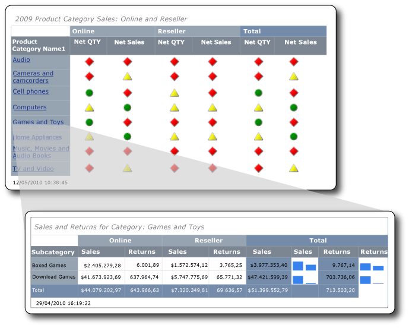

# <a name="tutorial-creating-drillthrough-and-main-reports-report-builder"></a>Lernprogramm: Erstellen von Drillthrough- und Hauptberichten (Berichts-Generator)
In diesem Tutorial erfahren Sie, wie Sie zwei Arten von paginierten [!INCLUDE[ssRSnoversion_md](../includes/ssrsnoversion-md.md)] -Berichten erstellen: einen Drillthroughbericht und einen Hauptbericht. Die in diesen Berichten verwendeten Beispielvertriebsdaten werden aus einem Analysis Services-Cube abgerufen. 

Die folgende Abbildung zeigt die Berichte, die Sie erstellen werden und wie der Feldwert „Games and Toys“ aus dem Hauptbericht im Titel des Drillthroughberichts angezeigt wird. Die Daten im Drillthroughbericht beziehen sich auf die Produktkategorie „Games and Toys!“.  
  
  
   
Geschätzte Zeit zum Bearbeiten dieses Lernprogramms: 30 Minuten  
  
## <a name="requirements"></a>Anforderungen  
Das Tutorial erfordert Zugriff auf den Contoso Sales-Cube jeweils für den Drillthrough- und den Hauptbericht. Dieses Dataset umfasst das Data Warehouse „ContosoDW“ und die OLAP -Datenbank (Online Analytical Processing) „Contoso_Retail“. Die Berichte, die Sie in diesem Lernprogramm erstellen, rufen Berichtsdaten aus dem Contoso Sales-Cube ab. Die OLAP-Datenbank Contoso_Retail kann vom [Microsoft Download Center](http://go.microsoft.com/fwlink/?LinkID=191575)heruntergeladen werden. Sie brauchen lediglich die Datei ContosoBIdemoABF.exe herunterzuladen. Diese Datei enthält die OLAP-Datenbank.  
  
Die andere Datei, ContosoBIdemoBAK.exe, ist für das Data Warehouse ContosoDW bestimmt, das in diesem Lernprogramm nicht verwendet wird.  
  
Die Website enthält Anweisungen zum Extrahieren und Wiederherstellen der Sicherungsdatei ContosoRetail.abf in der OLAP-Datenbank Contoso_Retail.  

Sie benötigen Zugriff auf eine Instanz von [!INCLUDE[ssASnoversion](../includes/ssasnoversion-md.md)], auf der die OLAP-Datenbank installiert werden soll.  
    
Weitere Informationen zu den allgemeinen Anforderungen finden Sie unter [Voraussetzungen für Tutorials &#40;Berichts-Generator&#41;](../reporting-services/prerequisites-for-tutorials-report-builder.md).  
  
## <a name="DMatrixAndDataset"></a>1. Erstellen eines Drillthroughberichts mit dem Tabellen- oder Matrix-Assistenten  
Erstellen Sie im Dialogfeld „Erste Schritte“ mit dem **Tabellen- oder Matrix-Assistenten** einen Matrixbericht. Im Assistenten stehen zwei Modi zur Auswahl: Berichtsentwurf und Entwurf von freigegebenen Datasets. In diesem Lernprogramm verwenden Sie den Berichtsentwurfsmodus.  
  
#### <a name="to-create-a-new-report"></a>So erstellen Sie einen neuen Bericht  
  
1.  [Starten Sie den Berichts-Generator](../reporting-services/report-builder/start-report-builder.md) entweder von Ihrem Computer, über das [!INCLUDE[ssRSnoversion_md](../includes/ssrsnoversion-md.md)] -Webportal oder über den integrierten SharePoint-Modus.  
  
    Das Dialogfeld **Neuer Bericht oder neues Dataset** wird geöffnet.  
  
    Wenn das Dialogfeld **Neuer Bericht oder neues Dataset** nicht angezeigt wird, wählen Sie im Menü **Datei** die Option **Neu**.  
  
2.  Vergewissern Sie sich, dass im linken Bereich **Neuer Bericht** ausgewählt ist.  
  
3.  Vergewissern Sie sich, dass im rechten Bereich **Tabellen- oder Matrix-Assistent** ausgewählt ist.  
  
## <a name="DConnection"></a>1a. Angeben einer Datenverbindung  
Eine Datenverbindung enthält die erforderlichen Informationen zum Herstellen einer Verbindung mit einer externen Datenquelle, z. B. einem Analysis Services-Cube oder einer [!INCLUDE[ssNoVersion](../includes/ssnoversion-md.md)] -Datenbank. Sie können zum Angeben einer Datenverbindung eine freigegebene Datenquelle vom Berichtsserver verwenden oder eine eingebettete Datenquelle erstellen, die nur in diesem Bericht verwendet wird. In diesem Lernprogramm verwenden Sie eine eingebettete Datenquelle. Weitere Informationen zur Verwendung von freigegebenen Datenquellen finden Sie unter [Alternative Methoden zum Herstellen einer Datenverbindung &#40;Berichts-Generator&#41;](../reporting-services/alternative-ways-to-get-a-data-connection-report-builder.md).  
  
#### <a name="to-create-an-embedded-data-source"></a>So erstellen Sie eine eingebettete Datenquelle  
  
1.  Klicken Sie auf der Seite **Dataset auswählen** auf **Dataset erstellen**und anschließend auf **Weiter**. Die Seite **Verbindung mit einer Datenquelle auswählen** wird geöffnet.  
  
2.  Klicken Sie auf **Neu**. Das Dialogfeld **Datenquelleneigenschaften** wird angezeigt.  
  
3.  Geben Sie im Feld **Name**als Name für die Datenquelle **Online and Reseller Sales Detail** ein.  
  
4.  Wählen Sie unter **Verbindungstyp auswählen**die Option **Microsoft SQL Server Analysis Services**aus, und klicken Sie anschließend auf **Erstellen**.  
  
5.  Vergewissern Sie sich, dass unter **Datenquelle**die Option **Microsoft SQL Server Analysis Services (AdomdClient)**ausgewählt ist.  
  
6.  Geben Sie unter **Servername**den Namen eines Servers ein, auf dem eine Instanz von Analysis Services installiert ist.  
  
7.  Wählen Sie unter **Datenbanknamen eingeben oder auswählen**den Contoso-Cube aus.  
  
8.  [!INCLUDE[clickOK](../includes/clickok-md.md)]  
  
9. Überprüfen Sie, ob die **Verbindungszeichenfolge** die folgende Syntax enthält:  
  
    ```  
    Data Source=<servername>; Initial Catalog = Contoso  
    ```  
  
    Der `<servername>` ist der Name der Instanz von [!INCLUDE[ssNoVersion](../includes/ssnoversion-md.md)] , auf der Analysis Services installiert sind.  
  
10. Klicken Sie auf **Anmeldeinformationstyp**.  
  
    > [!NOTE]  
    > Abhängig davon, wie die Berechtigungen für die Datenquelle konfiguriert sind, müssen Sie u. U. die standardmäßigen Authentifizierungsoptionen ändern. Weitere Informationen finden Sie unter [ &#40;Berichts-Generator&#41;](../reporting-services/report-builder/security-report-builder.md).  
  
11. [!INCLUDE[clickOK](../includes/clickok-md.md)]  
  
    Die Seite **Verbindung mit einer Datenquelle auswählen** wird angezeigt.  
  
12. Klicken Sie auf **Verbindung testen**, um sicherzustellen, dass die Verbindung mit der Datenquelle hergestellt werden kann.  
  
    Die Meldung **Die Verbindung wurde erfolgreich hergestellt** wird angezeigt.  
  
13. [!INCLUDE[clickOK](../includes/clickok-md.md)]  
  
14. Klicken Sie auf **Weiter**.  
  
## <a name="DMDXQuery"></a>1b. Erstellen einer MDX-Abfrage  
In einem Bericht können Sie ein freigegebenes Dataset mit einer vordefinierten Abfrage verwenden oder ein eingebettetes Dataset erstellen, das nur in Ihrem Bericht verwendet wird. In diesem Lernprogramm erstellen Sie ein eingebettetes Dataset.  
  
#### <a name="to-create-query-filters"></a>So erstellen Sie Abfragefilter  
  
1.  Klicken Sie auf der Seite **Abfrage entwerfen** im Bereich Metadaten auf die Schaltfläche **(...)**.  
  
2.  Klicken Sie im Dialogfeld **Cubeauswahl** auf „Sales“ und anschließend auf **OK**.  
  
    > [!TIP]  
    > Wenn Sie nicht, um die MDX-Abfrage manuell zu erstellen möchten, klicken Sie auf die  Symbol, Wechseln der Abfrage-Designer zum Abfragemodus, fügen Sie die abgeschlossene MDX in den Abfrage-Designer, und fahren Sie mit Schritt 6 in [So erstellen Sie das Dataset](#DSkip).  
  
    ```  
    SELECT NON EMPTY { [Measures].[Sales Amount], [Measures].[Sales Return Amount] } ON COLUMNS, NON EMPTY { ([Channel].[Channel Name].[Channel Name].ALLMEMBERS * [Product].[Product Category Name].[Product Category Name].ALLMEMBERS * [Product].[Product Subcategory Name].[Product Subcategory Name].ALLMEMBERS ) } DIMENSION PROPERTIES MEMBER_CAPTION, MEMBER_UNIQUE_NAME ON ROWS FROM ( SELECT ( { [Date].[Calendar Year].&[2009] } ) ON COLUMNS FROM ( SELECT ( { [Sales Territory].[Sales Territory Group].&[North America] } ) ON COLUMNS FROM ( SELECT ( STRTOSET(@ProductProductCategoryName, CONSTRAINED) ) ON COLUMNS FROM ( SELECT ( { [Channel].[Channel Name].&[2], [Channel].[Channel Name].&[4] } ) ON COLUMNS FROM [Sales])))) WHERE ( [Sales Territory].[Sales Territory Group].&[North America], [Date].[Calendar Year].&[2009] ) CELL PROPERTIES VALUE, BACK_COLOR, FORE_COLOR, FORMATTED_VALUE, FORMAT_STRING, FONT_NAME, FONT_SIZE, FONT_FLAGS  
    ```  
  
3.  Erweitern Sie im Bereich Measuregruppe den Eintrag „Channel“, und ziehen Sie anschließend „Channel Name“ in die Spalte **Hierarchie** im Filterbereich.  
  
    Der Dimensionsname, Channel, wird automatisch zur Spalte **Dimension** hinzugefügt. Nehmen Sie keine Änderungen an den Spalten **Dimension** oder **Operator** vor.  
  
4.  Klicken Sie zum Öffnen der Liste **Filterausdruck** auf den Abwärtspfeil in der Spalte **Filterausdruck** .  
  
5.  Erweitern Sie in der Filterausdruckliste den Eintrag **All Channel**, klicken Sie auf **Online**, auf **Reseller**und anschließend auf **OK**.  
  
    Die Abfrage enthält nun einen Filter, um nur die folgenden Vertriebswege einzuschließen: Online und Wiederverkäufer.  
  
6.  Erweitern Sie die Dimension „Sales Territory“, und ziehen Sie anschließend „Sales Territory Group“ in die Spalte **Hierarchie** unter **Channel Name**.  
  
7.  Öffnen Sie die Liste **Filterausdruck** , erweitern Sie **All Sales Territory**, klicken Sie auf **North America**, und klicken Sie anschließend auf **OK**.  
  
    Die Abfrage enthält nun einen Filter, um nur den Vertrieb in Nordamerika einzubeziehen.  
  
8.  Erweitern Sie im Bereich „Measure Group“ den Eintrag „Date“, und ziehen Sie anschließend „Calendar Year“ in die Spalte **Hierarchie** im Filterbereich.  
  
    Der Dimensionsname, Date, wird automatisch zur Spalte **Dimension** hinzugefügt. Nehmen Sie keine Änderungen an den Spalten **Dimension** oder **Operator** vor.  
  
9. Klicken Sie zum Öffnen der Liste **Filterausdruck** auf den Abwärtspfeil in der Spalte **Filterausdruck** .  
  
10. Erweitern Sie in der Filterausdruckliste den Eintrag **All Date**, klicken Sie auf **Year 2009**, und klicken Sie anschließend auf **OK**.  
  
    Die Abfrage enthält nun einen Filter, um nur das Kalenderjahr 2009 einzubeziehen.  
  
#### <a name="to-create-the-parameter"></a>So erstellen Sie den Parameter  
  
1.  Erweitern Sie die Dimension „Product“, und ziehen Sie anschließend das Element „Product Category Name“ in die Spalte **Hierarchie** unter **Calendar Year**.  
  
2.  Öffnen Sie die Liste **Filterausdruck** , klicken Sie auf **All Products**, und klicken Sie anschließend auf **OK**.  
  
3.  Klicken Sie auf das Kontrollkästchen **Parameter** . Die Abfrage enthält nun den Parameter „ProductProductCategoryName“.  
  
    > [!NOTE]  
    > Der Parameter enthält die Namen von Produktkategorien. Wenn Sie im Hauptbericht auf den Namen einer Produktkategorie klicken, wird dieser Name durch Verwendung dieses Parameters an den Drillthroughbericht übergeben.  
  
### <a name="DSkip"></a>So erstellen Sie das Dataset  
  
1.  Ziehen Sie „Channel Name“ aus der Dimension „Channel“ in den Datenbereich.  
  
2.  Ziehen Sie „Product Category Name“ aus der Dimension „Product“ in den Datenbereich, und legen Sie es rechts neben „Channel Name“ ab.  
  
3.  Ziehen Sie „Product Subcategory Name“ aus der Dimension „Product“ in den Datenbereich, und legen Sie es rechts neben „Product Category Name“ ab.  
  
4.  Erweitern Sie im Bereich „Metadaten“ zuerst den Eintrag **Measure**und anschließend „Sales“.  
  
5.  Ziehen Sie das Measure „Sales Amount“ in den Datenbereich, und legen Sie es rechts neben „Product Subcategory Name“ ab.  
  
6.  Klicken Sie auf der Symbolleiste des Abfrage-Designers auf **Ausführen (!)**.  
  
7.  Klicken Sie auf **Weiter**.  
  
## <a name="DLayout"></a>1c. Gruppieren von Daten  
Durch das Auswählen von Feldern für die Datengruppierung entwerfen Sie eine Matrix mit Zeilen und Spalten, in denen Detaildaten und aggregierte Daten angezeigt werden.  
  
#### <a name="to-organize-data-into-groups"></a>So gruppieren Sie Daten  
  
1.  Klicken Sie auf **Entwurf**, um zur Entwurfsansicht zu wechseln.  
  
2.  Ziehen Sie „Product_Subcategory_Name“ auf der Seite **Felder anordnen** in **Zeilengruppen**.  
  
    > [!NOTE]  
    > Die Leerzeichen in den Namen werden durch Unterstriche ersetzt (_). Beispiel: Product Category Name wird zu Product_Category_Name.  
  
3.  Ziehen Sie Channel_Name in **Spaltengruppen**.  
  
4.  Ziehen Sie Sales_Amount in **Werte**.  
  
    Sales_Amount wird automatisch von der Sum-Funktion aggregiert, dem Standardaggregat für numerische Felder. Der Wert ist `[Sum(Sales_Amount)]`.  
  
    Öffnen Sie die Dropdownliste, um die anderen verfügbaren Aggregatfunktionen anzuzeigen (ändern Sie die Aggregatfunktion nicht).  
  
5.  Ziehen Sie Sales_Return_Amount in **Werte**, und fügen Sie dieses Feld unter `[Sum(Sales_Amount)]`ein.  
  
    In Schritt 4 und 5 werden die Daten angegeben, die in der Matrix angezeigt werden sollen.  
  
6.  Klicken Sie auf **Weiter**.  
  
## <a name="DTotals"></a>1d. Hinzufügen von Teilergebnissen und Summen  
Nachdem Sie Gruppen erstellt haben, können Sie Zeilen hinzufügen und formatieren, in denen Aggregatwerte für die Felder angezeigt werden. Sie können auch auswählen, ob alle Daten angezeigt werden oder der Benutzer gruppierte Daten interaktiv erweitern und reduzieren kann.  
  
#### <a name="to-add-subtotals-and-totals"></a>So fügen Sie Teilergebnisse und Summen hinzu  
  
1.  Vergewissern Sie sich auf der Seite **Layout auswählen** , dass unter **Optionen**die Option **Teil- und Gesamtergebnisse anzeigen** ausgewählt ist.  
  
    Im Vorschaubereich des Assistenten wird eine Matrix mit vier Zeilen angezeigt.  
  
2.  Klicken Sie auf **Weiter**.  
  
2.  Klicken Sie auf **Fertig stellen**.  
  
    Die Tabelle wird der Entwurfsoberfläche hinzugefügt.  
  
3.  Klicken Sie auf **Ausführen (!)**, um den Bericht in der Vorschau anzuzeigen.  
  
## <a name="DFormat"></a>2. Formatieren von Daten als Währung  
Übernehmen Sie die Währungsformatierung für die Sales Amount-Felder im Drillthroughbericht.  
  
#### <a name="to-format-data-as-currency"></a>So formatieren Sie Daten als Währung  
  
1.  Klicken Sie auf **Entwurf**, um zur Entwurfsansicht zu wechseln.  
  
2.  Um mehrere Zellen in einem Schritt auszuwählen und zu formatieren, drücken Sie die STRG-TASTE, und wählen Sie dann die Zellen aus, die die numerischen Vertriebsdaten enthalten.  
  
3.  Klicken Sie auf der Registerkarte **Stamm** in der Gruppe **Zahl** auf **Währung**.  
  
## <a name="DSparkline"></a>3. Hinzufügen von Spalten zum Anzeigen von Umsatzwerten in Sparklines  
Statt Umsätze und Umsatzrenditen als Währungswerte anzuzeigen, zeigt der Bericht die Werte in einer Sparkline an.  
  
#### <a name="to-add-sparklines-to-columns"></a>So fügen Sie Sparklines zu Spalten hinzu  
  
1.  Klicken Sie auf **Entwurf**, um zur Entwurfsansicht zu wechseln.  
  
2.  Klicken Sie in der Gesamtergebnisgruppe der Matrix mit der rechten Maustaste auf die Spalte **Sales Amount** , zeigen Sie auf **Spalte einfügen**, und klicken Sie anschließend auf **Rechts**.  
  
    Rechts von **Sales Amount**wird eine leere Spalte eingefügt.  
  
3.  Klicken Sie im Menüband auf **Rechteck**und anschließend auf die leere Zelle rechts von der Zelle `[Sum(Sales_Amount)]` in der Zeilengruppe [Product_Subcategory].  
  
4.  Klicken Sie im Menüband auf das Symbol **Sparkline** und anschließend auf die Zelle, in der das Rechteck hinzugefügt wurde.  
  
5.  Vergewissern Sie sich, dass im Dialogfeld **Sparklinetyp auswählen** der Typ **Spalte** ausgewählt ist.  
  
6.  [!INCLUDE[clickOK](../includes/clickok-md.md)]  
  
7.  Klicken Sie mit der rechten Maustaste auf die Sparkline.  
  
8.  Klicken Sie im Bereich Diagrammdaten auf das Symbol **Feld hinzufügen** und anschließend auf Sales_Amount.  
  
9. Klicken Sie mit der rechten Maustaste auf die Spalte `Sales_Return_Amount` , und fügen Sie dann rechts davon eine Spalte hinzu.  
  
10. Wiederholen Sie die Schritte 2 bis 6.  
  
11. Klicken Sie mit der rechten Maustaste auf die Sparkline.  
  
12. Klicken Sie im Bereich Diagrammdaten auf das Symbol **Feld hinzufügen** und anschließend auf Sales_Return_Amount.  
  
13. Klicken Sie auf **Ausführen**, um den Bericht in der Vorschau anzuzeigen.  
  
## <a name="DReportTitle"></a>4. Hinzufügen des Berichtstitels mit dem Namen der Produktkategorie  
Ein Berichtstitel wird oben im Bericht angezeigt. Sie können den Berichtstitel in eine Berichtskopfzeile einfügen oder, wenn der Bericht keine Kopfzeile enthält, in einem Textfeld am oberen Rand des Berichtshauptteils. In diesem Lernprogramm verwenden Sie das Textfeld, das automatisch am oberen Rand des Berichtshauptteils platziert wird.  
  
#### <a name="to-add-a-report-title"></a>So fügen Sie einen Berichtstitel hinzu  
  
1.  Klicken Sie auf **Entwurf**, um zur Entwurfsansicht zu wechseln.  
  
2.  Klicken Sie auf der Entwurfsoberfläche auf **Zum Hinzufügen eines Titels klicken**.  
  
3.  Geben Sie **Sales and Returns for Category:**ein.  
  
4.  Klicken Sie mit der rechten Maustaste, und klicken Sie anschließend auf **Platzhalter erstellen**.  
  
5.  Klicken Sie auf die Schaltfläche **(fx)** rechts neben der Liste **Wert** .  
  
6.  Klicken Sie im Dialogfeld **Ausdruck** im Bereich Kategorie auf **Dataset**und anschließend der Liste **Werte** auf `First(Product_Category_Name)`.  
  
    Das Feld **Ausdruck** enthält den folgenden Ausdruck:  
  
    ```  
    =First(Fields!Product_Category_Name.Value, "DataSet1")  
    ```  
  
7.  Klicken Sie auf **Ausführen**, um den Bericht in der Vorschau anzuzeigen.  
  
Der Berichtstitel enthält den Namen der ersten Produktkategorie. Später, nachdem Sie diesen Bericht als Drillthroughbericht ausgeführt haben, ändert sich der Name der Produktkategorie dynamisch entsprechend dem Namen der Produktkategorie, auf die im Hauptbericht geklickt wurde.  
  
## <a name="DParameter"></a>5. Aktualisieren von Parametereigenschaften  
Standardmäßig sind Parameter sichtbar, was für diesen Bericht ungeeignet ist. Sie werden die Parametereigenschaften für den Drillthroughbericht aktualisieren.  
  
#### <a name="to-hide-a-parameter"></a>So blenden Sie einen Parameter aus  
  
1.  Erweitern Sie im Berichtsdatenbereich den Eintrag **Parameter**.  
  
2.  Klicken Sie mit der rechten Maustaste auf @ProductProductCategoryNameund anschließend auf **Parametereigenschaften**heruntergeladen werden.  
  
    > [!NOTE]  
    > Das @ neben dem Namen zeigt an, dass es sich hierbei um einen Parameter handelt.  
  
3.  Klicken Sie auf der Registerkarte **Allgemein** auf **Ausgeblendet**.  
  
4.  Geben Sie im Feld **Eingabeaufforderung** den Text **Product Category**ein.  
  
    > [!NOTE]  
    > Da der Parameter verborgen ist, wird diese Eingabeaufforderung nie verwendet.  
  
5.  Klicken Sie optional auf **Verfügbare Werte** und **Standardwerte** , und überprüfen Sie die dort enthaltenen Optionen. Ändern Sie keine Optionen auf diesen Registerkarten.  
  
6.  [!INCLUDE[clickOK](../includes/clickok-md.md)]  
  
## <a name="DSave"></a>6. Speichern des Berichts in einer SharePoint-Bibliothek  
Sie können den Bericht in einer SharePoint-Bibliothek, auf einem Berichtsserver oder auf dem Computer speichern. Wenn Sie den Bericht auf dem Computer speichern, ist eine Reihe von [!INCLUDE[ssRSnoversion](../includes/ssrsnoversion-md.md)] -Funktionen nicht verfügbar, z. B. Berichtsteile und Unterberichte. In diesem Lernprogramm speichern Sie den Bericht in der SharePoint-Bibliothek.  
  
#### <a name="to-save-the-report"></a>So speichern Sie den Bericht  
  
1.  Klicken Sie über die Schaltfläche Berichts-Generator auf **Speichern**. Das Dialogfeld **Als Bericht speichern** wird geöffnet.  
  
    > [!NOTE]  
    > Wenn Sie einen Bericht erneut speichern, wird er automatisch am vorherigen Speicherort erneut gespeichert. Verwenden Sie die Option **Speichern unter** , um den Speicherort zu ändern.  
  
2.  Um eine Liste der zuletzt verwendeten Berichtsserver und SharePoint-Websites anzuzeigen, klicken Sie auf **Letzte Sites und Server**.  
  
3.  Wählen Sie den Namen der SharePoint-Website aus, für die Sie Berechtigungen zum Speichern von Berichten haben, oder geben Sie ihn ein.  
  
    Die URL der SharePoint-Bibliothek hat folgende Syntax:  
  
    ```  
    Http://<ServerName>/<Sites>/  
    ```  
  
4.  Klicken Sie auf **Speichern**.  
  
    Unter**Letzte Sites und Server** werden die Bibliotheken auf der SharePoint-Website aufgeführt.  
  
5.  Navigieren Sie zu der Bibliothek, in der Sie den Bericht speichern werden.  
  
6.  Ersetzen Sie im Feld **Name** den Standardnamen durch **ResellerVSOnlineDrillthrough**.  
  
    > [!NOTE]  
    > Sie werden den Hauptbericht am selben Speicherort speichern. Wenn Sie den Hauptbericht und die Drillthroughberichte an unterschiedlichen Speicherorten oder Bibliotheken speichern möchten, müssen Sie den Pfad der Aktion **Gehe zu Bericht** im Hauptbericht aktualisieren.  
  
7.  Klicken Sie auf **Speichern**.  
  
## <a name="MMatrixAndDataset"></a>1. Erstellen des Hauptberichts mit dem Tabellen- oder Matrix-Assistenten  
Erstellen Sie im Dialogfeld **Erste Schritte** mit dem **Tabellen- oder Matrix-Assistenten** einen Matrixbericht.  
  
#### <a name="to-create-the-main-report"></a>So erstellen Sie den Hauptbericht  
  
1.  [Starten Sie den Berichts-Generator](../reporting-services/report-builder/start-report-builder.md) entweder von Ihrem Computer, über das [!INCLUDE[ssRSnoversion_md](../includes/ssrsnoversion-md.md)] -Webportal oder über den integrierten SharePoint-Modus.  
  
    Das Dialogfeld **Neuer Bericht oder neues Dataset** wird geöffnet.  
  
    Wenn das Dialogfeld **Neuer Bericht oder neues Dataset** nicht angezeigt wird, wählen Sie im Menü **Datei** die Option **Neu**.  
 
2.  Überprüfen Sie im Dialogfeld **Erste Schritte** , dass **Neuer Bericht** ausgewählt ist, und klicken Sie anschließend auf **Tabellen- oder Matrix-Assistent**.  
  
## <a name="MConnection"></a>1a. Angeben einer Datenverbindung  
Sie werden dem Hauptbericht eine eingebettete Datenquelle hinzufügen.  
  
#### <a name="to-create-an-embedded-data-source"></a>So erstellen Sie eine eingebettete Datenquelle  
  
1.  Klicken Sie auf der Seite **Dataset auswählen** auf **Dataset erstellen**und anschließend auf **Weiter**.  
  
2.  Klicken Sie auf **Neu**.  
  
3.  Geben Sie im Feld **Name**als Name für die Datenquelle **Online and Reseller Sales Main** ein.  
  
4.  Wählen Sie unter **Verbindungstyp auswählen**die Option **Microsoft SQL Server Analysis Services**aus, und klicken Sie anschließend auf **Erstellen**.  
  
5.  Vergewissern Sie sich, dass unter **Datenquelle**die Option **Microsoft SQL Server Analysis Services (AdomdClient)**ausgewählt ist.  
  
6.  Geben Sie unter **Servername**den Namen eines Servers ein, auf dem eine Instanz von [!INCLUDE[msCoName](../includes/msconame-md.md)][!INCLUDE[ssASnoversion](../includes/ssasnoversion-md.md)] installiert ist.  
  
7.  Wählen Sie unter **Datenbanknamen eingeben oder auswählen**den Contoso-Cube aus.  
  
8.  [!INCLUDE[clickOK](../includes/clickok-md.md)]  
  
9. Überprüfen Sie, dass die **Verbindungszeichenfolge** die folgende Syntax enthält:  
  
    ```  
    Data Source=<servername>; Initial Catalog = Contoso  
    ```  
  
10. Klicken Sie auf **Anmeldeinformationstyp**.  
  
    Abhängig davon, wie die Berechtigungen für die Datenquelle konfiguriert sind, müssen Sie u. U. die Standardauthentifizierung ändern.  
  
11. [!INCLUDE[clickOK](../includes/clickok-md.md)]  
  
12. Klicken Sie auf **Verbindung testen**, um sicherzustellen, dass die Verbindung mit der Datenquelle hergestellt werden kann.  
  
13. [!INCLUDE[clickOK](../includes/clickok-md.md)]  
  
14. Klicken Sie auf **Weiter**.  
  
## <a name="MMDXQuery"></a>1b. Erstellen einer MDX-Abfrage  
Erstellen Sie als Nächstes ein eingebettetes Dataset. Hierzu erstellen Sie mit dem Abfrage-Designer Filter, Parameter und berechnete Elemente sowie das Dataset selbst.  
  
#### <a name="to-create-query-filters"></a>So erstellen Sie Abfragefilter  
  
1.  Klicken Sie auf der Seite **Abfrage entwerfen** im Bereich Metadaten im Cubeabschnitt auf die Schaltfläche mit den Auslassungszeichen **(...)**.  
  
2.  Klicken Sie im Dialogfeld **Cubeauswahl** auf „Sales“ und anschließend auf **OK**.  
  
    > [!TIP]  
    > Wenn Sie nicht, um die MDX-Abfrage manuell zu erstellen möchten, klicken Sie auf die  Symbol, den Abfrage-Designer in den Abfragemodus zu wechseln, fügen Sie die abgeschlossene MDX in den Abfrage-Designer, und fahren Sie mit Schritt 5 in [So erstellen Sie das Dataset](#MSkip).  
  
    ```  
    WITH MEMBER [Measures].[Net QTY] AS [Measures].[Sales Quantity] -[Measures].[Sales Return Quantity] MEMBER [Measures].[Net Sales] AS [Measures].[Sales Amount] - [Measures].[Sales Return Amount] SELECT NON EMPTY { [Measures].[Net QTY], [Measures].[Net Sales] } ON COLUMNS, NON EMPTY { ([Channel].[Channel Name].[Channel Name].ALLMEMBERS * [Product].[Product Category Name].[Product Category Name].ALLMEMBERS ) } DIMENSION PROPERTIES MEMBER_CAPTION, MEMBER_UNIQUE_NAME ON ROWS FROM ( SELECT ( { [Date].[Calendar Year].&[2009] } ) ON COLUMNS FROM ( SELECT ( STRTOSET(@ProductProductCategoryName, CONSTRAINED) ) ON COLUMNS FROM ( SELECT ( { [Sales Territory].[Sales Territory Group].&[North America] } ) ON COLUMNS FROM ( SELECT ( { [Channel].[Channel Name].&[2], [Channel].[Channel Name].&[4] } ) ON COLUMNS FROM [Sales])))) WHERE ( [Sales Territory].[Sales Territory Group].&[North America], [Date].[Calendar Year].&[2009] ) CELL PROPERTIES VALUE, BACK_COLOR, FORE_COLOR, FORMATTED_VALUE, FORMAT_STRING, FONT_NAME, FONT_SIZE, FONT_FLAGSQuery text: Code.  
    ```  
  
3.  Erweitern Sie im Bereich Measuregruppe den Eintrag „Channel“, und ziehen Sie anschließend „Channel Name“ in die Spalte **Hierarchie** im Filterbereich.  
  
    Der Dimensionsname, Channel, wird automatisch zur Spalte **Dimension** hinzugefügt. Nehmen Sie keine Änderungen an den Spalten **Dimension** oder **Operator** vor.  
  
4.  Klicken Sie zum Öffnen der Liste **Filterausdruck** auf den Abwärtspfeil in der Spalte **Filterausdruck** .  
  
5.  Erweitern Sie in der Filterausdruckliste den Eintrag **All Channel**, klicken Sie auf **Online** und **Reseller**und anschließend auf **OK**.  
  
    Die Abfrage enthält nun einen Filter, um nur die folgenden Vertriebswege einzuschließen: Online und Wiederverkäufer.  
  
6.  Erweitern Sie die Dimension „Sales Territory“, und ziehen Sie anschließend „Sales Territory Group“ in die Spalte **Hierarchie** unter **Channel Name**.  
  
7.  Öffnen Sie die Liste **Filterausdruck** , erweitern Sie **All Sales Territory**, klicken Sie auf **North America**, und klicken Sie anschließend auf **OK**.  
  
    Die Abfrage enthält nun einen Filter, um nur den Vertrieb in Nordamerika einzubeziehen.  
  
8.  Erweitern Sie im Bereich Measure Group den Eintrag „Date“, und ziehen Sie anschließend „Calendar Year“ in die Spalte **Hierarchie** im Filterbereich.  
  
    Der Dimensionsname, Date, wird automatisch zur Spalte **Dimension** hinzugefügt. Nehmen Sie keine Änderungen an den Spalten **Dimension** oder **Operator** vor.  
  
9. Klicken Sie zum Öffnen der Liste **Filterausdruck** auf den Abwärtspfeil in der Spalte **Filterausdruck** .  
  
10. Erweitern Sie in der Filterausdruckliste den Eintrag **All Date**, klicken Sie auf **Year 2009**, und klicken Sie anschließend auf **OK**.  
  
    Die Abfrage enthält nun einen Filter, um nur das Kalenderjahr 2009 einzubeziehen.  
  
#### <a name="to-create-the-parameter"></a>So erstellen Sie den Parameter  
  
1.  Erweitern Sie die Dimension „Product“, und ziehen Sie anschließend das Element „Product Category Name“ in die Spalte **Hierarchie** unter **Sales Territory Group**.  
  
2.  Öffnen Sie die Liste **Filterausdruck** , klicken Sie auf **All Products**, und klicken Sie anschließend auf **OK**.  
  
3.  Klicken Sie auf das Kontrollkästchen **Parameter** . Die Abfrage enthält nun den Parameter „ProductProductCategoryName“.  
  
#### <a name="to-create-calculated-members"></a>So erstellen Sie berechnete Elemente  
  
1.  Platzieren Sie den Cursor innerhalb des Bereichs Berechnete Elemente, klicken Sie mit der rechten Maustaste, und klicken Sie anschließend auf **Neues berechnetes Element**.  
  
2.  Erweitern Sie im Bereich Metadaten zuerst den Eintrag **Measures** und anschließend „Sales“.  
  
3.  Ziehen Sie das Measure „Sales Quantity“ in das Feld **Ausdruck** , geben Sie das Subtraktionszeichen (-) ein, und ziehen Sie anschließend das Measure „Sales Return Quantity“ in das Feld **Ausdruck** ; platzieren Sie es hinter dem Subtraktionszeichen (-).  
  
    Im folgenden Code wird der Ausdruck gezeigt:  
  
    ```  
    [Measures].[Sales Quantity] - [Measures].[Sales Return Quantity]  
    ```  
  
4.  Geben Sie im Feld „Name“ die Zeichenfolge **Net QTY**ein, und klicken Sie anschließend auf **OK**.  
  
    Im Bereich Berechnete Elemente wird das berechnete Element **Net QTY** aufgeführt.  
  
5.  Klicken Sie mit der rechten Maustaste auf **Berechnete Elemente**, und klicken Sie anschließend auf **Neues berechnetes Element**.  
  
6.  Erweitern Sie im Bereich Metadaten zuerst den Eintrag **Measures**und anschließend „Sales“.  
  
7.  Ziehen Sie das Measure „Sales Amount“ in das Feld **Ausdruck** , geben Sie das Subtraktionszeichen (-) ein, und ziehen Sie anschließend das Measure „Sales Return Amount“ in das Feld **Ausdruck** ; platzieren Sie es hinter dem Subtraktionszeichen (-).  
  
    Im folgenden Code wird der Ausdruck gezeigt:  
  
    ```  
    [Measures].[Sales Amount] - [Measures].[Sales Return Amount]  
    ```  
  
8.  Geben Sie im Feld **Name** den Text  **Net Sales**ein, und klicken Sie anschließend auf **OK**. Im Bereich Berechnete Elemente wird das berechnete Element **Net Sales** aufgeführt.  
  
### <a name="MSkip"></a>So erstellen Sie das Dataset  
  
1.  Ziehen Sie „Channel Name“ aus der Dimension „Channel“ in den Datenbereich.  
  
2.  Ziehen Sie „Product Category Name“ aus der Dimension „Product“ in den Datenbereich, und legen Sie es rechts neben „Channel Name“ ab.  
  
3.  Ziehen Sie aus **Berechnete Elemente**das Element `Net QTY` in den Datenbereich, und legen Sie es rechts neben „Product Category Name“ ab.  
  
4.  Ziehen Sie aus Berechnete Elemente das Element „Net Sales“ in den Datenbereich, und legen Sie es rechts neben `Net QTY`ab.  
  
5.  Klicken Sie auf der Symbolleiste des Abfrage-Designers auf **Ausführen (!)**.  
  
    Überprüfen Sie das Abfrageresultset.  
  
6.  Klicken Sie auf **Weiter**.  
  
## <a name="MLayout"></a>1c. Gruppieren von Daten  
Durch das Auswählen von Feldern für die Datengruppierung entwerfen Sie eine Matrix mit Zeilen und Spalten, in denen Detaildaten und aggregierte Daten angezeigt werden.  
  
#### <a name="to-organize-data-into-groups"></a>So gruppieren Sie Daten  
  
1.  Ziehen Sie Product_Category_Name auf der Seite **Felder anordnen** in **Zeilengruppen**.  
  
2.  Ziehen Sie Channel_Name in **Spaltengruppen**.  
  
3.  Ziehen Sie `Net_QTY` zu **Werte**.  
  
    `Net_QTY` wird automatisch von der Sum-Funktion aggregiert, dem Standardaggregat für numerische Felder. Der Wert ist `[Sum(Net_QTY)]`.  
  
    Wenn Sie die anderen verfügbaren Aggregatfunktionen anzeigen möchten, können Sie die Dropdownliste öffnen. Ändern Sie die Aggregatfunktion nicht.  
  
4.  Ziehen Sie `Net_Sales_Return` in **Werte** , und platzieren Sie es unter `[Sum(Net_QTY)]`.  
  
    In Schritt 3 und 4 werden die Daten angegeben, die in der Matrix angezeigt werden sollen.  
  
## <a name="MTotals"></a>1d. Hinzufügen von Teilergebnissen und Summen  
Sie können in Berichten Teil- und Gesamtergebnisse anzeigen. Die Daten im Hauptbericht zeigen einen Indikator an; Sie werden die Gesamtsumme nach Abschluss des Assistenten entfernen.  
  
#### <a name="to-add-subtotals-and-grand-totals"></a>So fügen Sie Teilergebnisse und Gesamtsummen hinzu  
  
1.  Vergewissern Sie sich auf der Seite **Layout auswählen** , dass unter **Optionen**die Option **Teil- und Gesamtergebnisse anzeigen** ausgewählt ist.  
  
    Im Vorschaubereich des Assistenten wird eine Matrix mit vier Zeilen angezeigt.  Wenn Sie den Bericht ausführen, wird jede Zeile folgendermaßen angezeigt: Die erste Zeile ist die Spaltengruppe, die zweite Zeile enthält die Spaltenüberschriften, die dritte Zeile enthält die Produktkategoriedaten (`[Sum(Net_ QTY)]` und `[Sum(Net_Sales)]`), und die vierte Zeile enthält die Ergebnisse.  
  
2.  Klicken Sie auf **Weiter**.  
  
3.  Klicken Sie auf **Fertig stellen**.  
  
3.  Klicken Sie auf **Ausführen**, um den Bericht in der Vorschau anzuzeigen.  
  
## <a name="MGrandTotal"></a>2. Entfernen der Gesamtergebniszeile  
Die Datenwerte werden als Indikatorzustände angezeigt, einschließlich der Spaltengruppenergebnisse. Entfernen Sie die Zeile, in der das Gesamtergebnis angezeigt wird.  
  
#### <a name="to-remove-the-grand-total-row"></a>So entfernen Sie die Gesamtergebniszeile  
  
1.  Klicken Sie auf **Entwurf**, um zur Entwurfsansicht zu wechseln.  
  
2.  Klicken Sie auf die Ergebniszeile (die letzte Zeile in der Matrix), klicken Sie mit der rechten Maustaste, und klicken Sie anschließend auf **Zeilen löschen**.  
  
3.  Klicken Sie auf **Ausführen**, um den Bericht in der Vorschau anzuzeigen.  
  
## <a name="MDrillthrough"></a>3. Konfigurieren der Textfeldaktion für den Drillthrough  
Um den Drillthrough zu aktivieren, geben Sie eine Aktion für ein Textfeld im Hauptbericht an.  
  
#### <a name="to-enable-an-action"></a>So aktivieren Sie eine Aktion  
  
1.  Klicken Sie auf **Entwurf**, um zur Entwurfsansicht zu wechseln.  
  
2.  Klicken Sie mit der rechten Maustaste auf die Zelle, die Product_Category_Name enthält, und klicken Sie anschließend auf **Textfeldeigenschaften**.  
  
3.  Klicken Sie auf die Registerkarte **Aktion** .  
  
4.  Wählen Sie **Gehe zu Bericht**aus.  
  
5.  Klicken Sie unter **Bericht angeben**auf **Durchsuchen**, und suchen Sie anschließend den Drillthroughbericht mit der Bezeichnung ResellerVSOnlineDrillthrough.  
  
6.  Wenn Sie einen Parameter zur Ausführung des Drillthroughberichts hinzufügen möchten, klicken Sie auf **Hinzufügen**.  
  
7.  Wählen Sie in der Liste **Name** den Eintrag ProductProductCategoryName aus.  
  
8.  Geben Sie im Feld **Wert**die Zeichenfolge `[Product_Category_Name.UniqueName]`ein.  
  
    Product_Category_Name ist ein Feld im Dataset.  
  
    > [!IMPORTANT]  
    > Sie müssen die Eigenschaft **UniqueName** einschließen, da für die Drillthroughaktion ein eindeutiger Wert erforderlich ist.  
  
9. [!INCLUDE[clickOK](../includes/clickok-md.md)]  
  
#### <a name="to-format-the-drillthrough-field"></a>So formatieren Sie das Drillthroughfeld  
  
1.  Klicken Sie mit der rechten Maustaste auf die Zelle, die `Product_Category_Name`enthält, und klicken Sie anschließend auf **Textfeldeigenschaften**.  
  
2.  Klicken Sie auf die Registerkarte **Schriftart** .  
  
3.  Wählen Sie in der Liste **Effekte** die Option **Unterstrichen**aus.  
  
4.  Wählen Sie in der Liste **Farbe** die Option **Blau**aus.  
  
5.  [!INCLUDE[clickOK](../includes/clickok-md.md)]  
  
6.  Klicken Sie auf **Ausführen**, um den Bericht in der Vorschau anzuzeigen.  
  
Die Produktkategorienamen weisen das übliche Linkformat (blau und unterstrichen) auf.  
  
## <a name="MIndicators"></a>4. Ersetzen von numerischen Werten durch Indikatoren  
Verwenden Sie Indikatoren, um den Status von Mengen und Umsätzen für Online- und Wiederverkäuferkanäle anzuzeigen.  
  
#### <a name="to-add-an-indicator-for-net-qty-values"></a>So fügen Sie einen Indikator für Netto-QTY-Werte hinzu  
  
1.  Klicken Sie auf **Entwurf**, um zur Entwurfsansicht zu wechseln.  
  
2.  Klicken Sie im Menüband auf das Symbol **Rechteck** , und klicken Sie anschließend in die Zelle `[Sum(Net QTY)]` in der Zeilengruppe `[Product_Category_Name]` in der Spaltengruppe `Channel_Name` .  
  
3.  Klicken Sie auf dem Menüband auf das Symbol **Indikator** , und klicken Sie anschließend in das Rechteck. Das Dialogfeld **Indikatortyp auswählen** wird geöffnet. Der Indikator **Direktional** ist vorausgewählt.  
  
4.  Klicken Sie auf den Typ **3 Zeichen** und anschließend auf **OK**.  
  
5.  Klicken Sie mit der rechten Maustaste auf den Indikator, und klicken Sie im Bereich Messgerätdaten auf den Pfeil nach unten neben **(Keine Angabe)**. Wählen Sie `Net_QTY`aus.  
  
6.  Wiederholen Sie die Schritte 2 bis 5 für die Zelle `[Sum(Net QTY)]` in der Zeilengruppe `[Product_Category_Name]` innerhalb von **Gesamt**.  
  
#### <a name="to-add-an-indicator-for-net-sales-values"></a>So fügen Sie einen Indikator für Nettoumsatzwerte hinzu  
  
1.  Klicken Sie im Menüband auf das Symbol **Rechteck** und anschließend in die Zelle `[Sum(Net_Sales)]` in der Zeilengruppe `[Product_Category_Name]` in der Spaltengruppe `Channel_Name` .  
  
2.  Klicken Sie auf dem Menüband auf das Symbol **Indikator** , und klicken Sie anschließend in das Rechteck.  
  
3.  Klicken Sie auf den Typ **3 Zeichen** und anschließend auf **OK**.  
  
4.  Klicken Sie mit der rechten Maustaste auf den Indikator, und klicken Sie im Bereich Messgerätdaten auf den Pfeil nach unten neben **(Keine Angabe)**. Wählen Sie `Net_Sales`aus.  
  
5.  Wiederholen Sie die Schritte 1 bis 4 für die Zelle `[Sum(Net_Sales)]` in der Zeilengruppe `[Product_Category_Name]` innerhalb von **Gesamt**.  
  
6.  Klicken Sie auf **Ausführen**, um den Bericht in der Vorschau anzuzeigen.  
  
## <a name="MParameter"></a>5. Aktualisieren von Parametereigenschaften  
Standardmäßig werden Parameter angezeigt, was für diesen Bericht nicht angemessen ist. Sie werden die Parametereigenschaften aktualisieren, um den Parameter zu einem internen Parameter zu machen.  
  
#### <a name="to-make-the-parameter-internal"></a>So machen Sie den Parameter zu einem internen Parameter  
  
1.  Erweitern Sie im Berichtsdatenbereich den Eintrag **Parameter**.  
  
2.  Klicken Sie mit der rechten Maustaste auf `@ProductProductCategoryName,` , und klicken Sie anschließend auf **Parametereigenschaften**.  
  
3.  Klicken Sie auf der Registerkarte **Allgemein** auf **Intern**.  
  
4.  Klicken Sie optional auf die Registerkarten **Verfügbare Werte** und **Standardwerte** , und überprüfen Sie die dort enthaltenen Optionen. Ändern Sie keine Optionen auf diesen Registerkarten.  
  
5.  [!INCLUDE[clickOK](../includes/clickok-md.md)]  
  
## <a name="MTitle"></a>6. Hinzufügen eines Berichtstitels  
Hinzufügen eines Titels zum Hauptbericht  
  
#### <a name="to-add-a-report-title"></a>So fügen Sie einen Berichtstitel hinzu  
  
1.  Klicken Sie auf der Entwurfsoberfläche auf **Zum Hinzufügen eines Titels klicken**.  
  
2.  Geben Sie **2009 Product Category Sales: Online and Reseller Category:**ein.  
  
3.  Wählen Sie den eingegebenen Text aus.  
  
4.  Wählen Sie auf der Registerkarte **Stamm** des Menübands in der Gruppe Schriftart die Schriftart **Times New Roman** , die Größe **16 pt** und die Schriftschnitte **Fett** und **Kursiv** aus.  
  
5.  Klicken Sie auf **Ausführen**, um den Bericht in der Vorschau anzuzeigen.  
  
## <a name="MSave"></a>7. Speichern des Hauptberichts in einer SharePoint-Bibliothek  
Speichern Sie den Hauptbericht in einer SharePoint-Bibliothek.  
  
#### <a name="to-save-the-report"></a>So speichern Sie den Bericht  
  
1.  Klicken Sie auf **Entwurf**, um zur Entwurfsansicht zu wechseln.  
  
2.  Klicken Sie über die Schaltfläche Berichts-Generator auf **Speichern**.  
  
3.  Wenn Sie eine Liste der zuletzt verwendeten Berichtsserver und SharePoint-Websites anzeigen möchten, klicken Sie auf **Letzte Sites und Server**.  
  
4.  Wählen Sie den Namen der SharePoint-Website aus, für die Sie Berechtigungen zum Speichern von Berichten haben, oder geben Sie ihn ein. Die URL der SharePoint-Bibliothek hat folgende Syntax:  
  
    ```  
    Http://<ServerName>/<Sites>/  
    ```  
  
5.  Navigieren Sie zu der Bibliothek, in der Sie den Bericht speichern möchten.  
  
6.  Ersetzen Sie unter **Name**den Standardnamen durch **ResellerVSOnlineMain**.  
  
    > [!IMPORTANT]  
    > Speichern Sie den Hauptbericht an demselben Speicherort, an dem Sie den Drillthroughbericht gespeichert haben. Wenn Sie den Hauptbericht und die Drillthroughberichte an unterschiedlichen Speicherorten oder Bibliotheken speichern möchten, überprüfen Sie, dass die Aktion **Gehe zu Bericht** im Hauptbericht auf den korrekten Speicherort des Drillthroughberichts verweist.  
  
7.  Klicken Sie auf **Speichern**.  
  
## <a name="MRunReports"></a>8. Ausführen des Haupt- und Drillthroughberichts  
Führen Sie den Hauptbericht aus, und klicken Sie dann auf Werte in der Produktkategoriespalte, um den Drillthroughbericht auszuführen.  
  
#### <a name="to-run-the-reports"></a>So führen Sie die Berichte aus  
  
1.  Öffnen Sie die SharePoint-Bibliothek, in der die Berichte gespeichert sind.  
  
2.  Doppelklicken Sie auf ResellerVSOnlineMain.  
  
    Der Bericht wird ausgeführt und zeigt Verkaufsinformationen zur Produktkategorie an.  
  
3.  Klicken Sie auf den Link **Games and Toys** in der Spalte, die Produktkategorienamen enthält.  
  
    Der Drillthroughbericht wird ausgeführt und zeigt nur die Werte für die Produktkategorie Games and Toys.  
  
4.  Um zum Hauptbericht zurückzukehren, klicken Sie auf die Schaltfläche Zurück in Internet Explorer.  
  
5.  Sie können sich auch andere Produktkategorien ansehen, indem Sie auf deren Namen klicken.  
  
## <a name="see-also"></a>Siehe auch  
[Tutorials (Berichts-Generator)](../reporting-services/report-builder-tutorials.md)  
  

