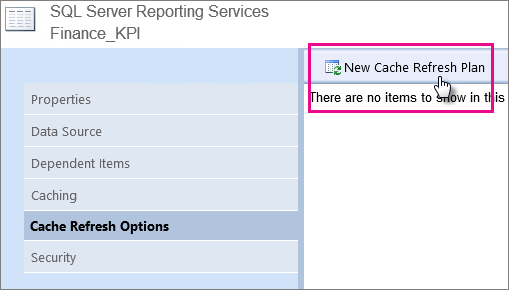
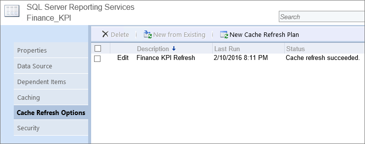

# Arbeiten mit KPIs in Reporting Services
Ein Key Performance Indicator (KPI) ist ein sichtbarer Hinweis, der Auskunft über den Fortschritt im Hinblick auf das Erreichen eines Ziels gibt.  Key Performance Indicators sind wertvoll für Teams, Manager und Unternehmen, um schnell den bei messbaren Zielen erzielten Fortschritt zu evaluieren.   
  
Mit KPIs in SQL Server 2016 Reporting Services können Sie einfach Antworten für die folgenden Fragen visualisieren:  
  
-   Womit bin ich weit vorangekommen, oder womit hänge ich hinterher?  
  
-   Wie weit habe ich vorausgearbeitet, oder wie weit hänge ich hinterher?  
  
-   Was ist das Minimum, das ich abgeschlossen habe?  
  
## Erstellen eines Dataset  
Eine KPI wird nur die erste Zeile der Daten aus einem freigegebenen Dataset verwenden. Stellen Sie sicher, dass sich die Daten, die Sie verwenden möchten, in dieser ersten Zeile befinden. Um ein freigegebenes Dataset zu erstellen, können Sie entweder den Berichts-Generator oder SQL Server Data Tools verwenden.  
  
> **Hinweis**: Das Dataset muss sich nicht im selben Ordner wie die KPI befinden.  
  
## Platzierung von KPIs  
  
KPIs können in einem beliebigen Ordner auf Ihrem Berichtsserver erstellt werden.  Bevor Sie eine KPI erstellen, sollten Sie überlegen, wo der richtige Speicherort dafür wäre. Sie sollten sie in einem Ordner ablegen, der für Benutzer sichtbar ist. Gleichzeitig sollte der Ordner auch relevant für andere Berichte sowie KPIs in der Umgebung sein.  
  
## Hinzufügen einer KPI  
  
Nachdem Sie den Speicherort der KPI bestimmt haben, wechseln Sie zu dem Ordner, und wählen Sie **Neu** > **KPI** im oberen Menü aus.  
  
  
  
Dies zeigt Ihnen den Bildschirm **Neue KPI** an.  
  
  
  
Sie können entweder statische Werte zuweisen oder Daten aus einem freigegebenen Dataset verwenden. Wenn Sie eine neue KPI erstellen, wird diese mit zufälligen manuellen Daten aufgefüllt.  
  
|Feld|Description|  
|---|---|  
|Wertformat|  Wird verwendet, um das Format des angezeigten Werts zu ändern.|   
|Wert|Der für die KPI anzuzeigender Wert.|  
|Ziel|Wird als Vergleich mit einem numerischen Wert verwendet und als prozentuale Differenz angezeigt.|  
|Status|Zum Bestimmen der KPI-Kachelfarbe verwendete und durch Komma getrennte numerische Werte. Gültige Werte sind 1 (Grün), 0 (gelb) und-1 (Rot).|  
|Trendsatz|Für Diagrammvisualisierungen verwendete durch Komma getrennte numerische Werte. Dies kann auch für eine Spalte eines Dataset mit Werten festgelegt werden, die den Trend darstellen.|  
  
> **Warnung**: Bei der Verwendung des Wordwerts für das **Status**-Feld zur Entwurfszeit, sollten Sie den Zahlenwert verwenden, wenn Sie ein Dataset aktualisieren. Wenn Sie ein Dataset mit dem Wortwert anstelle des Zahlenwerts aktualisieren, könnten die KPIs auf Ihrem Server beschädigt werden.  
  
> **Hinweis:**: Die Felder **Wert**, **Ziel** und **Status** können nur einen Wert aus der ersten Zeile des Ergebnisses eines Datasets auswählen. Das Feld **Trendsatz** kann jedoch wählen, welche Spalte den Trend widerspiegelt.  
  
Um Daten aus einem freigegebenen Dataset zu verwenden, können Sie Folgendes tun.  
  
1.  Ändern Sie das Dropdownfeld des Felds von **Manuell festlegen** oder **Nicht festgelegt** auf **Datasetfeld**.  
  
      
  
2.  Wählen Sie die **Auslassungspunkte (...)** im Datenfeld. Hierdurch erscheint der Bildschirm **Wählen Sie ein Dataset**.  
  
      
  
3.  Wählen Sie das Dataset aus, das die Daten enthält, die Sie anzeigen möchten.  
  
4.  Wählen Sie das Feld aus, das Sie verwenden möchten. Wählen Sie **OK**.  
  
      
  
5.  Ändern Sie das **Wertformat**, damit es mit dem Format Ihres Werts übereinstimmt. In diesem Beispiel ist der Wert einer Währung.  
  
      
  
6.  Wählen Sie **Anwenden** aus.  
  
      
  
## Entfernen einer KPI  
  
Um eine KPI zu entfernen, können Sie Folgendes tun.  
  
1.  Wählen Sie die **Auslassungspunkte (...)** der KPI aus, die Sie entfernen möchten. Wählen Sie **Verwalten** aus.  
  
      
  
2.  Wählen Sie **Löschen** aus. Wählen Sie **Löschen** erneut im Bestätigungsdialogfeld aus.  
  
      
  
## Aktualisieren einer KPI  
  
Um eine KPI zu aktualisieren, müssen Sie einen **Cacheaktualisierungsplan** für das freigegebene Dataset konfigurieren. Sie können derzeit keinen Cacheaktualisierungsplan aus dem Webportal konfigurieren. Sie müssen dazu zum alten Berichts-Manager wechseln.   
  
Dieser erläutert, wie ein Cacheaktualisierungsplan mithilfe einiger Grundeinstellungen erstellt wird. Weitere Informationen zu Cacheaktualisierungsplänen finden Sie unter [Optionen zur Cacheaktualisierung (Berichts-Manager)](Cache%20Refresh%20Options%20(Report%20Manager).xml).  
  
1.  Öffnen Sie den Berichts-Manager, und suchen Sie das freigegebene Dataset, für das Sie die Eigenschaften des Cacheaktualisierungsplans konfigurieren möchten.   
  
2.  Zeigen Sie auf den Bericht oder das freigegebene Dataset, und wählen Sie den Dropdownpfeil aus.  
  
3.  Wählen Sie in der Dropdownliste **Verwalten** aus. Die Seite **Allgemeine Eigenschaften** wird geöffnet.  
  
4.  Wählen Sie die Registerkarte **Optionen zur Cacheaktualisierung** aus.  
  
5.  Um einen neuen Cacheplan zu erstellen, wählen Sie **Neuer Cacheaktualisierungsplan**.  
  
      
  
6.  Sie erhalten eine Meldung, die Sie fragt, ob Sie das Zwischenspeichern für dieses Element mit Standardoptionen aktivieren möchten. Wählen Sie **OK**.  
  
    > **Hinweis**: Sie müssen den SQL Server-Agent-Dienst aktivieren und starten, um einen Cacheaktualisierungsplan zu erstellen.  
  
7.  Sie können einen bestimmten Zeitplan auswählen oder, sofern vorhanden, einen freigegebenen Zeitplan.  
  
8.  Die Werte für die KPI werden aktualisiert, wenn der Zeitplan für den Cacheaktualisierungsplan ausgeführt wird.  
  
      
  
## Siehe auch  
  
- [Webportal (einheitlicher SSRS-Modus)](../reporting-services/web-portal-ssrs-native-mode.md)  
  
- [Optionen zur Cacheaktualisierung (Berichts-Manager)](Cache%20Refresh%20Options%20(Report%20Manager).xml)  
  
    
  
  
  
