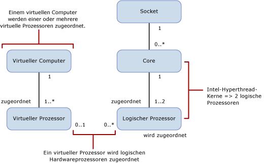

# Compute Capacity Limits by Edition of SQL Server
  In diesem Thema wird erläutert, wie Sie Kapazitätsgrenzen für verschiedene Editionen von [!INCLUDE[ssCurrent](../includes/sscurrent-md.md)] berechnen und wie sie sich in physischen und virtualisierten Umgebungen mit Hyperthreaded-Prozessoren unterscheiden.  
  
   
  
 In der folgenden Tabelle werden die Schreibweisen, die im oben angegebenen Diagramm verwendet werden, beschrieben:  
  
|Wert|Beschreibung|  
|-----------|-----------------|  
|0..1|Null oder Eins|  
|1|Genau eins|  
|1..*|Ein oder mehr|  
|0..*|0 oder mehr|  
|1..2|Einer oder zwei|  
  
> [!IMPORTANT]  
>  Weitere Details:  
>   
>  1.  Einem virtuellen Computer werden ein oder mehrere virtuelle Prozessoren zugeordnet.  
> 2.  Ein oder mehrere virtuelle Prozessoren werden genau einem virtuellem Computer zugeordnet.  
> 3.  0 (null) oder ein virtueller Prozessor wird null oder mehreren logischen Prozessoren zugeordnet. Die Zuordnung virtueller Prozessor zu logischer Prozessor kann wie folgt sein:  
>   
>      -   1:0 stellt einen ungebundenen logischen, von den Gastbetriebssystemen nicht verwendeten Prozessor dar.  
>     -   1:viele stellt einen Overcommit dar.  
>     -   0:viele stellt die Abwesenheit des virtuellen Computers auf dem Hostsystem dar, deshalb werden keine logischen Prozessoren von den VMs verwendet.  
> 4.  Ein Socket wird null oder mehr Kernen zugeordnet. Die Zuordnung Socket zu Kern kann wie folgt sein:  
>   
>      -   1:0 stellt einen leeren Socket dar (kein Chip installiert).  
>     -   1:1 stellt einen in den Socket installierten Einzelkern-Chip dar (heutzutage sehr selten).  
>     -   1:viele stellt ein in den Socket installierten Mehrkern-Chip dar (typische Werte sind 2,4,8).  
> 5.  Ein Kern wird einem oder zwei logischen Prozessoren zugeordnet. Die Zuordnung Kern zu logischer Prozessor kann wie folgt sein:  
>   
>      -   1:1, Hyperthreading ist aus.  
>     -   1:2, Hyperthreading ist an.  
  
 Die folgenden Definitionen gelten für die in diesem Thema verwendeten Begriffe:  
  
-   Ein Thread oder logischer Prozessor ist aus der Sicht von [!INCLUDE[ssNoVersion](../includes/ssnoversion-md.md)]bzw. aus der Sicht des Betriebssystems, einer Anwendung oder eines Treibers ein logisches Computermodul.  
  
-   Ein Kern ist eine Prozessoreinheit, die aus einem oder mehreren logischen Prozessoren bestehen kann.  
  
-   Ein physischer Prozessor kann aus einem oder mehreren Kernen bestehen. Ein physischer Prozessor ist das Gleiche wie ein Prozessorpaket oder ein Socket.  
  
 Systeme mit mehr als einem physischen Prozessor oder Systeme mit physischen Prozessoren, die mehrere Kerne und/oder Hyperthreads haben, ermöglichen dem Betriebssystem, mehrere Tasks gleichzeitig auszuführen. Jeder Thread der Ausführung wird als logischer Prozessor angezeigt. Wenn Sie z. B. einen Computer haben, der zwei Quad-Core-Prozessoren hat, mit aktiviertem Hyperthreading und zwei Threads pro Kern, haben Sie 16 logische Prozessoren: 2 Prozessoren x 4 Kerne pro Prozessor x 2 Threads pro Kern. Beachten Sie dabei Folgendes:  
  
-   Die Rechenkapazität eines logischen Prozessors von einem einzelnen Thread eines Hyperthread-Kerns ist geringer als die Rechenkapazität eines logischen Prozessors von diesem gleichen Kern mit deaktiviertem Hyperthreading.  
  
-   Doch die Rechenkapazität der 2 logischen Prozessoren im Hyperthread-Kern ist größer als die Rechenkapazität des gleichen Kerns mit deaktiviertem Hyperthreading.  
  
 Jede Edition von [!INCLUDE[ssNoVersion](../includes/ssnoversion-md.md)] hat zwei Rechenkapazitätsgrenzen:  
  
1.  Die maximale Anzahl von Sockets (identisch mit physischem Prozessor oder Socket oder Prozessorpaket).  
  
2.  Die maximale Anzahl von Kernen, wie vom Betriebssystem gemeldet.  
  
 Diese Begrenzungen gelten für eine einzelne Instanz von [!INCLUDE[ssNoVersion](../includes/ssnoversion-md.md)]. Sie stellen die maximale Rechenkapazität dar, die eine einzelne Instanz verwendet. Sie schränken den Server nicht ein, auf dem die Instanz möglicherweise bereitgestellt wird. Die Bereitstellung mehrerer [!INCLUDE[ssNoVersion](../includes/ssnoversion-md.md)] -Instanzen auf demselben physischen Server ist zweifellos eine effiziente Möglichkeit, die Rechenkapazität eines physischen Servers mit mehr Sockets und/oder Kernen zu nutzen, als unten für die Kapazitätsgrenzen angegeben ist.  
  
 Die folgende Tabelle gibt die Rechenkapazitätsgrenzen für eine einzelne Instanz jeder Edition von [!INCLUDE[ssCurrent](../includes/sscurrent-md.md)]an:  
  
|[!INCLUDE[ssNoVersion](../includes/ssnoversion-md.md)] Edition|Maximale von einer einzelnen Instanz verwendete Rechenkapazität ([!INCLUDE[ssNoVersion](../includes/ssnoversion-md.md)][!INCLUDE[ssDE](../includes/ssde-md.md)])|Maximale von einer einzelnen Instanz verwendete Rechenkapazität (AS, RS)|  
|---------------------------------------|--------------------------------------------------------------------------------------------------------|-------------------------------------------------------------------|  
|Enterprise Edition: Kernbasierte Lizenzierung|Maximum des Betriebssystems|Maximum des Betriebssystems|  
|Entwickler|Maximum des Betriebssystems|Maximum des Betriebssystems|  
|Standard|Beschränkt auf weniger als 4 Sockets oder 24 Kerne|Beschränkt auf weniger als 4 Sockets oder 24 Kerne|  
|Express|Beschränkt auf weniger als 1 Socket oder 4 Kerne|Beschränkt auf weniger als 1 Socket oder 4 Kerne|  
 *Die Enterprise Edition mit einer Lizenzierung auf Grundlage von Serverlizenz + Clientzugriffslizenz (für neue Verträge nicht verfügbar) ist auf maximal 20 Kerne pro [!INCLUDE[ssNoVersion](../includes/ssnoversion-md.md)] -Instanz beschränkt. Für das auf Prozessorkernen basierende Serverlizenzierungsmodell gelten keine Beschränkungen.  
  
 In einer virtualisierten Umgebung basiert die Rechenkapazitätsgrenze auf der Anzahl der logischen Prozessoren und nicht der Kerne, da die Prozessorarchitektur für die Gastanwendungen nicht sichtbar ist.  Ein Server mit vier Sockets beispielsweise, bestückt mit Quad-Core-Prozessoren und der Fähigkeit, zwei Hyperthreads pro Kern zu aktivieren, enthält mit aktiviertem Hyperthreading 32 logische Prozessoren, bei deaktiviertem Hyperthreading jedoch nur 16 logische Prozessoren. Diese logischen Prozessoren können virtuellen Computern auf dem Server zugeordnet werden, wobei die Rechenlast des virtuellen Computers auf diesem logischen Prozessor einem Ausführungs-Thread auf dem physischen Prozessor im Hostserver zugeordnet wird.  
  
 Sie können das Hyperthreading deaktivieren, wenn die Leistung pro virtueller Prozessor wichtig ist. Sie können das Hyperthreading anhand einer BIOS-Einstellung für den Prozessor während des BIOS-Setups deaktivieren, aber es ist in der Regel ein Vorgang im Serverbereich, der sich auf alle Arbeitsauslastungen auswirkt, die auf dem Server ausgeführt werden. Dies weist darauf hin, Arbeitsauslastungen, die in virtualisierten Umgebungen ausgeführt werden, von denen zu trennen, die in einer physischen Betriebssystemumgebung von der Hyperthreading-Leistungssteigerung profitieren würden.  
  
## Siehe auch  
 [Editionen und Komponenten von SQL Server 2016](../sql-server/editions-and-components-of-sql-server-2016.md)   
 [Von den SQL Server 2016-Editionen unterstützte Funktionen](~/sql-server/editions-and-supported-features-for-sql-server-2016.md)   
 [Spezifikationen der maximalen Kapazität für SQL Server](../sql-server/maximum-capacity-specifications-for-sql-server.md)   
 [Schnellstart-Installation von SQL Server 2016](http://msdn.microsoft.com/library/672afac9-364d-4946-ad5d-8a2d89cf8d81)  
  
  

