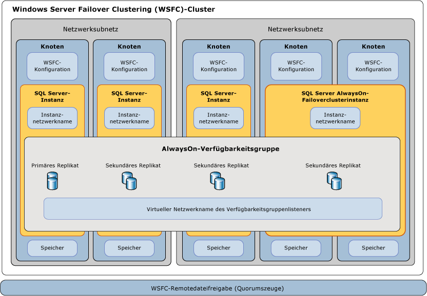

# Windows Server-Failoverclustering mit SQL Server
[!INCLUDE[appliesto-ss-xxxx-xxxx-xxx-md](../../../includes/appliesto-ss-xxxx-xxxx-xxx-md.md)] Beim *Windows Server-Failovercluster* (WSFC) handelt es sich um eine Gruppe unabhängiger Server, die zur Steigerung der Verfügbarkeit von Anwendungen und Diensten zusammenarbeiten. [!INCLUDE[ssCurrent](../../../includes/sscurrent-md.md)] nutzt WSFC-Dienste und -Funktionen, um [!INCLUDE[ssHADR](../../../includes/sshadr-md.md)] - und [!INCLUDE[ssNoVersion](../../../includes/ssnoversion-md.md)] -Failoverclusterinstanzen zu unterstützen.  
  
   
##   Begriffe und Definitionen  
 Beim Windows Server-Failovercluster (WSFC) handelt es sich um eine Gruppe unabhängiger Server, die zur Steigerung der Verfügbarkeit von Anwendungen und Diensten zusammenarbeiten.  
  
 Node  
 Ein Server, der an einem WSFC teilnimmt.
  
 Clusterressource  
 Eine physische oder logische Entität, die im Besitz eines Knotens sein, online und offline geschaltet, zwischen Knoten verschoben und als Clusterobjekt verwaltet werden kann. Eine Clusterressource kann jeweils nur im Besitz eines einzelnen Knotens sein.  
  
 -Rolle  
 Eine Auflistung von Clusterressourcen, die als einzelnes Clusterobjekt verwaltet werden, um besondere Funktionen bereitzustellen. Für SQL Server gilt entweder die Rolle „Always On-Verfügbarkeitsgruppe“ (AG) oder die Rolle „Always On-Failoverclusterinstanz“ (FCI). Eine Rolle enthält sämtliche Clusterressourcen, die für AG und FCI benötigt werden. Failover und Failback führen Aktionen immer im Zusammenhang mit Rollen aus. Für eine FCI enthält die Rolle die Ressourcen einer IP-Adresse und eines Netzwerknamens sowie die SQL Server-Ressourcen. Eine AG-Rolle umfasst die AG-Ressource und, sollte ein Listener konfiguriert sein, einen Netzwerknamen und eine IP-Ressource. 

 Netzwerknamenressource  
 Ein logischer Servername, der als Clusterressource verwaltet wird. Eine Netzwerknamenressource muss mit einer IP-Adressressource verwendet werden. Für diese Einträge sind möglicherweise Objekte in Active Directory Domain Services und/oder DNS erforderlich. 
  
 Ressourcenabhängigkeit  
 Eine Ressource, von der eine andere Ressource abhängt. Wenn Ressource A von Ressource B abhängig ist, stellt B eine Abhängigkeit von A dar und Ressource A kann nicht ohne Ressource B gestartet werden.  
  
  
 Bevorzugter Besitzer  
 Ein Knoten, auf dem eine Ressourcengruppe bevorzugt ausgeführt wird. Jede Ressourcengruppe ist einer Liste von bevorzugten Besitzern zugeordnet, die nach Präferenz sortiert ist. Während eines automatischen Failovers wird die Ressourcengruppe in den nächsten bevorzugten Knoten in der Liste der bevorzugten Besitzer verschoben.  
  
 Möglicher Besitzer  
 Ein sekundärer Knoten, auf dem eine Ressource ausgeführt werden kann. Jede Ressourcengruppe ist einer Liste von möglichen Besitzern zugeordnet. Rollen können nur ein Failover zu Knoten ausführen, die als mögliche Besitzer aufgeführt sind.   
  
 Quorummodus  
 Die Quorumkonfiguration in einem Failovercluster, die die Anzahl von Knotenfehlern bestimmt, die der Cluster tolerieren kann.  
  
 Erzwungenes Quorums  
 Der Prozess zum Starten des Clusters, auch wenn nur eine Minderheit der für ein Quorum erforderlichen Elemente kommuniziert.  
  

##   Übersicht über Windows Server-Failoverclustering  
 Windows Server-Failoverclustering stellt Infrastrukturfunktionen bereit, die Szenarien mit hoher Verfügbarkeit und Notfallwiederherstellung für gehostete Serveranwendungen, z. B. Microsoft [!INCLUDE[ssNoVersion](../../../includes/ssnoversion-md.md)] und Microsoft Exchange, unterstützen. Wenn ein Clusterknoten oder -dienst fehlschlägt, können die auf diesem Knoten gehosteten Dienste automatisch oder manuell auf einen anderen verfügbaren Knoten übertragen werden. Dieser Prozess wird als *Failover*bezeichnet.  
  
 Die Knoten in einem WSFC arbeiten zusammen, um diese Arten von Funktionen bereitzustellen:  
  
-   **Verteilte Metadaten und Benachrichtigungen.** Metadaten des WSFC-Diensts und gehosteter Anwendungen sind in jedem Knoten im Cluster enthalten. Diese Metadaten enthalten WSFC-Konfiguration und -Status sowie Einstellungen der gehosteten Anwendung. Änderungen an den Metadaten oder am Status eines Knotens werden automatisch an die anderen Knoten im WSFC weitergegeben.  
  
-   **Ressourcenverwaltung.** Einzelne Knoten im WSFC stellen möglicherweise physische Ressourcen bereit, z.B. direkt angeschlossene Speicher, Netzwerkschnittstellen und Zugriff auf freigegebenen Datenspeicher. Gehostete Anwendungen registrieren sich als Clusterressource und konfigurieren möglicherweise Start- und Integritätsabhängigkeiten von anderen Ressourcen.  
  
-   **Systemüberwachung.** Die Integritätsermittlung zwischen den Knoten und des primären Knotens erfolgt durch eine Kombination aus getakteter Netzwerkkommunikation und Ressourcenüberwachung. Die allgemeine Integrität des WSFC wird von den Abstimmungen eines Quorums der Knoten im WSFC bestimmt.  
  
-   **Failoverkoordination.** Jede Ressource wird zum Hosten auf einem primären Knoten konfiguriert und kann automatisch oder manuell an mindestens einen sekundären Knoten übertragen werden. Eine integritätsbasierte Failoverrichtlinie steuert die automatische Übertragung des Ressourcenbesitzes zwischen Knoten. Knoten und gehostete Anwendungen werden benachrichtigt, wenn ein Failover erfolgt, damit sie entsprechend reagieren können.  
  
 Weitere Informationen finden Sie unter : [Failoverclustering: Übersicht – Windows Server](https://technet.microsoft.com/library/hh831579(v=ws.11).aspx)  
  
##   SQL Server Always On-Technologien und WSFC  
 [!INCLUDE[ssCurrent](../../../includes/sscurrent-md.md)]
            *Always On* ist eine Lösung für Hochverfügbarkeit und Notfallwiederherstellung, die WSFC nutzt. Always On-Komponenten stellen eine integrierte, flexible Lösung bereit, die die Anwendungsverfügbarkeit erhöht, einen höheren Ertrag bei Hardwareinvestitionen bietet und die Bereitstellung und Verwaltung von Hochverfügbarkeit vereinfacht.  
  
 Sowohl [!INCLUDE[ssHADR](../../../includes/sshadr-md.md)] als auch Always On-Failoverclusterinstanzen verwenden WSFC als Plattformtechnologie und registrieren Komponenten als WSFC-Clusterressourcen.  Verwandte Ressourcen werden in einer *Rolle* kombiniert, für die Abhängigkeiten von anderen WSFC-Clusterressourcen festgelegt werden können. Der WSFC-Clusterdienst kann dann die Notwendigkeit eines Neustarts der [!INCLUDE[ssNoVersion](../../../includes/ssnoversion-md.md)]-Instanz ermitteln und signalisieren oder automatisch ein Failover zu einem anderen Serverknoten im WSFC-Cluster ausführen.  
  
> **WICHTIG!** Um die [!INCLUDE[ssNoVersion](../../../includes/ssnoversion-md.md)] Always On-Technologien voll ausnützen zu können, sollten Sie verschiedene WSFC-bezogene Voraussetzungen erfüllen.  
>   
>  Weitere Informationen finden Sie unter [Voraussetzungen, Einschränkungen und Empfehlungen für Always On-Verfügbarkeitsgruppen&#40;SQL Server&#41;](../../../database-engine/availability-groups/windows/prereqs-restrictions-recommendations-always-on-availability.md).  
  
### Hohe Verfügbarkeit auf Instanzebene mit Always On-Failoverclusterinstanzen  
 Eine Always On-*Failoverclusterinstanz* (FCI) ist eine [!INCLUDE[ssNoVersion](../../../includes/ssnoversion-md.md)]-Instanz, die auf mehreren Knoten in einem WSFC installiert wird. Dieser Typ der Instanz hängt von Ressourcen für Speicher und für den virtuellen Netzwerknamen ab. Der Speicher kann Fibre Channel, iSCSI, FCoE oder SAS für freigegebenen Datenträgerspeicher verwenden; alternativ kann er auch lokal angefügten Speicher mit [Storage Spaces Direct (S2D)](http://technet.microsoft.com/windows-server-docs/storage/storage-spaces/storage-spaces-direct-overview) verwenden. Die Ressource des virtuellen Netzwerknamens hängt von mindestens einer virtuellen IP-Adresse in jeweils unterschiedlichen Subnetzen ab. Der SQL Server-Dienst und der SQL Server-Agent-Dienst sind ebenfalls Ressourcen und von den Ressourcen des Speichers und des virtuellen Netzwerknamens abhängig.  
  
 Im Fall eines Failovers überträgt der WSFC-Dienst den Besitz von Ressourcen einer Instanz auf einen festgelegten Failoverknoten. Die [!INCLUDE[ssNoVersion](../../../includes/ssnoversion-md.md)] -Instanz wird dann im Failoverknoten neu gestartet, und Datenbanken werden wie gewohnt wiederhergestellt. Nur jeweils ein einzelner Knoten im Cluster kann die FCI und zugrunde liegende Ressourcen hosten.  
  
> **HINWEIS:**  Eine AlwaysOn-Failoverclusterinstanz erfordert symmetrischen freigegebenen Festplattenspeicher, z. B. ein Storage Area Network (SAN) oder eine SMB-Dateifreigabe.  Die freigegebenen Festplattenspeichervolumes müssen für alle potenziellen Failoverknoten im WSFC-Cluster verfügbar sein.  
  
 Weitere Informationen finden Sie unter [Always On-Failoverclusterinstanzen &#40;SQL Server&#41;](../../../sql-server/failover-clusters/windows/always-on-failover-cluster-instances-sql-server.md).  
  
### Hohe Verfügbarkeit auf Datenbankebene mit [!INCLUDE[ssHADR](../../../includes/sshadr-md.md)]  
 Eine Always On-*Verfügbarkeitsgruppe* (AG) besteht aus mindestens einer Benutzerdatenbank, die ein Failover ausführt. Eine Verfügbarkeitsgruppe besteht aus einem primären *Verfügbarkeitsreplikat* und einem bis vier sekundären Replikaten, die mittels protokollbasierter SQL Server-Datenverschiebung verwaltet werden, um den Datenschutz ohne freigegebenen Speicher zu gewährleisten. Jedes Replikat wird von einer Instanz von [!INCLUDE[ssNoVersion](../../../includes/ssnoversion-md.md)] auf einem anderen Knoten des WSFC gehostet. Die Verfügbarkeitsgruppe und ein entsprechender virtueller Netzwerkname werden als Ressourcen im WSFC-Cluster registriert.  
  
 Ein *Verfügbarkeitsgruppenlistener* im Knoten des primären Replikats reagiert auf eingehende Clientanforderungen zum Herstellen einer Verbindung mit dem virtuellen Netzwerknamen. Auf Grundlage von Attributen in der Verbindungszeichenfolge wird jede Anforderung an die entsprechende [!INCLUDE[ssNoVersion](../../../includes/ssnoversion-md.md)] -Instanz umgeleitet.  
  
 Statt im Fall eines Failovers den Besitz von freigegebenen physischen Ressourcen an einen anderen Knoten zu übertragen, wird WSFC dazu genutzt, ein sekundäres Replikat auf einer anderen [!INCLUDE[ssNoVersion](../../../includes/ssnoversion-md.md)] -Instanz neu zu konfigurieren, sodass es zum primären Replikat der Verfügbarkeitsgruppe wird. Die virtuelle Netzwerknamenressource der Verfügbarkeitsgruppe wird dann auf diese Instanz übertragen.  
  
 Nur eine einzelne [!INCLUDE[ssNoVersion](../../../includes/ssnoversion-md.md)] -Instanz kann jeweils das primäre Replikat der Datenbanken einer Verfügbarkeitsgruppe hosten. Alle zugeordneten sekundären Replikate müssen sich jeweils auf separaten Instanzen und die einzelnen Instanzen müssen sich in unterschiedlichen physischen Knoten befinden.  
  
> **HINWEIS:** [!INCLUDE[ssHADR](../../../includes/sshadr-md.md)] nicht erforderlich.  
>   
>  Eine Failoverclusterinstanz (FCI) kann zusammen mit einer Verfügbarkeitsgruppe verwendet werden, um die Verfügbarkeit eines Verfügbarkeitsreplikats zu verbessern. Um potenzielle Racebedingungen im WSFC-Cluster zu verhindern, wird jedoch automatisches Failover der Verfügbarkeitsgruppe zu oder von einem Verfügbarkeitsreplikat, das sich auf einer FCI befindet, nicht unterstützt.  
  
 Weitere Informationen finden Sie unter [Übersicht über Always On-Verfügbarkeitsgruppen (SQL Server)](../../../database-engine/availability-groups/windows/overview-of-always-on-availability-groups-sql-server.md).  
  
##   WSFC-Systemüberwachung und -Failover  
 Hohe Verfügbarkeit für eine Always On-Lösung wird durch proaktive Systemüberwachung physischer und logischer WSFC-Clusterressourcen zusammen mit automatischem Failover zu und Neukonfiguration von redundanter Hardware erreicht.  Ein Systemadministrator kann außerdem ein *manuelles Failover* einer Verfügbarkeitsgruppe oder [!INCLUDE[ssNoVersion](../../../includes/ssnoversion-md.md)] -Instanz von einem Knoten zum anderen initiieren.  
  
### Failoverrichtlinien für Knoten, Failoverclusterinstanzen und Verfügbarkeitsgruppen  
 Eine *Failoverrichtlinie* wird auf Ebene des WSFC-Knotens, der [!INCLUDE[ssNoVersion](../../../includes/ssnoversion-md.md)] -Failoverclusterinstanz (FCI) und der Verfügbarkeitsgruppe konfiguriert.  Diese Richtlinien können auf Grundlage des Schweregrads, der Dauer und Häufigkeit eines fehlerhaften Clusterressourcenstatus und eines fehlerhaften Knotenreaktionsverhaltens einen Dienstneustart oder ein *automatisches Failover* von Clusterressourcen von einem Knoten zum anderen auslösen. Außerdem kann die Verschiebung eines primären Verfügbarkeitsgruppenreplikats von einer [!INCLUDE[ssNoVersion](../../../includes/ssnoversion-md.md)] -Instanz zu einer anderen ausgelöst werden.  
  
 Failover eines Verfügbarkeitsgruppenreplikats wirkt sich nicht auf die zugrunde liegende [!INCLUDE[ssNoVersion](../../../includes/ssnoversion-md.md)] -Instanz aus.  Bei einem Failover von einer FCI werden die gehosteten Verfügbarkeitsgruppenreplikate mit der Instanz verschoben.  
  
 Weitere Informationen finden Sie unter [Failover Policy for Failover Cluster Instances](../../../sql-server/failover-clusters/windows/failover-policy-for-failover-cluster-instances.md).  
  
### WSFC-Ressourcenintegritätserkennung  
 Jede Ressource in einem WSFC kann in regelmäßigen Abständen oder bedarfsgesteuert Status und Integrität melden. Verschiedene Umstände deuten möglicherweise auf Ressourcenfehler hin, z. B. Stromausfall, Datenträger- oder Arbeitsspeicherfehler, Netzwerkkommunikationsfehler oder nicht reagierende Dienste.  
  
 WSFC-Ressourcen wie Netzwerke, Speicher oder Dienste können so konfiguriert werden, dass sie voneinander abhängig sind. Die kumulierte Integrität einer Ressource wird ermittelt, indem für die Integrität nacheinander ein Rollup mit der Integrität jeder ihrer Ressourcenabhängigkeiten ausgeführt wird.  
  
### WSFC-Integritätsermittlung zwischen Knoten und Quorumabstimmung  
 Jeder Knoten in einem WSFC nimmt an regelmäßig getakteter Kommunikation teil, um den Integritätsstatus des Knotens für die anderen Knoten freizugeben. Bei nicht reagierenden Knoten wird der Status als fehlerhaft betrachtet.  
  
 Bei einem *Quorum* handelt es sich um einen Mechanismus, mit dessen Hilfe gewährleistet werden soll, dass der WSFC funktioniert, indem es sicherstellt, dass im WSFC genügend Ressourcen online sind. Wenn der WSFC über genügend Stimmen verfügt, funktioniert er ordnungsgemäß und kann eine Fehlertoleranz auf Knotenebene bereitstellen.  
  
 Der *Quorummodus* wird im WSFC konfiguriert, der die Methodik für die Quorumabstimmung vorgibt und bestimmt, wann ein automatisches Failover ausgeführt oder der Cluster offline geschaltet wird. 
  
> **TIPP!** Es wird empfohlen, immer über eine ungerade Anzahl an Quorumstimmen in einem WSFC zu verfügen.  Für den Zweck der Quorumabstimmung muss [!INCLUDE[ssNoVersion](../../../includes/ssnoversion-md.md)] nicht auf allen Knoten im Cluster installiert sein. Ein zusätzlicher Server kann als Quorumelement dienen. Alternativ kann das WSFC-Quorummodell zur Verwendung einer Remotedateifreigabe als Tiebreaker konfiguriert werden.  
>   
>  Weitere Informationen finden Sie unter [WSFC-Quorummodi und Abstimmungskonfiguration (SQL Server)](../../../sql-server/failover-clusters/windows/wsfc-quorum-modes-and-voting-configuration-sql-server.md).  
  
### Notfallwiederherstellung durch erzwungenes Quorum  
 Abhängig vom Betriebsverfahren und von der WSFC-Konfiguration können Sie sowohl automatische als auch manuelle Failovers auslösen und dennoch eine stabile, fehlertolerante [!INCLUDE[ssNoVersion](../../../includes/ssnoversion-md.md)]-Always On-Lösung betreiben. Falls jedoch ein Quorum der freigegebenen Abstimmungsknoten im WSFC nicht kommunizieren kann oder bei der Integritätsüberprüfung des WSFC ein anderer Fehler zurückgegeben wird, wird der WSFC möglicherweise offline geschaltet.  
  
 Wird der WSFC wegen eines nicht geplanten Notfalls oder aufgrund eines persistenten Hardware- oder Kommunikationsfehlers offline geschaltet, ist manueller Eingriff durch den Administrator erforderlich, um ein *Quorum zu erzwingen* und die überdauernden Clusterknoten in einer nicht fehlertoleranten Konfiguration wieder online zu schalten.  
  
 Danach müssen außerdem einige Schritte ausgeführt werden, um den WSFC neu zu konfigurieren, die betroffenen Datenbankreplikate wiederherzustellen und ein neues Quorum einzurichten.  
  
 Informationen zur Erzwingung des Quorums finden Sie unter [WSFC-Notfallwiederherstellung durch erzwungenes Quorum (SQL Server)](../../../sql-server/failover-clusters/windows/wsfc-disaster-recovery-through-forced-quorum-sql-server.md).  
  
##   Beziehung der AlwaysOn-Komponenten in SQL Server mit WSFC  
 Zwischen den Funktionen und Komponenten von [!INCLUDE[ssNoVersion](../../../includes/ssnoversion-md.md)] Always On und WSFC liegen verschiedene Beziehungsstufen vor.  
  
 Always On-Verfügbarkeitsgruppen werden auf [!INCLUDE[ssNoVersion](../../../includes/ssnoversion-md.md)] -Instanzen gehostet.  
 Eine Clientanforderung, in der zum Herstellen einer Verbindung mit einer primären oder sekundären Datenbank ein logischer Netzwerkname für einen Verfügbarkeitsgruppenlistener angegeben wird, wird an den entsprechenden Netzwerknamen der zugrunde liegenden [!INCLUDE[ssNoVersion](../../../includes/ssnoversion-md.md)]-Instanz oder [!INCLUDE[ssNoVersion](../../../includes/ssnoversion-md.md)]-FCI umgeleitet.  
  
 SQL Server-Instanzen werden aktiv in einem einzelnen Knoten gehostet.  
 Eine eigenständige [!INCLUDE[ssNoVersion](../../../includes/ssnoversion-md.md)] -Instanz (sofern vorhanden) befindet sich immer in einem einzelnen Knoten mit einem statischen Instanznetzwerknamen.  Eine [!INCLUDE[ssNoVersion](../../../includes/ssnoversion-md.md)] -Failoverclusterinstanz (sofern vorhanden) ist für einen von mindestens zwei möglichen Failoverknoten mit einem virtuellen Instanznetzwerknamen aktiv.  
  
 Knoten sind Mitglieder eines WSFC-Clusters.  
 Metadaten und Status der WSFC-Konfiguration für alle Knoten werden in jedem Knoten gespeichert. Jeder Server kann asymmetrischen Speicher oder freigegebene Speichervolumes (SAN) für Benutzer- oder Systemdatenbanken bereitstellen. Jeder Server besitzt mindestens eine physische Netzwerkschnittstelle in mindestens einem IP-Subnetz.  
  
 Der WSFC überwacht die Integrität und verwaltet die Konfiguration für mehrere Server.  
 Die WSFC-Mechanismen geben Änderungen an den WSFC-Konfigurationsmetadaten und am Status an alle Knoten im WSFC weiter. Wenn ein Datenträgerzeuge verwendet wird, werden die Metadaten ebenfalls an dieser Stelle gespeichert. Standardmäßig erhält jeder Knoten des WSFC eine Quorumstimme, und ein Zeuge wird ggf. verwendet und konfiguriert.
 
 [!INCLUDE[ssHADR](../../../includes/sshadr-md.md)] -Registrierungsschlüssel sind Unterschlüssel des WSFC-Clusters.  
 Wenn Sie einen WSFC löschen und anschließend neu erstellen, müssen Sie die Funktion [!INCLUDE[ssHADR](../../../includes/sshadr-md.md)] auf jeder Serverinstanz, die auf dem ursprünglichen WSFC für [!INCLUDE[ssHADR](../../../includes/sshadr-md.md)] aktiviert war, deaktivieren und erneut aktivieren. Weitere Informationen finden Sie unter [Aktivieren und Deaktivieren von Always On-Verfügbarkeitsgruppen &#40;SQL Server&#41;](../../../database-engine/availability-groups/windows/enable-and-disable-always-on-availability-groups-sql-server.md).  
  
   
  
##   Verwandte Aufgaben  
  
-   [Anzeigen von Cluster-Quorum-NodeWeight-Einstellungen](../../../sql-server/failover-clusters/windows/view-cluster-quorum-nodeweight-settings.md)  
  
-   [Konfigurieren von Cluster-Quorum-NodeWeight-Einstellungen](../../../sql-server/failover-clusters/windows/configure-cluster-quorum-nodeweight-settings.md)  
  
-   [Erzwingen des Starts eines Clusters ohne Quorum](../../../sql-server/failover-clusters/windows/force-a-wsfc-cluster-to-start-without-a-quorum.md)  
  
##   Verwandte Inhalte  
  
-   [Windows Server-Technologien: Failovercluster](http://technet.microsoft.com/library/cc732488\(v=WS.10\).aspx)  

-   [Überblick über direkte Speicherplätze \(S2D\)](http://technet.microsoft.com/windows-server-docs/storage/storage-spaces/storage-spaces-direct-overview)

-   [Failovercluster in Windows Server 2008 R2](http://technet.microsoft.com/library/ff182338\(WS.10\).aspx)  
  
-   [Anzeigen von Ereignissen und Protokollen für einen Failovercluster](http://technet.microsoft.com/library/cc772342\(WS.10\).aspx)  
  
-   [Get-ClusterLog-Failovercluster-Cmdlet](http://technet.microsoft.com/library/ee461045.aspx)  
  
## Weitere Informationen finden Sie unter  
 [AlwaysOn-Failoverclusterinstanzen (SQL Server)](../../../sql-server/failover-clusters/windows/always-on-failover-cluster-instances-sql-server.md)   
 [Übersicht über Always On-Verfügbarkeitsgruppen (SQL Server)](../../../database-engine/availability-groups/windows/overview-of-always-on-availability-groups-sql-server.md)   
 [WSFC-Quorummodi und Abstimmungskonfiguration (SQL Server)](../../../sql-server/failover-clusters/windows/wsfc-quorum-modes-and-voting-configuration-sql-server.md)   
 [Failover Policy for Failover Cluster Instances](../../../sql-server/failover-clusters/windows/failover-policy-for-failover-cluster-instances.md)   
 [WSFC-Notfallwiederherstellung durch erzwungenes Quorum (SQL Server)](../../../sql-server/failover-clusters/windows/wsfc-disaster-recovery-through-forced-quorum-sql-server.md)  
 [SQL Server 2016 unterstützt direkte Speicherplätze von Windows Server 2016](http://blogs.technet.microsoft.com/dataplatforminsider/2016/09/27/sql-server-2016-now-supports-windows-server-2016-storage-spaces-direct/)
  
