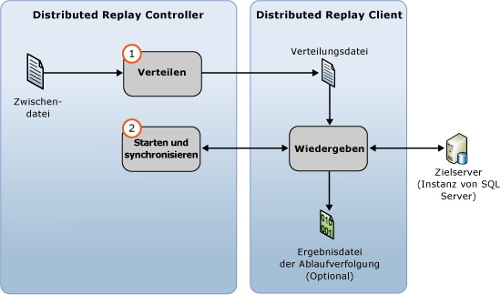

# Wiedergeben von Ablaufverfolgungsdaten
  Wenn Sie die Eingabedaten der Ablaufverfolgung vorbereitet haben, können Sie eine verteilte Wiedergabe mit der [!INCLUDE[msCoName](../../includes/msconame-md.md)] [!INCLUDE[ssNoVersion](../../includes/ssnoversion-md.md)] Distributed Replay-Funktion starten. Weitere Informationen finden Sie unter [Vorbereiten der Eingabedaten für die Ablaufverfolgung](../../tools/distributed-replay/prepare-the-input-trace-data.md).  
  
 Mit der Option **Wiedergabe** des Verwaltungstools können Sie die Ereigniswiedergabephase der verteilten Wiedergabe initiieren. Diese Phase besteht aus zwei Teilen: der Verteilung der Ablaufverfolgungsdaten und dem Start und der Synchronisierung der verteilten Wiedergabe.  
  
   
  
 Sie können Ablaufverfolgungsdaten in einem von zwei Sequenzierungsmodi wiedergeben: dem Belastungsmodus und dem Synchronisierungsmodus. Im Standardverhalten werden die Ablaufverfolgungsdaten im Belastungsmodus wiedergegeben. Weitere Informationen zur Ereigniswiedergabephase und den Sequenzierungsmodi finden Sie unter [SQL Server Distributed Replay](../../tools/distributed-replay/sql-server-distributed-replay.md).  
  
> [!NOTE]  
>  Die Eingabedaten der Ablaufverfolgung müssen in einer Version von [!INCLUDE[ssNoVersion](../../includes/ssnoversion-md.md)] aufgezeichnet werden, die mit Distributed Replay kompatibel ist. Die Eingabedaten der Ablaufverfolgung müssen zudem mit dem Zielserver kompatibel sein, für den Sie die Ablaufverfolgungsdaten wiedergeben möchten. Weitere Informationen zu den Versionsanforderungen finden Sie unter [Distributed Replay: Anforderungen](../../tools/distributed-replay/distributed-replay-requirements.md).  
  
### So geben Sie die Ablaufverfolgung wieder  
  
1.  **(Optional) Ändern Sie die Konfigurationseinstellungen für die Wiedergabe:** Wenn Sie die Konfigurationseinstellungen für die Wiedergabe ändern möchten, z.B. den Sequenzierungsmodus und verschiedene Skalierungswerte, müssen Sie das `<ReplayOptions>`-Element der XML-basierten Wiedergabekonfigurationsdatei `DReplay.exe.replay.config` ändern. Sie können auch das `<OutputOptions>`-Element ändern, um die Ausgabeeinstellungen anzugeben, z. B. ob die Zeilenanzahl aufgezeichnet werden soll. Wenn Sie die Wiedergabekonfigurationsdatei ändern, empfiehlt es sich, statt des Originals eine Kopie zu ändern. Zum Ändern der Einstellungen führen Sie folgende Schritte aus:  
  
    1.  Erstellen Sie eine Kopie der Standardkonfigurationsdatei für die Wiedergabe, `DReplay.exe.replay.config`, und benennen Sie die neue Datei um. Die Standardkonfigurationsdatei für die Wiedergabe befindet sich im Installationsordner des Verwaltungstools.  
  
    2.  Ändern Sie in der neuen Konfigurationsdatei die Konfigurationseinstellungen für die Wiedergabe.  
  
    3.  Wenn Sie die Ereigniswiedergabephase initiieren (nächster Schritt), geben Sie mit dem *config_file*-Parameter der Option **Wiedergabe** den Speicherort der geänderten Konfigurationsdatei an.  
  
     Weitere Informationen zur Konfigurationsdatei für die Wiedergabe finden Sie unter [Konfigurieren von Distributed Replay](../../tools/distributed-replay/configure-distributed-replay.md).  
  
2.  **Initiieren Sie die Ereigniswiedergabephase:** Zum Starten der verteilten Wiedergabe müssen Sie das Verwaltungstool mit der Option **Wiedergabe** ausführen. Weitere Informationen finden Sie unter [Option Wiedergabe &#40;Verwaltungstool Distributed Replay&#41;](../../tools/distributed-replay/replay-option-distributed-replay-administration-tool.md).  
  
    1.  Öffnen Sie die Windows-Eingabeaufforderung (**CMD.exe**), und navigieren Sie zum Installationspfad des Verwaltungstools „Distributed Replay“ (**DReplay.exe**).  
  
    2.  (Optional) Wenn der Controllerdienst und das Verwaltungstool auf unterschiedlichen Computern ausgeführt werden, geben Sie über den *controller*-Parameter **-m** den entsprechenden Controller an.  
  
    3.  Geben Sie über den *controller_working_directory*-Parameter **-d** den Speicherort auf dem Controller an, an dem die Zwischendatei während der Vorverarbeitungsphase gespeichert wurde.  
  
    4.  (Optional) Verwenden Sie den Parameter **-o**, um die Wiedergabeaktivität auf jedem Client in einer Ergebnisdatei der Ablaufverfolgung aufzuzeichnen.  
  
    5.  (Optional) Geben Sie über den *target_server*-Parameter **-s** die [!INCLUDE[ssNoVersion](../../includes/ssnoversion-md.md)]-Instanz an, in der auf den Distributed Replay-Clients die Arbeitsauslastung der Ablaufverfolgung wiedergegeben werden soll. Dieser Parameter ist nicht erforderlich, wenn Sie mithilfe des `<Server>`-Elements den Zielserver im `<ReplayOptions>`-Element der Wiedergabekonfigurationsdatei angegeben haben.  
  
    6.  Geben Sie mit dem *clients*-Parameter **-w** die Distributed Replay-Clients an, die an der Wiedergabe teilnehmen sollen. Führen Sie die Namen der Clientcomputer mit Trennzeichen getrennt auf. Hinweis: IP-Adressen sind nicht zulässig.  
  
    7.  (Optional) Geben Sie mit dem *config_file*-Parameter **-c** den Speicherort der Wiedergabekonfigurationsdatei an. Wenn Sie eine Kopie der Standardkonfigurationsdatei für die Wiedergabe geändert haben, verwenden Sie diesen Parameter, um auf die neue Konfigurationsdatei zu zeigen.  
  
    8.  (Optional) Geben Sie mit dem *status_interval*-Parameter **-f** an, ob Statusmeldungen im Verwaltungstool mit einer anderen Frequenz als 30 Sekunden angezeigt werden sollen.  
  
     Mit der folgenden Syntax initiieren Sie beispielsweise die Wiedergabephase auf dem Computer mit dem Controllerdienst, verwenden das Controllerarbeitsverzeichnis `c:\WorkingDir`, zeichnen die Wiedergabeaktivität auf jedem teilnehmenden Client auf, verwenden die Clients `client1` und `client2` zum Ausführen der Wiedergabe und rufen die verbleibenden Konfigurationseinstellungen für die Wiedergabe der geänderten Wiedergabekonfigurationsdatei `c:\modifiedreplay.config` ab:  
  
     `dreplay replay -d c:\WorkingDir -o -w client1,client2 -c c:\modifiedreplay.config`  
  
3.  Wenn die verteilte Wiedergabe beendet wurde, werden vom Verwaltungstool Zusammenfassungsinformationen zurückgegeben. Wenn Sie die Option **-o** angegeben haben, wurde die Wiedergabeaktivität auf jedem Client in Ergebnisdateien der Ablaufverfolgung gespeichert. Weitere Informationen zu den Ergebnisdateien der Ablaufverfolgung finden Sie unter [Überprüfen der Wiedergabeergebnisse](../../tools/distributed-replay/review-the-replay-results.md).  
  
## Siehe auch  
 [Distributed Replay: Anforderungen](../../tools/distributed-replay/distributed-replay-requirements.md)   
 [Befehlszeilenoptionen für das Verwaltungstool &#40;Distributed Replay Utility&#41;](../../tools/distributed-replay/administration-tool-command-line-options-distributed-replay-utility.md)   
 [Konfigurieren von Distributed Replay](../../tools/distributed-replay/configure-distributed-replay.md)  
  
  