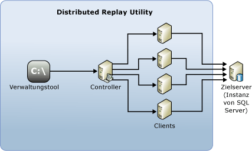

# SQL Server Distributed Replay
[!INCLUDE[appliesto-ss-xxxx-xxxx-xxx-md](../../includes/appliesto-ss-xxxx-xxxx-xxx-md.md)]
  Die [!INCLUDE[msCoName](../../includes/msconame-md.md)] [!INCLUDE[ssNoVersion](../../includes/ssnoversion-md.md)] Distributed Replay-Funktion unterstützt Sie beim Bewerten der Auswirkungen zukünftiger Upgrades von [!INCLUDE[ssNoVersion](../../includes/ssnoversion-md.md)] . Mit dem Hilfsprogramm können Sie auch die Auswirkungen von Hardware- und Betriebssystemupgrades sowie [!INCLUDE[ssNoVersion](../../includes/ssnoversion-md.md)] -Optimierungen bewerten.  
  
## Vorteile von Distributed Replay  
 Ähnlich wie mit [!INCLUDE[ssSqlProfiler](../../includes/sssqlprofiler-md.md)]können Sie mithilfe von Distributed Replay eine aufgezeichnete Ablaufverfolgung in einer aktualisierten Testumgebung wiedergeben. Im Gegensatz zu [!INCLUDE[ssSqlProfiler](../../includes/sssqlprofiler-md.md)]ist Distributed Replay nicht auf die Wiedergabe der Arbeitsauslastung von einem einzelnen Computer beschränkt.  
  
 Distributed Replay bietet eine stärker skalierbare Lösung als [!INCLUDE[ssSqlProfiler](../../includes/sssqlprofiler-md.md)]. Mit Distributed Replay können Sie eine Arbeitsauslastung von mehreren Computern wiedergeben und eine unternehmenskritische Arbeitsauslastung besser simulieren.  
  
 Die [!INCLUDE[msCoName](../../includes/msconame-md.md)] [!INCLUDE[ssNoVersion](../../includes/ssnoversion-md.md)] Distributed Replay-Funktion kann Ablaufverfolgungsdaten mithilfe mehrerer Computer wiedergeben und eine unternehmenswichtige Arbeitsauslastung simulieren. Verwenden des Distributed Replay für Anwendungskompatibilitätstests, Leistungstests oder die Kapazitätsplanung.  
  
## Verwendungsbereiche von Distributed Replay  
 [!INCLUDE[ssSqlProfiler](../../includes/sssqlprofiler-md.md)] und Distributed Replay überschneiden sich in manchen Punkten.  
  
 Mit dem [!INCLUDE[ssSqlProfiler](../../includes/sssqlprofiler-md.md)] können Sie eine aufgezeichnete Ablaufverfolgung in einer aktualisierten Testumgebung wiedergeben. Sie können auch die Wiedergabeergebnisse analysieren, um nach möglichen Funktions- und Leistungsinkompatibilitäten zu suchen. Mit dem [!INCLUDE[ssSqlProfiler](../../includes/sssqlprofiler-md.md)] kann jedoch nur eine Arbeitsauslastung von einem einzelnen Computer wiedergegeben werden. Wenn Sie eine ressourcenintensive OLTP-Anwendung mit zahlreichen gleichzeitig aktiven Verbindungen oder einem hohen Durchsatz wiedergeben, kann [!INCLUDE[ssSqlProfiler](../../includes/sssqlprofiler-md.md)] zu einem Ressourcenengpass werden.  
  
 Distributed Replay bietet eine stärker skalierbare Lösung als [!INCLUDE[ssSqlProfiler](../../includes/sssqlprofiler-md.md)]. Mit Distributed Replay können Sie eine Arbeitsauslastung von mehreren Computern wiedergeben und eine unternehmenskritische Arbeitsauslastung besser simulieren.  
  
 In der folgenden Tabelle ist beschrieben, wann jedes Tool verwendet werden sollte.  
  
|Tool|Verwendung|  
|----------|---------------|  
|[!INCLUDE[ssSqlProfiler](../../includes/sssqlprofiler-md.md)]|Sie möchten den herkömmlichen Wiedergabemechanismus auf einem einzelnen Computer verwenden. Insbesondere benötigen Sie zeilenweise Debugfunktionen, z.B. die Befehle **Schritt**, **Ausführen bis Cursorposition**und **Haltepunkt ein/aus** .   Sie möchten eine [!INCLUDE[ssASnoversion](../../includes/ssasnoversion-md.md)] -Ablaufverfolgung wiedergeben.|  
|Distributed Replay|Sie möchten die Anwendungskompatibilität auswerten. Sie möchten z. B. Upgradeszenarien für [!INCLUDE[ssNoVersion](../../includes/ssnoversion-md.md)] und das Betriebssystem, Hardwareupgrades oder die Indexoptimierung testen.   Die Parallelität in der aufgezeichneten Ablaufverfolgung ist so stark, dass mit einem einzelnen Wiedergabeclient keine ausreichende Simulation erzielt werden kann.|  
  
## Konzepte von Distributed Replay  
 Die folgenden Komponenten bilden die Distributed Replay-Umgebung:  
  
-   **Verwaltungstool "Distributed Replay"**: Eine Konsolenanwendung ( **DReplay.exe**), die zur Kommunikation mit Distributed Replay Controller verwendet werden kann. Verwenden Sie das Verwaltungstool zum Steuern der verteilten Wiedergabe.  
  
-   **Distributed Replay Controller**: Ein Computer, auf dem der Windows-Dienst [!INCLUDE[ssNoVersion](../../includes/ssnoversion-md.md)] Distributed Replay Controller ausgeführt wird. Der Distributed Replay Controller koordiniert die Aktionen der Distributed Replay Clients. Es kann in jeder Distributed Replay-Umgebung jeweils nur eine Controllerinstanz geben.  
  
-   **Distributed Replay Clients**: Ein oder mehrere Computer (physisch oder virtuell), auf denen der Windows-Dienst [!INCLUDE[ssNoVersion](../../includes/ssnoversion-md.md)] Distributed Replay Client ausgeführt wird. Die Distributed Replay Clients simulieren gemeinsam Arbeitsauslastungen auf einer Instanz von [!INCLUDE[ssNoVersion](../../includes/ssnoversion-md.md)]. In jeder Distributed Replay-Umgebung kann sich mindestens ein Client befinden.  
  
-   **Zielserver**: Eine Instanz von [!INCLUDE[ssNoVersion](../../includes/ssnoversion-md.md)] , mit der Distributed Replay Clients Ablaufverfolgungsdaten wiedergeben können. Es wird empfohlen, den Zielserver in einer Testumgebung zu platzieren.  
  
 Distributed Replay-Verwaltungstool, Controller und Client können auf verschiedenen Computern oder demselben Computer installiert werden. Auf demselben Computer kann nur eine Instanz des Distributed Replay Controller oder Client-Diensts ausgeführt werden.  
  
 In der folgenden Abbildung ist die physische Architektur von [!INCLUDE[ssNoVersion](../../includes/ssnoversion-md.md)] Distributed Replay dargestellt:  
  
   
  
## Tasks von Distributed Replay  
  
|Taskbeschreibung|Thema|  
|----------------------|-----------|  
|Beschreibt, wie Distributed Replay konfiguriert wird.|[Konfigurieren von Distributed Replay](../../tools/distributed-replay/configure-distributed-replay.md)|  
|Beschreibt, wie die Eingabedaten der Ablaufverfolgung vorbereitet werden.|[Vorbereiten der Eingabedaten für die Ablaufverfolgung](../../tools/distributed-replay/prepare-the-input-trace-data.md)|  
|Beschreibt, wie die Ablaufverfolgungsdaten wiedergegeben werden.|[Wiedergeben von Ablaufverfolgungsdaten](../../tools/distributed-replay/replay-trace-data.md)|  
|Beschreibt, wie die Ergebnisse der Ablaufverfolgungsdaten von Distributed Replay überprüft werden.|[Überprüfen der Wiedergabeergebnisse](../../tools/distributed-replay/review-the-replay-results.md)|  
|Beschreibt, wie das Verwaltungstool zum Initiieren, Überwachen und Abbrechen von Vorgängen auf dem Controller verwendet wird.|[Befehlszeilenoptionen für das Verwaltungstool &#40;Distributed Replay Utility&#41;](../../tools/distributed-replay/administration-tool-command-line-options-distributed-replay-utility.md)|  
  
## Weitere Informationen finden Sie unter  
 [SQL Server Distributed Replay Forum](http://social.technet.microsoft.com/Forums/sl/sqldru/)   
 [Verwenden von Distributed Replay für den Auslastungstest von SQL Server: Teil 2](http://blogs.msdn.com/b/mspfe/archive/2012/11/14/using-distributed-replay-to-load-test-your-sql-server-part-2.aspx)   
 [Verwenden von Distributed Replay für den Auslastungstest von SQL Server – Teil 1](http://blogs.msdn.com/b/mspfe/archive/2012/11/08/using-distributed-replay-to-load-test-your-sql-server-part-1.aspx)  
  
  
