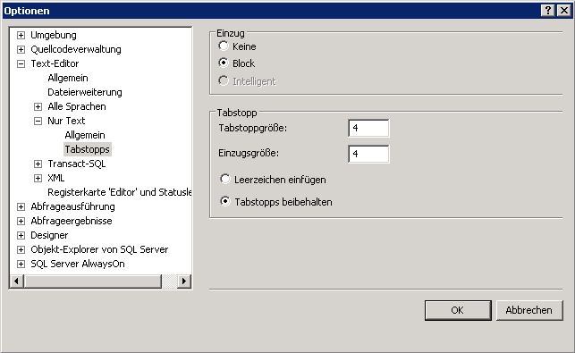

# Hinzuf&#252;gen von Einz&#252;gen
Der Abfrage-Editor ermöglicht es Ihnen, mit nur einem Schritt einen Einzug für große Codeabschnitte festzulegen. Außerdem können Sie die Größe des Einzugs ändern.  
  
## Festlegen von Einzügen für Code  
  
#### So legen Sie einen Einzug für mehrere Codezeilen fest  
  
1.  Klicken Sie auf der Symbolleiste auf **Neue Abfrage**.  
  
2.  Erstellen Sie eine zweite Abfrage, über die die Spalten **BusinessEntityID**, FirstName, **MiddleName**und **LastName** aus der Tabelle **Person** der Schemas **Person** ausgewählt werden. Platzieren Sie jede Spalte in eine separate Zeile, sodass der Code wie folgt aussieht:  
  
    ```  
    -- Search for a contact  
    SELECT   
    BusinessEntityID,  
    FirstName,   
    MiddleName,   
    LastName  
    FROM Person.Person  
    WHERE LastName = 'Sanchez';  
    GO  
    ```  
  
3.  Markieren Sie den gesamten Text von `BusinessEntityID` bis `LastName`.  
  
4.  Klicken Sie auf der Symbolleiste **SQL-Editor** auf **Einzug vergrößern** , um für alle Zeilen gleichzeitig einen Einzug festzulegen.  
  
#### So ändern Sie den Standardeinzug  
  
1.  Klicken Sie im Menü **Extras** auf **Optionen**.  
  
2.  Erweitern Sie **Text-Editor**, erweitern Sie **Alle Sprachen**, und klicken Sie dann auf **Tabstopps** , um die gewünschten Werte für die Einzüge festzulegen. Beachten Sie, dass Sie die Größe des Einzugs und der Tabstopps festlegen können und angeben können, ob Tabstopps in Leerzeichen umgewandelt werden sollen.  
  
      
  
3.  Klicken Sie auf **OK**.  
  
## Nächste Aufgabe in der Lektion  
[Maximieren des Abfrage-Editors](../../tools/sql-server-management-studio/maximizing-query-editor.md)  
  
  
  
