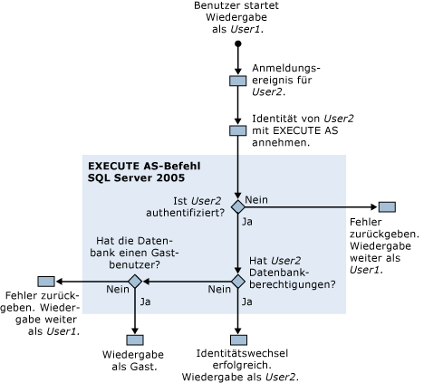

# Erforderliche Berechtigungen zum Ausführen von SQL Server Profiler
[!INCLUDE[appliesto-ss-xxxx-xxxx-xxx-md](../../includes/appliesto-ss-xxxx-xxxx-xxx-md.md)]Standardmäßig wird beim Ausführen [!INCLUDE[ssSqlProfiler](../../includes/sssqlprofiler-md.md)] erfordert die gleichen Berechtigungen wie die gespeicherten Transact-SQL-Prozeduren, die zum Erstellen von ablaufverfolgungen verwendet werden. Zum Ausführen von [!INCLUDE[ssSqlProfiler](../../includes/sssqlprofiler-md.md)]muss Benutzern die ALTER TRACE-Berechtigung erteilt werden. Weitere Informationen finden Sie unter [GRANT (Serverberechtigungen) &#40;Transact-SQL&#41;](../../t-sql/statements/grant-server-permissions-transact-sql.md).  
  
> [!IMPORTANT]  
>  Benutzer mit den Berechtigungen SHOWPLAN, ALTER TRACE oder VIEW SERVER STATE können Abfragen anzeigen, die in der Showplan-Ausgabe erfasst werden. Diese Abfragen enthalten möglicherweise vertrauliche Informationen wie Kennwörter. Daher wird empfohlen, diese Berechtigungen nur Benutzern zu gewähren, die zum Zugreifen auf vertrauliche Informationen berechtigt sind, z. B. Mitglieder der festen Datenbankrolle "db_owner" oder Mitglieder der festen Serverrolle "sysadmin". Darüber hinaus wird empfohlen, Showplan-Dateien oder Ablaufverfolgungsdateien, die Ereignisse mit Bezug zu Showplan enthalten, nur an einem Speicherort zu speichern, für den das NTFS-Dateisystem verwendet wird, und den Zugriff auf Benutzer zu beschränken, die zum Zugreifen auf vertrauliche Informationen berechtigt sind.  
  
## Berechtigungen zur Wiedergabe von Ablaufverfolgungen  
 Für die Wiedergabe von Ablaufverfolgungen benötigt der Benutzer, der die Ablaufverfolgung wiedergibt, ebenfalls die ALTER TRACE-Berechtigung.  
  
 Während der Wiedergabe verwendet [!INCLUDE[ssSqlProfiler](../../includes/sssqlprofiler-md.md)] jedoch den EXECUTE AS-Befehl, falls ein Audit Login-Ereignis in der wiedergegebenen Ablaufverfolgung gefunden wird. [!INCLUDE[ssSqlProfiler](../../includes/sssqlprofiler-md.md)] verwendet den EXECUTE AS-Befehl, um die Identität des Benutzers anzunehmen, der dem Anmeldeereignis zugeordnet ist.  
  
 Falls [!INCLUDE[ssSqlProfiler](../../includes/sssqlprofiler-md.md)] ein Anmeldeereignis in einer wiedergegebenen Ablaufverfolgung findet, werden die folgenden Berechtigungsüberprüfungen ausgeführt:  
  
1.  User1, der die ALTER TRACE-Berechtigung hat, startet die Wiedergabe einer Ablaufverfolgung.  
  
2.  Ein Anmeldeereignis für User2 wird in der wiedergegebenen Ablaufverfolgung gefunden.  
  
3.  [!INCLUDE[ssSqlProfiler](../../includes/sssqlprofiler-md.md)] verwendet den EXECUTE AS-Befehl, um die Identität von User2 anzunehmen.  
  
4.  [!INCLUDE[ssNoVersion](../../includes/ssnoversion-md.md)] versucht User2 zu identifizieren. In Abhängigkeit von den Ergebnissen trifft eine der folgenden Aussagen zu:  
  
    1.  Falls User2 nicht authentifiziert werden kann, gibt [!INCLUDE[ssSqlProfiler](../../includes/sssqlprofiler-md.md)] einen Fehler zurück und setzt die Wiedergabe der Ablaufverfolgung als User1 fort.  
  
    2.  Falls User2 erfolgreich authentifiziert wird, wird die Wiedergabe der Ablaufverfolgung als User2 fortgesetzt.  
  
5.  Die Berechtigungen für User2 werden in der Zieldatenbank überprüft. In Abhängigkeit von den Ergebnissen trifft eine der folgenden Aussagen zu:  
  
    1.  Falls User2 Berechtigungen für die Zieldatenbank hat, war der Identitätswechsel erfolgreich, und die Ablaufverfolgung wird als User2 wiedergegeben.  
  
    2.  Falls User2 keine Berechtigungen für die Zieldatenbank hat, sucht der Server nach einem Gastbenutzer in dieser Datenbank.  
  
6.  Das Vorhandensein eines Gastbenutzers wird in der Zieldatenbank überprüft. In Abhängigkeit von den Ergebnissen trifft eine der folgenden Aussagen zu:  
  
    1.  Falls ein Gastkonto vorhanden ist, wird die Ablaufverfolgung mit dem Gastkonto wiedergegeben.  
  
    2.  Falls in der Zieldatenbank kein Gastkonto vorhanden ist, wird ein Fehler zurückgegeben, und die Ablaufverfolgung wird als User1 wiedergegeben.  
  
 Das folgende Diagramm zeigt, wie bei der Wiedergabe von Ablaufverfolgungen die Berechtigungen überprüft werden:  
  
   
  
## Siehe auch  
 [Gespeicherte Prozeduren von SQL Server Profiler &#40;SQL Server Profiler&#41;](../../relational-databases/system-stored-procedures/sql-server-profiler-stored-procedures-transact-sql.md)   
 [Wiedergeben von Ablaufverfolgungen](../../tools/sql-server-profiler/replay-traces.md)   
 [Erstellen einer Ablaufverfolgung &#40;SQL Server Profiler&#41;](../../tools/sql-server-profiler/create-a-trace-sql-server-profiler.md)   
 [Wiedergeben einer Ablaufverfolgungstabelle &#40;SQL Server Profiler&#41;](../../tools/sql-server-profiler/replay-a-trace-table-sql-server-profiler.md)   
 [Wiedergeben einer Ablaufverfolgungsdatei &#40;SQL Server Profiler&#41;](../../tools/sql-server-profiler/replay-a-trace-file-sql-server-profiler.md)  
  
  
